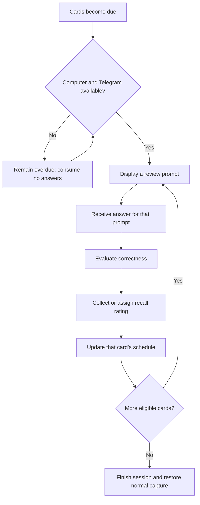

# Reliable Spaced Vocabulary Review

## Summary

Replace completion- and exposure-based vocabulary rotation with reliable local catch-up, FSRS-style scheduling, and independently scheduled forward and reverse recall. Keep the bot local-only while ensuring that an unseen Telegram prompt can never consume an unrelated vocabulary message.

---

## Problem Frame

The local Hermes cron job currently commits a pending daily review before Telegram delivery succeeds. When delivery fails after the computer starts late or without network connectivity, the hidden pending row still intercepts the next ordinary Telegram message; this caused a new word to be graded as an answer to a review prompt that was never seen.

Review timing is also based on completion and chronological exposure rather than recall quality. Correct, partial, and incorrect answers currently produce equivalent daily scheduling, while five-word tests rotate by prior appearance and do not influence future review timing. This limits reinforcement and can repeatedly surface words without responding to demonstrated weakness.

Forward definition recall and reverse word production exercise different knowledge. The current product schedules only the forward direction and cannot independently reinforce a particular stored sense in reverse.

---

## Actors

- A1. Learner: saves vocabulary, answers forward and reverse prompts, and reports subjective recall effort.
- A2. Vocabulary companion: selects cards, evaluates answers, records learning evidence, and protects ordinary messages from hidden study state.
- A3. Hermes/Telegram delivery path: runs only while the local computer is available and reports whether a prompt was successfully delivered.

---

## Key Flows

- F1. Reliable local catch-up
  - **Trigger:** The computer and Hermes start after one or more cards have become due.
  - **Actors:** A1, A2, A3
  - **Steps:** The companion calculates overdue work using actual elapsed time; Hermes attempts delivery; only a successfully delivered prompt becomes answerable; failed delivery remains retryable; the next successful attempt surfaces the overdue queue without duplicating learning events.
  - **Outcome:** Overdue work is visible after startup, and no unseen prompt can claim an answer.
  - **Covered by:** R1, R2, R3, R4, R18

- F2. Mixed scheduled review
  - **Trigger:** A delivered catch-up prompt or `/review` starts or resumes study.
  - **Actors:** A1, A2
  - **Steps:** The companion selects the most overdue eligible card; presents its forward or reverse prompt; evaluates the response; obtains the required recall rating; updates only that card; buries sibling cards; and repeats until no eligible work remains or the learner exits.
  - **Outcome:** All completed prompts produce independent, recall-sensitive schedules; stopping early leaves remaining work due and resumable.
  - **Covered by:** R5, R6, R7, R8, R9, R10, R11, R12

- F3. Directional five-question test
  - **Trigger:** The learner sends `/test forward` or `/test reverse`.
  - **Actors:** A1, A2
  - **Steps:** The companion validates that five eligible unique cards exist; selects due cards, then weak seen cards, then permitted unseen cards; runs five answer/rating cycles; updates each card at its actual test time; and reports directional totals.
  - **Outcome:** Tests remain bounded but contribute real scheduling evidence instead of chronological exposure alone.
  - **Covered by:** R13, R14, R15, R16

- F4. Due review encountered during normal capture
  - **Trigger:** Reviews are due but no review prompt is answerable, and the learner sends an ordinary vocabulary message.
  - **Actors:** A1, A2
  - **Steps:** The companion does not grade or store the message as an answer; it displays the first due prompt; repeats the untouched original message; and asks the learner to resend that message after completing or exiting review.
  - **Outcome:** The learner sees the due work without losing or misclassifying the original vocabulary text.
  - **Covered by:** R3, R4

---

## Requirements

**Reliability and session boundaries**

- R1. Due work must remain inert while the computer is off; on the next local startup, eligibility and lateness must be calculated from real elapsed time without resetting schedules.
- R2. The product must distinguish due, prepared, delivery-failed-or-unknown, delivered, answerable, and completed review states sufficiently to correlate delivery outcomes with the affected prompt. Failed or unknown delivery must not make a prompt answerable; the same prompt remains retryable until delivery is confirmed, and safety takes precedence over avoiding a repeated visible Telegram message after an unknown outcome.
- R3. A non-command message may be consumed as an answer only when it belongs to an active prompt with recorded successful delivery; due, prepared, failed, or delivery-unknown work alone must never intercept ordinary capture.
- R4. When due work is encountered during ordinary capture without an answerable prompt, the companion must preserve the original text from grading, display the first due prompt, echo the untouched text, and request resubmission after review completion or exit.
- R5. `/review` must start or resume one explicit mixed-direction session; cron and interactive review must display one question at a time with current/total progress. An exit must preserve unanswered cards as due, and retries or restarts must not duplicate durable prompt, answer, or scheduling records. Retrying the same prompt after an unknown delivery outcome may repeat its Telegram text but must retain one prompt identity.

**Cards, selection, and scheduling**

- R6. Each entry must have one independently scheduled forward card, and each stored sense must have one independently scheduled reverse card linked as siblings under that entry.
- R7. Scheduling must use an FSRS-style memory model with 90% desired retention and actual answer timestamps, including overdue and early reviews.
- R8. A scheduled session must include every currently due eligible card and must also introduce up to five previously unseen eligible directional cards per local calendar day across all review and test modes, even when an overdue backlog exists. Due cards remain uncapped and precede unseen cards.
- R9. When a bounded selection must fill slots after including all due work, it must prioritize the weakest previously seen eligible cards by predicted recall, then unseen cards within the shared quota; insertion chronology may be only a final deterministic tie-breaker. Ordinary `/review` queue composition remains all due cards plus that local day's unseen introductions under R8.
- R10. After any card is answered, all sibling directions and senses for the same entry must be buried for the rest of that local day so one prompt cannot cue another.

**Answer grading and feedback**

- R11. Forward answers must retain semantic `correct`, `partial`, and `incorrect` evaluation and reveal corrective canonical content before scheduling is finalized: incorrect or surrender assigns Again; partial asks the learner to select Again or Hard; correct asks for Hard, Good, or Easy.
- R12. Reverse prompts must show exactly one stored definition without an answer-revealing example, and accept only the complete saved entry after case, whitespace, and harmless terminal-punctuation normalization; incorrect assigns Again, while correct asks for Hard, Good, or Easy without a semantic model call.
- R13. Evaluation, persistence, or provider failure must leave the same prompt answerable without recording an attempt, advancing progress, or changing scheduling.

**Five-question tests**

- R14. `/test forward` must run five forward cards from five distinct entries, `/test reverse` must run five reverse-sense cards from five distinct entries after applying same-day sibling burial, and bare `/test` must explain both supported modes.
- R15. A test must select due cards first, then weakest seen cards, then unseen cards allowed by the shared quota; every completed answer must update the selected card's schedule at the real test time, even when reviewed early.
- R16. If fewer than five eligible cards from distinct entries exist after sibling burial, the command must report the exact shortfall and create no partial session; active reviews and tests must not overlap, and interrupted tests must resume safely.

**History, rollout, and observability**

- R17. Every completed attempt must retain its source mode, direction and sense, submitted answer, evaluator outcome, final recall rating, actual timestamp, and enough before/after scheduling state to explain the next due time.
- R18. Existing history must remain available as audit evidence. Historical forward events with valid grades must initialize scheduling conservatively in timestamp order using correct as Good and partial or incorrect as Again; ungraded completions must not fabricate scheduling evidence. Existing reverse cards must enter as unseen and remain subject to the shared five-new-card daily quota.
- R19. Delivery failure history needed to protect routing must remain correlated with the prompt rather than being represented only by the latest cron-job status.
- R20. A card assigned Again must return once at the end of the current session after the main queue. If that retry also receives Again, it must become due on the next local day without another same-session loop or a timed minute-level Telegram prompt.

---

## Acceptance Examples

- AE1. **Covers R1, R2, R3, R19.** Given a card became due while the computer was off and Telegram delivery fails after startup, when the learner later sends `Xanthocroid`, that text is not graded against the unseen card; the failed prompt remains retryable and correlated with its delivery failure.
- AE2. **Covers R3, R4.** Given reviews are due but none is answerable, when the learner sends `Xanthocroid`, the companion shows the first review prompt, echoes `Xanthocroid` unchanged, and asks for it to be resent after review rather than saving it as a review answer.
- AE3. **Covers R5, R8.** Given eight overdue cards and at least five eligible unseen cards, when `/review` starts, all eight overdue cards and five unseen cards join the sequential queue with due cards first; exiting after four answers leaves the rest due and resumable.
- AE4. **Covers R10.** Given one entry has a forward card and three reverse-sense cards, when any one of those cards is answered, none of its siblings appears again that local day even if a sibling is overdue.
- AE5. **Covers R11, R13.** Given a forward answer omits a material sense, when evaluation returns partial, the companion shows the missing content and waits for Again or Hard; if rating persistence fails, the answer and schedule do not advance.
- AE6. **Covers R12.** Given the reverse prompt expects `Pro Forma`, ` pro   forma. ` is correct after normalization, while `proformal`, a synonym, or a different saved word is incorrect.
- AE7. **Covers R14, R15.** Given five eligible reverse cards from five distinct entries and two are overdue, when `/test reverse` starts, those two appear before weaker non-due or unseen cards, and all five completed answers update their reverse-sense schedules.
- AE8. **Covers R16.** Given only four eligible distinct entries after applying same-day sibling burial, when `/test forward` is sent, the response states that one more entry is needed and no session or scheduling record is created.
- AE9. **Covers R18.** Given historical events contain graded and ungraded forward completions, migration preserves all events, replays correct as Good and partial or incorrect as Again in timestamp order, treats ungraded completions as audit-only, and introduces reverse cards within the daily quota.
- AE10. **Covers R6, R7.** Given an entry with three stored senses, migration creates one forward card and three reverse-sense cards with independent memory state; answering one card at an overdue timestamp changes only that card using the real elapsed delay.
- AE11. **Covers R9, R17.** Given two seen eligible cards where the newer entry has lower predicted recall than the older entry, selection chooses the weaker newer card first, and completion records its mode, direction, sense, answer, evaluator result, final rating, actual timestamp, and before/after due state.
- AE12. **Covers R20.** Given a card receives Again, it returns once after the main session queue; if the retry also receives Again, it does not loop or trigger a minute-level prompt and is due again on the next local day.

---

## Success Criteria

- No failed or unseen Telegram prompt can cause an unrelated vocabulary message to be graded or discarded.
- Returning after local downtime immediately exposes overdue work and preserves the real delay in subsequent scheduling.
- Forward and per-sense reverse recall develop independently from graded review and test evidence.
- Repeated sessions demonstrably favor overdue and weak cards rather than chronological insertion order.
- A planner can derive persistence, migration, routing, grading, scheduling, and verification work without inventing product behavior.

---

## Scope Boundaries

- The computer remains the only runtime and authoritative storage location; reviews and tests cannot operate while it is off.
- Always-on hosting, remote databases, cross-device synchronization, and cloud migration are excluded for now.
- The work does not add generated definitions, synonyms, typo tolerance, multiple-choice prompts, additional hint levels, or new vocabulary-management commands.
- The work does not change the saved vocabulary content model except where independent forward and per-sense reverse learning state requires linkage.
- The work does not impose a cap on due cards; only unseen-card introduction is capped.
- Timed one-minute or ten-minute learning notifications are excluded; failed cards receive one end-of-session retry instead.

---

## Key Decisions

- Use local catch-up rather than always-on hosting: preserve the current privacy and deployment model while eliminating silent failure.
- Use FSRS-style scheduling at 90% desired retention: recall quality and elapsed time should determine reinforcement rather than completion or exposure order.
- Mix directions in `/review` but separate them in tests: scheduled work remains unified while `/test forward` and `/test reverse` provide explicit five-question practice modes.
- Reschedule every completed test card: tests are treated as genuine learning events, including early reviews.
- Use one reverse card per stored sense: productive recall for each meaning receives independent evidence.
- Require exact normalized reverse answers: reverse testing measures retrieval and spelling without model ambiguity.
- Ask for subjective effort only where correctness permits it: correct answers use Hard/Good/Easy; partial uses Again/Hard; incorrect and surrender use Again.
- Introduce up to five unseen cards daily even when overdue work exists: missed days intentionally grow the visible queue while overdue cards retain priority.
- Retry failed cards once at session end: preserve corrective retrieval without timer-driven Telegram interruptions or infinite failure loops.

---

## Dependencies / Assumptions

- Hermes and Telegram remain unavailable while the local computer is off.
- The delivery path can expose or be extended to expose a durable success/failure outcome correlated to a specific prompt.
- Semantic forward evaluation continues to use the existing strict structured-output provider contract.
- Local calendar-day behavior uses the configured IANA timezone.
- Existing historical data is sparse enough that conservative defaults are preferable to personalized parameter fitting at migration time.

---

## Outstanding Questions

### Deferred to Planning

- [Affects R2, R3, R19][Needs research] What is the narrowest supported Hermes integration seam for recording prompt delivery success without coupling vocabulary domain logic to Telegram internals?
- [Affects R7][Technical] Should the project adopt a maintained FSRS implementation or embed the minimal algorithm, given dependency policy, version compatibility, and deterministic test requirements?
