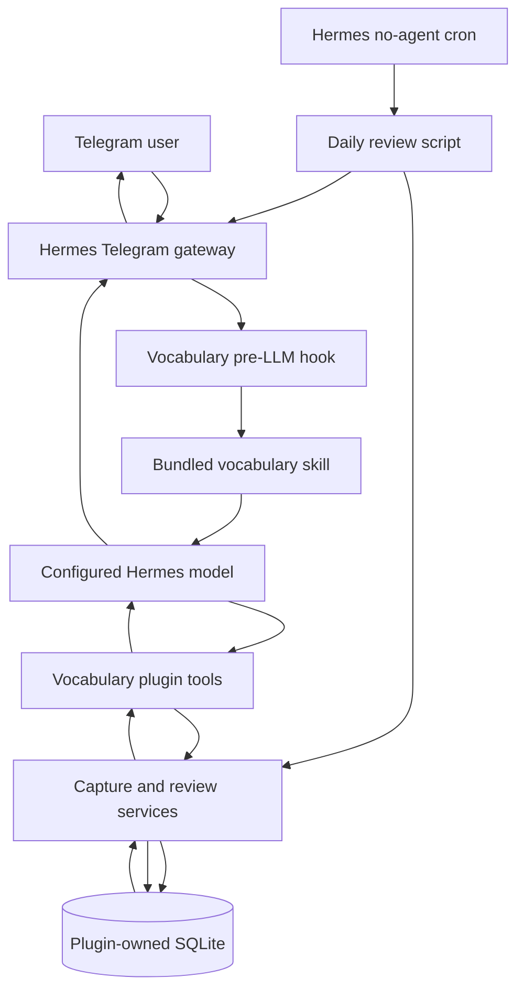
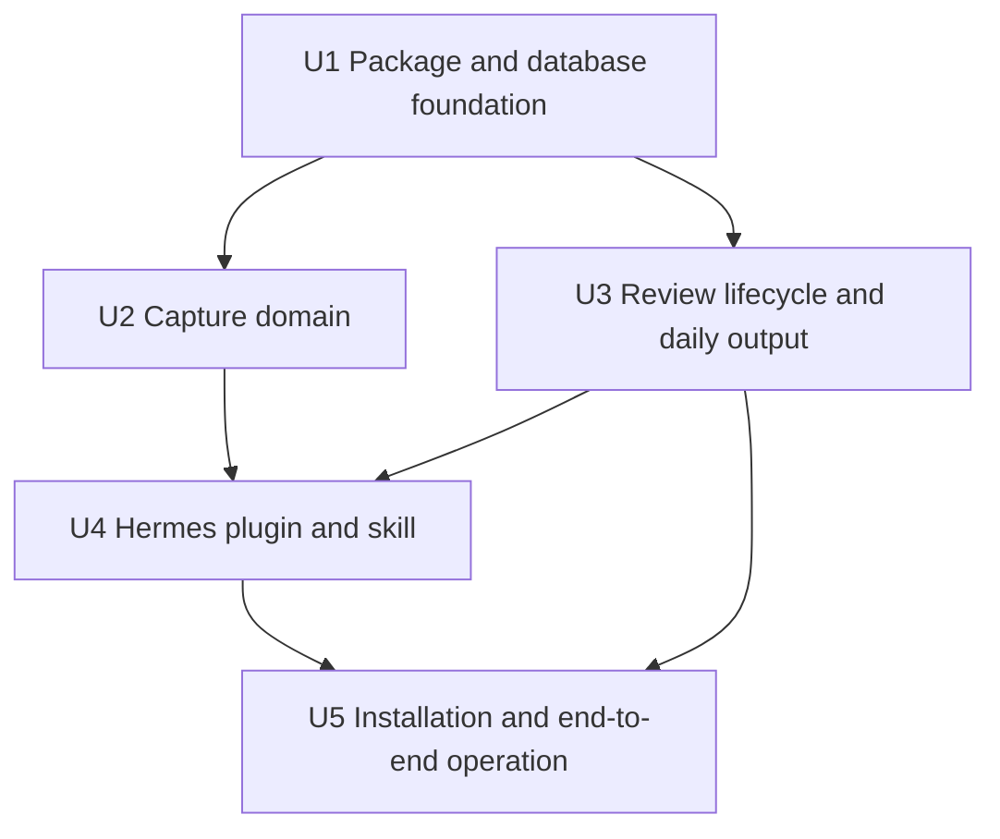
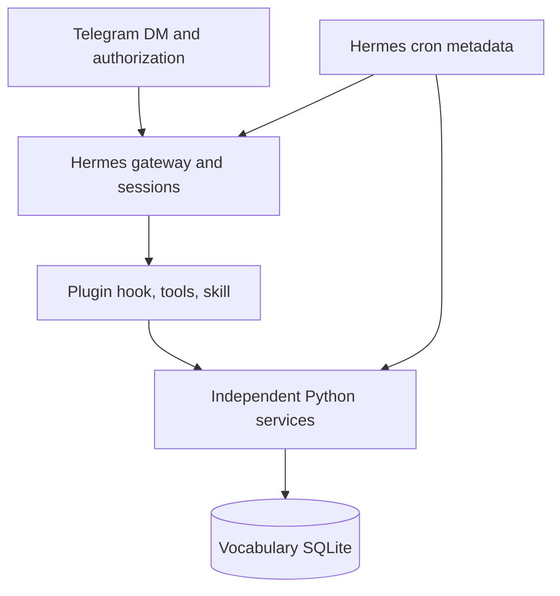

# feat: Build a local-first Hermes vocabulary companion

## Summary

Build a standalone Python package that integrates with NousResearch Hermes Agent through a small plugin and bundled skill. Hermes handles Telegram conversation and model inference; deterministic Python modules validate, persist, and review vocabulary in a plugin-owned SQLite database, while a no-agent Hermes cron job sends one morning question without depending on conversation memory.

---

## Problem Frame

The primary interaction must remain faster than opening a study application: send one unfamiliar word in Telegram and receive a concise definition, part of speech, example, and confirmed save. The same system should ask one lightweight review question each morning without turning into a spaced-repetition product.

The workspace is empty, so there are no local conventions to preserve. This plan therefore establishes a greenfield Python package, database ownership model, Hermes extension boundary, and deployment procedure explicitly.

Several requirements hide state and reliability concerns that should be resolved before code:

- A local morning push only works while the machine and Hermes gateway are running.
- A model-generated definition can be wrong; SQLite makes the output durable but does not make it authoritative.
- A pending review makes a one-word Telegram message ambiguous: it could be an answer or a new capture.
- `last_reviewed` and `review_status` alone cannot make scheduler retries idempotent or recover an unanswered prompt after restart.
- Hermes' native Telegram gateway persists session transcripts. Vocabulary behavior can avoid relying on those transcripts, but V1 cannot truthfully promise that Telegram history is never stored by Hermes.

The plan resolves these with explicit state, narrow contracts, and documented trade-offs rather than additional product features.

---

## Requirements

- R1. A single authorized user can send one lexical word in a private Telegram conversation and receive a concise card containing the word, part of speech, definition, example sentence, and save confirmation.
- R2. Capture requires no tags, metadata, categorization, or follow-up questions and should normally complete within ten seconds, subject to model/provider latency.
- R3. SQLite is the sole source of truth for vocabulary entries and review state; Hermes memory and Telegram transcript history must not determine whether a word exists or which review is pending.
- R4. Each saved entry contains the original word, a normalized unique key, definition, part of speech, example sentence, date added, a nullable last reviewed timestamp that remains null until the first completed review, and review status.
- R5. Duplicate inputs differing only by surrounding whitespace, Unicode compatibility form, or case produce one entry and do not overwrite the first saved card.
- R6. When at least one reviewable entry exists, Hermes sends exactly one question per configured local morning in the form `What does '<word>' mean?` through Telegram. An empty library receives one short capture-first message and no review event.
- R7. Re-running the morning job on the same local date returns the same question only while that date's review is pending, never selects a second word, and emits no Telegram message after the review is answered.
- R8. The next non-command Telegram message while a current review is pending is treated as the review response. Plain-text requests such as `answer` or `show answer` follow the same path and are stored verbatim; there is no semantic grading or special command parser. Hermes then shows the stored concise definition and example and records completion.
- R9. An unanswered review does not create a backlog: the next day's run marks it missed and creates at most one new pending review for that date.
- R10. Capture, review selection, and review completion survive Hermes restarts because all required state is persisted transactionally in the vocabulary database.
- R11. Business logic, normalization, schema migrations, review selection, and output formatting remain importable and testable without starting Hermes or Telegram.
- R12. Hermes integration uses supported extension points—a plugin tool/hook, bundled skill, native Telegram gateway, and no-agent cron—without patching Hermes core.
- R13. V1 setup uses one allowlisted Telegram user, polling mode, an explicit home chat, an explicit IANA timezone, and a continuously running Hermes gateway service.
- R14. The implementation guide explains architecture, file ownership, installation, Telegram setup, plugin enablement, cron setup, backup, and end-to-end verification before presenting optional future work.

---

## Scope Boundaries

- Single user and one private Telegram DM only; no groups, shared accounts, or multi-tenant schema.
- Text capture only; no voice, image, document, browser-extension, or ebook-reader ingestion.
- Model-generated English definition and example; no dictionary API, source citations, pronunciation, etymology, synonyms, or multiple senses in V1.
- No grading, scores, streaks, spaced-repetition intervals, difficulty levels, or mandatory correction flow.
- No custom Telegram bot implementation or custom Hermes platform adapter; use Hermes' native Telegram integration.
- No cloud database, sync service, web UI, admin UI, or production observability stack.
- No use of Hermes memory tools for vocabulary persistence.
- No guarantee that Hermes stores zero Telegram transcript history; V1 guarantees only that transcripts are not consulted as vocabulary state.

### Deferred to Follow-Up Work

- Anki export and sync.
- Weekly vocabulary summaries.
- Writing prompts and writing practice.
- Reading statistics and review analytics.
- Manual edit/delete commands or a repair UI.
- Authoritative dictionary-provider integration and provenance.
- Additional Hermes skills unrelated to vocabulary.
- Cloud/VPS deployment if local machine availability proves unreliable.

---

## Context & Research

### Relevant Code and Patterns

- The workspace root is empty: no repository, manifests, tests, architecture documents, or local conventions exist.
- Hermes `0.18.2` supports standalone plugins discovered through the `hermes_agent.plugins` Python entry-point group. A plugin can register tools, lifecycle hooks, and bundled namespaced skills.
- Hermes recommends skills for procedural instructions and plugin tools for deterministic processing. This maps cleanly to a skill that directs model behavior and Python handlers that own SQLite operations.
- Hermes `pre_llm_call` hooks run once per user turn in CLI and gateway sessions and can append ephemeral context to the user message. This is the narrowest supported way to make single-word capture and pending-review routing reliable without replacing Telegram ingress.
- Hermes' Telegram adapter already supports polling, user allowlists, home-channel delivery, and gateway sessions. V1 should not implement another Telegram client.
- Hermes no-agent cron executes a Python script and delivers stdout verbatim. It is a better fit for the exact morning question than starting a fresh LLM session.

### Institutional Learnings

- None found. The workspace contains no `docs/solutions/`, wiki, history, or existing project artifacts.

### External References

- Hermes installation: https://hermes-agent.nousresearch.com/docs/getting-started/installation
- Hermes Telegram setup: https://hermes-agent.nousresearch.com/docs/user-guide/messaging/telegram
- Hermes scheduled tasks: https://hermes-agent.nousresearch.com/docs/user-guide/features/cron
- Hermes skill authoring: https://hermes-agent.nousresearch.com/docs/developer-guide/creating-skills
- Hermes plugin authoring: https://hermes-agent.nousresearch.com/docs/developer-guide/plugins
- Hermes hook contracts: https://hermes-agent.nousresearch.com/docs/user-guide/features/hooks
- Source snapshot used for version-sensitive findings: https://github.com/NousResearch/hermes-agent/tree/b80b52aa46516bb3652967a6dd8763cf577867fe

---

## Key Technical Decisions

| Decision | Choice | Rationale |
|---|---|---|
| Hermes boundary | Standalone pip-discoverable plugin with a bundled skill | Keeps the project outside Hermes core, uses an upstream-supported extension point, and allows local editable installation during development. |
| Vocabulary logic | Plain Python package independent of Hermes | Hermes-specific registration and JSON tool contracts remain adapters; normalization, persistence, review state, and formatting can run in ordinary tests. |
| Database | Plugin-owned SQLite file, separate from Hermes `state.db` | Prevents Hermes session cleanup or schema changes from affecting vocabulary and makes backup/inspection straightforward. |
| Runtime dependencies | Python 3.11+ standard library for production code | Hermes already installs Python 3.11 and `uv`; `sqlite3`, `unicodedata`, `datetime`, `zoneinfo`, `json`, and `pathlib` are sufficient for V1. |
| Capture enrichment | Hermes model generates one bounded card; the save tool validates and commits it atomically | Avoids a dictionary dependency and avoids holding a database transaction during inference. Invalid or failed inference creates no partial vocabulary entry; the user can resend the word. |
| Duplicate handling | Normalize with trim, Unicode NFKC, and casefold; enforce a unique database key | Handles common duplicate forms deterministically without attempting lemmatization or conflating related words. |
| Capture trigger | `pre_llm_call` hook scopes behavior to Telegram and injects an instruction to load the bundled skill | Reduces reliance on the model discovering the skill from a bare word while leaving actual language understanding to Hermes. |
| Review persistence | Separate `review_events` table plus summary fields on each entry | A tiny event table makes same-day retries, pending answers, missed reviews, and restart recovery explicit. It is less complex than reconstructing state from transcripts or timestamps. |
| Review ambiguity | A current pending review owns the next non-command message | Deterministic and easy to explain. It briefly pauses frictionless capture until the user answers or asks for the answer; this is the smallest reliable V1 rule. |
| Morning execution | No-agent Hermes cron script writes/returns the day's review question | Guarantees exact output, avoids an unnecessary morning model call, and does not require cron sessions to discover plugin tools. |
| Selection policy | Prioritize never-reviewed entries by oldest `date_added`, then least-recently reviewed by `last_reviewed` | Predictable rotation without introducing spaced repetition, scores, or randomness. |
| Time semantics | Explicit IANA timezone; one `review_date` per local calendar date; timestamps stored in UTC | Keeps scheduler and idempotency semantics clear across restarts and daylight-saving changes. |
| Telegram deployment | Native polling gateway, one numeric user allowlist, explicit DM home channel | Lowest setup burden for a local personal agent; no public webhook or group privacy configuration. |
| Conversational memory | Do not read/write vocabulary through Hermes memory; tolerate native transcript persistence | Matches the stated source-of-truth requirement without replacing Hermes' gateway. Strict zero-transcript storage is a different, larger ingress project. |

---

## Open Questions

### Resolved During Planning

- **Should this be only a skill?** No. The skill describes when and how to act; deterministic SQLite state transitions belong in plugin tools and independent Python modules.
- **Should morning review use an agent-backed cron job?** No. The question is deterministic, so no-agent script delivery is simpler, cheaper, and easier to verify.
- **Should SQLite reuse Hermes' internal database?** No. The vocabulary schema has separate ownership, backup, and migration needs.
- **Should V1 add a dictionary API?** No. That adds provider selection, credentials, failure modes, and sense-mapping complexity. The configured Hermes model is acceptable for V1 with the accuracy limitation documented.
- **Should unanswered reviews remain pending forever?** No. A prior-day pending event becomes `missed` when the next local day's review is created.
- **Should V1 create pending-enrichment rows before inference?** No. That requires a multi-step recovery state and another tool round trip. The save tool instead accepts a complete validated card and performs one atomic insert; failed inference leaves no misleading partial entry.

### Deferred to Implementation

- Confirm the installed Hermes version and current `hermes cron create --help`, `hermes gateway install --help`, and plugin discovery output before copying exact commands into the final setup instructions; upstream main and prose documentation currently differ on some flags.
- Confirm the pip entry-point plugin manifest/package-data shape against the installed Hermes release. If entry-point discovery is unsuitable, use the documented user-plugin directory as a development fallback without changing the core package boundary.
- Choose the exact configurable morning time during setup; the reference default is 08:00 in the configured timezone.
- Confirm whether the Telegram adapter exposes reply metadata to plugin hooks. V1 correctness does not depend on it because pending-review state has priority, but reply metadata could improve later disambiguation.

---

## Output Structure

    .
    ├── README.md
    ├── pyproject.toml
    ├── scripts/
    │   └── daily_review.py
    ├── src/
    │   └── hermes_vocab/
    │       ├── __init__.py
    │       ├── capture.py
    │       ├── config.py
    │       ├── database.py
    │       ├── formatting.py
    │       ├── models.py
    │       ├── review.py
    │       ├── migrations/
    │       │   └── 001_initial.sql
    │       └── hermes_plugin/
    │           ├── __init__.py
    │           ├── hooks.py
    │           ├── plugin.yaml
    │           ├── schemas.py
    │           ├── tools.py
    │           └── skills/
    │               └── vocabulary/
    │                   └── SKILL.md
    └── tests/
        ├── integration/
        │   ├── test_database.py
        │   └── test_hermes_plugin.py
        └── unit/
            ├── test_capture.py
            ├── test_daily_review.py
            ├── test_formatting.py
            └── test_review.py

Why each component exists:

- `capture.py`: lexical validation, normalization, bounded-card validation, and idempotent save behavior. It knows nothing about Hermes.
- `formatting.py`: deterministic Telegram text for saved, duplicate, error, and review-reveal outcomes; Hermes relays these strings rather than inventing success wording.
- `review.py`: review selection and lifecycle transitions. It knows nothing about Telegram or cron.
- `database.py`: connection policy, migrations, transactions, and SQLite queries. Keeping SQL here avoids scattering persistence decisions through adapters.
- `models.py`: small dataclasses and enums for entries and review events; no framework models or ORM.
- `config.py`: one place for database path and timezone resolution, with explicit environment overrides.
- `migrations/`: one initial SQL migration plus an append-only upgrade path. This small foundation directly satisfies the requirement that the source-of-truth schema remain easy to extend; it is not an implementation of deferred export or statistics features.
- `hermes_plugin/`: the only Hermes-coupled package. Registration, tool schemas, hooks, and JSON serialization stay out of business logic.
- `SKILL.md`: concise model instructions for capture, pending-review response, formatting, and failure behavior.
- `scripts/daily_review.py`: thin no-agent entry point whose stdout is the Telegram payload; it delegates selection and state changes to `review.py`.
- `tests/unit/`: behavior contracts for pure capture/review decisions.
- `tests/integration/`: real temporary SQLite files and a fake Hermes registration context to prove cross-layer contracts.
- `README.md`: architecture-first setup and operating guide requested by the user; it is not a second source of business rules.

---

## High-Level Technical Design

> *This illustrates the intended approach and is directional guidance for review, not implementation specification. The implementing agent should treat it as context, not code to reproduce.*

Capture sequence:

1. An allowlisted Telegram DM enters Hermes normally.
2. The plugin hook checks platform plus SQLite pending-review state. A current review takes priority; otherwise one lexical token triggers capture guidance.
3. The bundled skill directs the model to produce one bounded card and call the save tool before claiming success.
4. The save tool validates all fields and inserts by normalized unique key in one short transaction.
5. A pure Python formatter turns the committed tool outcome into the exact Telegram card. The skill relays it verbatim; `✓ Saved.` appears only after a successful insert, and duplicates return the existing card with `Already saved.`

Morning review sequence:

1. Hermes cron runs the thin Python script without an agent.
2. The review service marks prior-day pending events missed, creates or retrieves the current local-date event, and atomically selects one eligible entry.
3. The script prints only `What does '<word>' mean?`; Hermes delivers stdout to the configured Telegram home DM without cron wrapping.
4. The next non-command message is routed as the pending review response. The plugin records the raw answer, marks the event answered, updates the entry's review summary, and returns the stored definition and example.

Database direction:

- `vocabulary_entries`: complete, reviewable cards only. Required fields are non-null; normalized word is unique.
- `review_events`: one row per local review date, linked to an entry, with `pending`, `answered`, or `missed` status and prompt/answer timestamps.
- Schema versioning uses ordered SQL migrations and SQLite's user-version metadata.
- Connections enable foreign keys, a bounded busy timeout, and WAL mode. Transactions never span model inference or Telegram delivery.

---

## Implementation Units

### U1. Establish the Python package and SQLite foundation

**Goal:** Create the greenfield package, configuration boundary, durable schema, and migration runner used by every later unit.

**Requirements:** R3, R4, R10, R11

**Dependencies:** None

**Files:**
- Create: `pyproject.toml`
- Create: `src/hermes_vocab/__init__.py`
- Create: `src/hermes_vocab/config.py`
- Create: `src/hermes_vocab/models.py`
- Create: `src/hermes_vocab/database.py`
- Create: `src/hermes_vocab/migrations/001_initial.sql`
- Test: `tests/integration/test_database.py`

**Approach:**
- Target the Python range supported by the installed Hermes release, beginning with Python 3.11.
- Use a `src/` layout and `uv`-compatible `pyproject.toml`; production code uses only the standard library. Keep test tooling in a development dependency group.
- Resolve a configurable plugin-owned database path with a stable local default. On POSIX, require a gateway-user-owned `0700` parent directory and a `0600` database file; the protected parent directory is the primary boundary for transient WAL/SHM sidecars, which should also be tightened when present.
- Add `vocabulary_entries` with display word, normalized unique word, definition, part of speech, example sentence, `date_added`, nullable `last_reviewed`, and `review_status` constrained to `new` or `reviewed`.
- Add `review_events` with entry foreign key, unique local `review_date`, status constrained to `pending`, `answered`, or `missed`, prompt/answer timestamps, and raw answer text.
- Use UTC ISO-8601 timestamps and local ISO dates. Enable foreign keys, WAL, and a bounded busy timeout on each connection.
- Apply append-only SQL migrations transactionally and record the current schema through SQLite user-version metadata.

**Execution note:** Implement schema behavior against a temporary real SQLite file before building Hermes adapters.

**Patterns to follow:**
- Python standard-library `sqlite3` transaction boundaries.
- Hermes installer runtime baseline: Python 3.11 and `uv`.
- Plugin-owned data separate from `~/.hermes/state.db`.

**Test scenarios:**
- Happy path: opening a new database applies the initial migration and exposes both tables with required constraints.
- Happy path: reopening an initialized database is idempotent and preserves rows.
- Edge case: two connections open the same file with foreign keys and busy timeout configured.
- Integration: on POSIX, initialization rejects an unsafe writable parent and leaves the database plus any present WAL/SHM artifacts inaccessible to other users.
- Error path: a migration failure rolls back and does not advance the schema version.
- Error path: invalid review statuses and review events referencing missing entries are rejected.
- Integration: deleting Hermes session data has no effect on the separately configured vocabulary database path.

**Verification:**
- A fresh temporary file initializes once, reports the expected schema version, enforces constraints, and reopens without data loss.

### U2. Implement deterministic vocabulary capture

**Goal:** Validate one-word capture input and complete model-generated cards, normalize duplicates, and save exactly one durable entry without importing Hermes.

**Requirements:** R1, R2, R4, R5, R10, R11

**Dependencies:** U1

**Files:**
- Create: `src/hermes_vocab/capture.py`
- Create: `src/hermes_vocab/formatting.py`
- Modify: `src/hermes_vocab/models.py`
- Modify: `src/hermes_vocab/database.py`
- Test: `tests/unit/test_capture.py`
- Test: `tests/unit/test_formatting.py`
- Test: `tests/integration/test_database.py`

**Approach:**
- Accept a single lexical token containing Unicode letters, with optional internal apostrophes or hyphens; trim surrounding whitespace and reject commands, phrases, empty input, and punctuation-only input.
- Preserve the first display form while deriving the unique key with NFKC normalization and casefolding. Do not lemmatize or merge inflections.
- Validate non-empty, bounded definition, part of speech, and example sentence before opening the write transaction.
- Insert once under the unique key. On conflict, read and return the existing entry without overwriting its card.
- Return explicit `saved`, `already_exists`, `invalid`, or `storage_error` outcomes so adapters never infer persistence success from prose.
- Do not create pending-enrichment rows. Model/provider failures occur before save and leave no partial review candidate.

**Execution note:** Implement new capture behavior test-first because normalization and idempotency are permanent observable contracts.

**Patterns to follow:**
- Tight SQLite transactions around persistence only.
- Domain outcomes instead of Hermes-formatted strings.

**Test scenarios:**
- Happy path: `obdurate` plus a valid card creates one entry with `review_status=new` and a UTC `date_added`.
- Happy path: Unicode words and words with an internal apostrophe or hyphen are accepted.
- Edge case: `Résumé`, `résumé`, Unicode-compatible equivalents, and surrounding whitespace resolve to one row while retaining the first display form.
- Edge case: inflected forms remain distinct because V1 does not lemmatize.
- Edge case: two concurrent inserts for the same normalized word produce one row and deterministic existing/saved outcomes.
- Error path: empty input, slash commands, whitespace-containing phrases, punctuation-only input, or missing/overlong card fields create no row.
- Error path: a locked or unavailable database returns a storage failure and never reports a save.
- Integration: duplicate capture returns the original stored definition/example rather than overwriting with a later model response.

**Verification:**
- Capture outcomes map one-to-one to durable database state, and no failure path leaves a partial vocabulary entry.

### U3. Implement the review lifecycle and deterministic morning output

**Goal:** Select one daily word, persist pending/missed/answered state, reveal stored content after a response, and produce exact no-agent cron output.

**Requirements:** R6, R7, R8, R9, R10, R11

**Dependencies:** U1

**Files:**
- Create: `src/hermes_vocab/review.py`
- Create: `scripts/daily_review.py`
- Modify: `src/hermes_vocab/models.py`
- Modify: `src/hermes_vocab/database.py`
- Modify: `src/hermes_vocab/formatting.py`
- Test: `tests/unit/test_review.py`
- Test: `tests/unit/test_daily_review.py`
- Test: `tests/integration/test_database.py`

**Approach:**
- Resolve one explicit IANA timezone and derive the local review date separately from UTC timestamps.
- In one transaction, inspect any current-date event. Return its existing question only when it is `pending`; return an already-completed/silent outcome when it is `answered`; otherwise mark older pending events missed, choose the next entry, and create one pending event for today.
- Select never-reviewed entries first by oldest `date_added`, then reviewed entries by oldest `last_reviewed`, using stable ID tie-breaking.
- When the database is empty, print one short capture-first message and create no review event.
- Record the next non-command user response as raw text against the current pending event. Plain text such as `answer` or `show answer` is not interpreted or graded; it is stored verbatim and follows the same completion path. Empty input does not close the event. A second response is idempotent and does not create another completion.
- Completing a review sets event status/timestamps and updates the entry's `last_reviewed` and `review_status=reviewed` in the same transaction. The service returns the stored definition and example; V1 performs no grading.
- Keep the executable script thin: load config, call the review service, print its exact question or empty-library message, and use exit status for operational failures.

**Execution note:** Implement state transitions test-first with an injectable clock/timezone; date boundaries and restart recovery are observable contracts.

**Patterns to follow:**
- Hermes no-agent cron contract: stdout is delivered verbatim; non-zero exit surfaces an error alert.
- Database state rather than cron-session or Telegram-session context.

**Test scenarios:**
- Happy path: first morning run creates one pending event and prints exactly `What does 'laconic' mean?`.
- Happy path: answering stores raw text, marks the event answered, updates the entry, and returns its definition/example.
- Edge case: two runs while the same local-date event is pending return the same event and question; a run after that event is answered produces empty stdout so no second Telegram prompt is delivered.
- Edge case: yesterday's unanswered event becomes missed before today's one event is created.
- Edge case: empty vocabulary emits capture-first guidance and creates no event.
- Edge case: a one-entry library can review the same entry on later dates without duplicating the entry.
- Edge case: never-reviewed entries are selected before least-recently reviewed entries with deterministic ties.
- Edge case: local dates immediately before and after midnight are distinct even when UTC date behavior differs.
- Error path: blank review responses do not close the pending event.
- Error path: completing with no current pending event returns an explicit no-pending outcome and changes nothing.
- Integration: restarting between prompt and answer preserves the pending event and permits exactly one completion.
- Integration: concurrent same-day review creation produces one event because `review_date` is unique.

**Verification:**
- Repeated and concurrent invocations produce at most one review event per local date; pending, answered, and empty-library stdout are deterministic functions of SQLite state.

### U4. Add the Hermes plugin, trigger hook, tools, and bundled vocabulary skill

**Goal:** Connect Telegram turns and Hermes model inference to the independent capture/review services without placing business rules in Hermes-specific code.

**Requirements:** R1, R2, R3, R8, R11, R12

**Dependencies:** U2, U3

**Files:**
- Modify: `pyproject.toml`
- Create: `src/hermes_vocab/hermes_plugin/__init__.py`
- Create: `src/hermes_vocab/hermes_plugin/hooks.py`
- Create: `src/hermes_vocab/hermes_plugin/plugin.yaml`
- Create: `src/hermes_vocab/hermes_plugin/schemas.py`
- Create: `src/hermes_vocab/hermes_plugin/tools.py`
- Create: `src/hermes_vocab/hermes_plugin/skills/vocabulary/SKILL.md`
- Test: `tests/integration/test_hermes_plugin.py`

**Approach:**
- Register the plugin through the `hermes_agent.plugins` entry-point group and package the manifest, skill, and migration resources. Keep a documented user-plugin-directory fallback for version compatibility.
- Register narrowly named tools for saving a complete card and completing the current review. The hook supplies pending-review context, and the completion tool derives the active event from SQLite or returns `no_pending`; no separate model-callable read tool is needed. Handlers translate JSON to/from domain outcomes, catch exceptions, and never run raw model-supplied SQL.
- Register one `pre_llm_call` hook. It returns no context outside Telegram. In Telegram, it checks the current pending review first; otherwise it recognizes a valid single lexical token. It injects a short instruction to load the namespaced vocabulary skill and use the appropriate tool path.
- Keep hook reads fast and side-effect free. All mutations happen in registered tools or the daily script.
- Write the bundled skill as the routing contract: no metadata questions; one concise sense; save before confirmation; pending review owns the next non-command message; unrelated messages fall back to normal Hermes behavior.
- Return exact user-facing text from `formatting.py` through tool results. The skill must relay that text verbatim rather than reconstructing cards, duplicate notices, errors, or review reveals.
- Ensure a failed model enrichment or tool call returns the formatter's concise retry response and never produces a false confirmation.

**Execution note:** Start with fake-context integration tests for registration, hook routing, and tool JSON contracts before live Hermes testing.

**Patterns to follow:**
- Official Hermes plugin contract: `plugin.yaml`, `register(ctx)`, explicit schemas/handlers, and bundled skill registration.
- Official `pre_llm_call` hook: ephemeral user-message context, scoped by `platform`.
- Hermes handler rule: catch failures and return structured JSON rather than raising into the tool loop.

**Test scenarios:**
- Happy path: plugin registration exposes the expected tools, hook, and namespaced skill.
- Happy path: Telegram single-word input with no pending review injects capture guidance; the save tool persists and returns a saved card.
- Happy path: a current pending review causes the next non-command Telegram message to inject review guidance and complete that event.
- Edge case: the same single word on CLI, Discord, or unrelated platforms does not auto-trigger Telegram capture behavior.
- Edge case: an ordinary multi-word Telegram question with no pending review receives no vocabulary context and remains normal Hermes chat.
- Edge case: duplicate tool save returns the existing card and an `already_exists` outcome.
- Edge case: saved, duplicate, invalid, storage-error, and review-reveal tool outcomes contain the exact formatter text and the skill-facing contract requires verbatim relay.
- Error path: malformed model tool arguments are rejected without a database row or save confirmation.
- Error path: storage failures return a structured error suitable for a concise retry response.
- Error path: hook exceptions are contained and normal Hermes conversation can continue; logs contain the failure.
- Integration: plugin reload/restart reads the same database and pending review state without Telegram history.

**Verification:**
- A fake Hermes context proves registration and routing contracts, and a real temporary SQLite file proves every tool response matches durable state.

### U5. Document and verify installation, Telegram, cron, and operation

**Goal:** Provide an architecture-first, step-by-step guide and prove the complete local workflow against the installed Hermes release.

**Requirements:** R1, R2, R6, R8, R12, R13, R14

**Dependencies:** U3, U4

**Files:**
- Create: `README.md`
- Modify: `pyproject.toml`
- Modify: `scripts/daily_review.py`
- Test: `tests/integration/test_hermes_plugin.py`

**Approach:**
- Begin the guide with the component diagram, folder tree, ownership boundaries, and the design mistakes/trade-offs listed in this plan before installation commands.
- Install Hermes through the official installer, run provider setup, verify local chat, and record the installed version.
- Create a Telegram bot through BotFather, retrieve the numeric user ID, run `hermes gateway setup`, allowlist only that ID, use polling, and set the private DM as the home channel with `/sethome`. Keep BotFather privacy mode enabled, leave group chat allowlists unset, and do not add the V1 bot to groups; the researched `pre_llm_call` contract exposes platform but not a stable chat-type field for an in-plugin DM gate.
- Install the project into the same Python environment from which Hermes discovers entry-point plugins, enable the plugin, verify plugin/skill/tool discovery, and configure the database path plus IANA timezone without exposing secrets to the model.
- Install or link the thin daily wrapper into Hermes' allowed scripts directory. Create one `0 8 * * *` no-agent job with explicit Telegram delivery, then disable cron response wrapping. Present 08:00 as an editable reference, not a hard-coded product rule.
- Install/start the Hermes gateway as a user service. State explicitly that the morning job will not fire while the gateway or host is unavailable.
- Document the SQLite file as the authoritative backup unit; require its directory/file permissions before gateway startup. Document Hermes cron job metadata and `~/.hermes/cron/output/` separately: cron output is non-authoritative but privacy-bearing because it contains reviewed words, so the guide must state its retention/cleanup policy. Include restore guidance that stops writes before replacing the database.
- Keep exact CLI flags version-checked. Do not document unsupported provider/model flags for `hermes cron create`; no-agent review does not need model pinning.
- Execute one end-to-end smoke path: capture, duplicate capture, manual same-day cron run, answer, verify a post-answer rerun is silent, inspect the cron output artifact, restart, and inspect durable state.

**Patterns to follow:**
- Official Hermes installer and `hermes doctor` diagnostics.
- Official Telegram BotFather, allowlist, polling, home-channel, and gateway service setup.
- Official cron constraints: supported cron expression, explicit `--deliver telegram`, no-agent script location, 60-second scheduler tick, and `cron.wrap_response: false`.

**Test scenarios:**
- Happy path: an authorized DM containing `obdurate` returns a concise card and successful save within the provider's normal latency envelope.
- Happy path: sending the same normalized word again returns the original card and `Already saved.` with one database row.
- Happy path: manually triggering the morning job sends exactly one question; answering reveals the stored definition/example and records completion.
- Edge case: manually triggering the job twice while pending reuses the same question; triggering it after completion delivers nothing and never selects a second word.
- Edge case: an unrelated multi-word Telegram request remains normal Hermes chat when no review is pending.
- Error path: an unauthorized Telegram user receives no vocabulary capability and creates no rows.
- Error path: the V1 bot is absent from groups, group allowlists remain unset, and BotFather privacy mode remains enabled; setup verification records these operational boundaries.
- Error path: gateway stopped at schedule time produces no false delivery claim; service/log/status checks identify the operational cause.
- Error path: invalid model card or database failure never produces `✓ Saved.`.
- Integration: after gateway restart, duplicate capture and pending/answered review state remain correct.
- Integration: vocabulary data remains present after clearing or resetting Hermes conversation history.

**Verification:**
- A clean-machine walkthrough reaches a live Telegram capture and daily-review cycle using only documented steps, and database inspection confirms one entry plus the expected review event transitions.

---

## System-Wide Impact

- **Interaction graph:** Telegram ingress remains owned by Hermes. The plugin hook only adds routing context; tools call core services; no-agent cron calls the same review service; both paths share one SQLite database.
- **Error propagation:** Domain/storage outcomes become structured tool errors or script exit failures. Telegram-facing text must not claim success unless the database commit succeeded.
- **State lifecycle risks:** Duplicate capture, same-day scheduler retries, missed reviews, restarts, and concurrent cron/message operations are guarded by unique constraints and short transactions.
- **API surface parity:** Automatic capture is intentionally Telegram-only. Core services remain callable from future interfaces, but CLI/Discord/Slack auto-trigger behavior is out of scope.
- **Integration coverage:** Unit tests cannot prove Hermes plugin discovery, Telegram authorization, home-channel routing, gateway service scheduling, or stdout delivery; U5's smoke scenario covers these seams.
- **Unchanged invariants:** Hermes core, Telegram adapter, memory schema, and session database are not modified. Clearing a Hermes session must not alter vocabulary data.

---

## Risks & Dependencies

| Risk | Likelihood | Impact | Mitigation |
|---|---|---|---|
| Laptop sleeps or gateway stops before morning schedule | Medium | Morning message is late or absent | Install gateway as a user service, document availability requirement, expose status/log checks, and defer VPS deployment until needed. |
| Model returns an incorrect or awkward definition | Medium | Bad durable card | Keep output concise, validate structure/length, preserve easy SQLite inspection/backup, and defer an authoritative dictionary source or edit command. |
| Pending review captures the next word as an answer | Low/Medium | One capture is missed | Make the state rule explicit in the prompt and guide; answer or ask for the answer first. Revisit reply-metadata routing only if this becomes real friction. |
| Hermes plugin/cron CLI changes across releases | Medium | Setup commands or discovery fail | Pin/document the tested Hermes version, inspect current help/discovery during implementation, and avoid internal Hermes imports outside the stable plugin API. |
| SQLite lock during cron and Telegram overlap | Low | Temporary failure | WAL, busy timeout, short transactions, unique constraints, and no transaction spanning inference or delivery. |
| Native Hermes transcripts are mistaken for vocabulary state | Medium | Behavior drifts after reset/history changes | Hook and tools consult SQLite only; tests clear/reset sessions and confirm vocabulary continuity. |
| Bot token leaks or bot is exposed to other users | Low | Unauthorized agent access | Store token in Hermes' secret configuration, allowlist one numeric user ID, keep DM-only, and document BotFather token revocation. |
| Database backup is taken during a write | Low | Inconsistent backup | Document SQLite-aware backup or stop the gateway before file replacement/copy; treat WAL sidecars correctly. |
| Cron response wrapper breaks exact question copy | Medium | Review feels noisy | Set `cron.wrap_response: false` and verify the live Telegram payload. |
| Same-day cron retry selects another word | Low after implementation | More than one daily review | Unique local `review_date` plus transactional get-or-create behavior. |

Dependencies and prerequisites:

- A supported local OS with Git and network access for Hermes installation.
- Hermes Agent, tested against the installed release rather than assumed from moving `main`.
- A configured Hermes model/provider for capture enrichment. Review responses are recorded and completed deterministically without semantic interpretation.
- A Telegram account, BotFather-issued bot token, and numeric user ID.
- A host that remains running when the morning schedule should fire.
- Python 3.11+ and `uv`, supplied by the official Hermes installer on the researched release.

---

## Alternative Approaches Considered

- **Skill plus helper scripts only:** Fewer files, but deterministic tool schemas, trigger context, error outcomes, and direct SQLite calls become prompt conventions rather than enforceable contracts. Rejected because the primary path must not falsely claim a save.
- **Custom Telegram bot outside Hermes:** Provides total message-routing control and potentially stateless operation, but duplicates Hermes authorization, gateway, delivery, service, and scheduling work. Rejected for V1.
- **Patch Hermes core:** Could intercept bare words at the gateway, but creates upgrade coupling and violates the desired separation. Rejected in favor of supported plugin APIs.
- **Agent-backed morning cron:** Can call skills naturally, but adds model latency/cost and makes exact wording less reliable. Rejected because selection and question formatting are deterministic.
- **Dictionary API before save:** Improves provenance but adds provider choice, credentials, rate limits, sense disambiguation, and another failure boundary. Deferred until model accuracy is shown to be inadequate.
- **Only columns on the vocabulary entry:** Simpler initial schema, but cannot safely represent daily idempotency, missed prompts, or an answer after restart. Rejected in favor of one small `review_events` table.
- **Full spaced-repetition model:** More study features, but directly conflicts with the tiny-interaction goal. Explicitly out of scope.

---

## Success Metrics

- A normal word capture requires one Telegram message and one Hermes response; no follow-up question is required.
- The response reports `✓ Saved.` only when SQLite contains the complete card.
- Saved, duplicate, error, and review-reveal messages match the pure Python formatter contract rather than model-authored success prose.
- Normalized duplicate capture leaves one entry.
- The morning scheduler creates at most one review event per configured local date.
- Once a local-date review is answered, same-day cron retries are silent.
- Review-answer behavior works after a gateway restart with no dependence on prior Telegram transcript content.
- Clearing/resetting Hermes conversation state does not remove vocabulary or pending review state.
- The full V1 workflow remains understandable from the README and module tree without reading Hermes source.

---

## Documentation / Operational Notes

- The README should teach architecture and ownership before commands, matching the user's requested learning posture.
- Installation commands must be copied from the installed Hermes release after checking help; upstream main moves quickly.
- Keep the Telegram bot token out of the repository and out of skill/model-visible text.
- Document the distinction between the vocabulary database, Hermes session database, Hermes cron job metadata, and Hermes cron output artifacts; only the vocabulary database is authoritative, while session/cron outputs remain privacy-bearing local history.
- Back up the vocabulary database regularly; it is the source of truth. Future Anki export is not a backup substitute.
- State the local availability trade-off plainly. Moving to a small VPS later should require only relocating the package/database and reconfiguring the gateway, not changing business logic.

---

## Sources & References

- Hermes Agent documentation: https://hermes-agent.nousresearch.com/docs/
- Installation guide: https://hermes-agent.nousresearch.com/docs/getting-started/installation
- Telegram guide: https://hermes-agent.nousresearch.com/docs/user-guide/messaging/telegram
- Cron guide: https://hermes-agent.nousresearch.com/docs/user-guide/features/cron
- Skill authoring: https://hermes-agent.nousresearch.com/docs/developer-guide/creating-skills
- Plugin authoring: https://hermes-agent.nousresearch.com/docs/developer-guide/plugins
- Event hooks: https://hermes-agent.nousresearch.com/docs/user-guide/features/hooks
- Researched source version: Hermes Agent `0.18.2`, commit `b80b52aa46516bb3652967a6dd8763cf577867fe`: https://github.com/NousResearch/hermes-agent/tree/b80b52aa46516bb3652967a6dd8763cf577867fe
