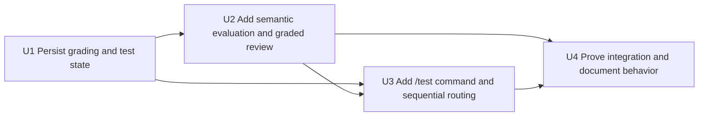

# feat: Add graded five-word vocabulary tests

## Summary

Add a supported Hermes `/test` command that starts a SQLite-backed five-word definition session, evaluates each response semantically, gives correctness-aware feedback, and ends with correct/partial/incorrect totals. Apply the same evaluator to the existing daily review path so every response is judged before the canonical definition is shown, while keeping daily scheduling completion-based rather than grade-based.

---

## Problem Frame

The current review path does not review the learner's response. `ReviewService.complete_review()` accepts any nonblank text, stores it, marks the event answered, and `format_review_completion()` immediately reveals the saved definition and example. The dedicated gateway, fallback tool schema, hook guidance, and bundled skill all preserve or explicitly require this no-grading behavior.

The user also needs an intentional study mode rather than one scheduled prompt: `/test` should ask for five definitions sequentially, preserve progress across restarts, and produce a compact result summary. This is a follow-up to `docs/plans/2026-07-16-001-feat-hermes-vocabulary-agent-plan.md`, not an update to it, because that V1 plan explicitly excluded grading and scores. Keeping a separate plan preserves the original decision record while making the new product direction explicit.

---

## Requirements

- R1. When the configured Telegram root-DM chat ID is present, register `/test` through Hermes Agent 0.18.2's supported plugin slash-command API; do not register a state-mutating command without that deployment prerequisite, patch Hermes core, or attempt to intercept the slash command as free text.
- R2. With at least five saved entries, `/test` atomically creates one active session containing exactly five distinct entries and returns the first `What does '<entry>' mean?` prompt. Reuse the existing deterministic review-priority ordering rather than adding random selection or spaced-repetition logic.
- R3. With fewer than five saved entries, `/test` reports the available count and number still needed and creates no session.
- R4. A duplicate `/test` during an active session is idempotent: it returns the current question and progress instead of replacing the session or selecting another set.
- R5. In the configured Telegram root DM, each non-command response during an active test is evaluated against the current entry, receives feedback, and advances exactly one position only after a valid evaluation is persisted. Five successful evaluations complete the session and return counts for correct, partial, and incorrect responses.
- R6. Semantic evaluation accepts accurate paraphrases. The evaluator emits only `correct`, `partial`, or `incorrect` plus bounded explanatory feedback, compares against every stored sense, and treats a response matching one valid sense as acceptable without requiring the learner to enumerate every sense.
- R7. Per-item feedback identifies the grade before showing the stored canonical definition and example. Multi-sense definitions remain in stored insertion order. Test completion reports category counts rather than inventing fractional scoring.
- R8. Evaluator provider failures, invalid evaluator output, and storage failures do not consume the response, advance the test, reveal the canonical answer, or complete a daily review. The same question remains current and the user receives retry guidance.
- R9. Test session state, ordered questions, raw answers, grades, feedback, and completion survive gateway/plugin restarts in plugin-owned SQLite. Concurrent replies cannot consume the same question twice or skip a position.
- R10. A pending daily review blocks `/test`. Once a test is active, the morning review service returns a silent test-active result and creates no overlapping review event, so all five questions remain uninterrupted and no response can be graded against a word the learner was not shown.
- R11. Daily review responses use the same semantic evaluator and correctness-aware feedback before reveal. Any successfully evaluated nonblank answer still marks the review event answered and updates `last_reviewed`/`review_status` regardless of grade, preserving completion-based scheduling.
- R12. Test answers and grades do not update `last_reviewed`, `review_status`, daily review selection, or spaced-repetition state.
- R13. The model-mediated fallback path outside the dedicated interceptor uses the same evaluated daily-review completion contract; no schema, hook, tool, or skill instruction may continue to say "do not grade."
- R14. Focused unit and integration coverage proves command registration, five-item sequencing, semantic evaluation boundaries, restart recovery, state precedence, concurrency safety, fallback parity, and unchanged daily scheduling semantics.
- R15. Exact `show answer` input during a daily review or test is a deterministic surrender: skip the evaluator, persist `incorrect` with fixed reveal feedback, show the canonical definition/example, and apply the normal completion/advancement effects. Other text, including `answer`, remains an attempted response and is evaluated semantically.

---

## Scope Boundaries

- The supported `/test` continuation surface is the existing configured single-user Telegram root DM. Hermes plugin command handlers receive only raw arguments, so this plan does not add multi-user, per-platform, group, topic, or cross-chat session routing.
- No Hermes core changes. `PluginContext.register_command()` starts the test; the existing `gateway_inbound_intercept` owns subsequent non-command answers.
- No new dictionary provider, authoritative definitions, source citations, or correction/edit UI. Grading compares against the definitions already stored by this package.
- No spaced repetition, difficulty adjustment, streaks, pass/fail thresholds, weighted scores, analytics dashboard, or changes to daily review selection based on grades.
- No `/test restart`, `/test cancel`, or custom command arguments in this iteration. Repeating `/test` resumes the active question.
- No random word selection. The first implementation reuses the existing deterministic review-priority order for five distinct entries.
- No change to capture behavior except routing precedence while a daily review or test response is pending. An active test suppresses that morning's daily event rather than creating an ambiguous overlapping prompt.

### Deferred to Follow-Up Work

- Test cancellation/restart controls and stale-session expiry.
- Grade-aware scheduling or least-recently-tested rotation.
- Multi-user/per-chat test sessions if Hermes later exposes source metadata to plugin command handlers.
- Historical test reports beyond the completion summary returned at the end of the active session.

---

## Context & Research

### Relevant Code and Patterns

- `src/hermes_vocab/review.py` owns SQLite-backed daily review selection and completion. Its short transactions, deterministic ordering, restart recovery, and conditional pending-event updates are the pattern for test-session state.
- `src/hermes_vocab/hermes_plugin/gateway.py` is the post-auth deterministic Telegram router. It currently gives pending review priority, bypasses slash commands, and then performs lookup/capture. Extend its non-command precedence to pending daily review, active test, then capture; do not make it dispatch `/test` itself.
- `src/hermes_vocab/hermes_plugin/__init__.py` is the plugin composition root. It already registers tools, hooks, a skill, an auxiliary definition task, and the inbound interceptor; it should register the supported `/test` plugin command and the answer-evaluation auxiliary task.
- `src/hermes_vocab/hermes_plugin/definition.py` provides the local pattern for a bounded, tool-free auxiliary model call with strict JSON parsing, typed statuses, no retries, and test injection. Mirror that boundary for answer evaluation rather than embedding provider calls in SQLite services or formatters.
- `src/hermes_vocab/formatting.py` owns exact user-facing output. Keep grade labels, canonical reveal ordering, next-question progress, summary totals, and retry copy deterministic here.
- `src/hermes_vocab/hermes_plugin/tools.py`, `src/hermes_vocab/hermes_plugin/schemas.py`, `src/hermes_vocab/hermes_plugin/hooks.py`, and `src/hermes_vocab/hermes_plugin/skills/vocabulary/SKILL.md` implement the model-mediated review fallback and currently codify the no-grading behavior. They require a clean contract cutover.
- `tests/unit/test_review.py`, `tests/unit/test_gateway_routing.py`, `tests/unit/test_definition.py`, `tests/unit/test_formatting.py`, `tests/integration/test_database.py`, and `tests/integration/test_hermes_plugin.py` establish the expected pytest style: temporary SQLite databases, deterministic clocks, injected providers, `asyncio.run()`, direct persistence assertions, exact formatting assertions, and fake Hermes registration contexts.

### Institutional Learnings

- `docs/plans/2026-07-16-001-feat-hermes-vocabulary-agent-plan.md` established SQLite—not Hermes transcripts or memory—as vocabulary authority, required restart-safe review state, and deliberately chose completion-based review without grading. This follow-up retains the storage and scheduling invariants while reversing only the no-grading product decision.
- `docs/superpowers/plans/2026-07-17-deterministic-telegram-vocabulary-routing.md` established the post-auth `gateway_inbound_intercept` path, exact-response routing, and independent Python testability. The interceptor is correct for subsequent answers but intentionally runs only for non-command messages.
- `README.md` documents the current pending-review-first precedence and single configured Telegram DM. The new test session should extend that explicit state ordering, not introduce conversational-memory routing.
- No `docs/solutions/` or `STRATEGY.md` exists in this repository.

### External References

- Hermes Agent plugin documentation: https://hermes-agent.nousresearch.com/docs/developer-guide/plugins
- Hermes Agent 0.18.2 source contract: `PluginContext.register_command()` in `hermes_cli/plugins.py` registers sync or async in-session commands; gateway dispatch awaits handlers and passes only raw argument text.
- Hermes Agent 0.18.2 gateway contract: `GatewayRunner._handle_message()` skips `gateway_inbound_intercept` for slash commands, dispatches plugin commands before ordinary agent turns, and supplies transport metadata only to the later non-command interceptor.

---

## Key Technical Decisions

- **Separate test and daily-review state machines:** Add persisted test sessions/questions rather than overloading `review_events`. A test has five ordered attempts and a summary lifecycle; a daily review remains one scheduled event. Sharing evaluation does not justify conflating their persistence or scheduling effects.
- **One typed evaluator boundary:** Add an async auxiliary-model provider that accepts the learner response plus all stored senses and returns a strictly validated grade and concise feedback. Both daily review and `/test` orchestration use it, preventing dedicated and fallback paths from drifting.
- **Evaluate outside, finalize inside a guarded transaction:** Load an immutable pending event/question snapshot, perform the model call without holding a SQLite transaction, then conditionally persist the result against the same still-pending identifier. This avoids long write locks and prevents stale/concurrent evaluations from advancing state twice.
- **Persist five ordered question rows at session start:** Store the selected entry IDs and positions atomically. Derive the current position from the first unanswered question instead of maintaining a second mutable index that can drift.
- **Single active session:** Enforce at most one active test in SQLite, matching the current single-user deployment and the command handler's lack of source metadata. Duplicate `/test` reads that session and returns its current prompt.
- **No overlapping study prompts:** An already-pending daily review blocks test start. Once a test is active, `ReviewService.daily_review()` returns silently without creating an event; the explicit five-question flow remains uninterrupted and the learner is never asked to answer two active prompts.
- **Completion-based daily scheduling remains invariant:** Persist grade/feedback on the review event for display/audit, but update reviewed timestamps for every successfully evaluated answer, including incorrect answers. Test attempts never update those fields.
- **Fail closed on grading:** Invalid/provider-error evaluations are not converted into `incorrect`. No attempt is persisted and no canonical answer is shown until evaluation succeeds.
- **No strict string matcher:** Exact matching cannot reliably accept paraphrases or multi-sense meanings. The deterministic boundary is the evaluator's typed/validated output, not lexical equality.
- **Explicit reveal is an incorrect attempt:** Exact `show answer` bypasses semantic evaluation but uses the same guarded completion path with a deterministic `incorrect` result. This preserves a learner escape hatch without paying for a model call or pretending the response was semantically judged.

---

## Open Questions

### Resolved During Planning

- **How should `/test` integrate with Hermes?** Use `ctx.register_command("test", ...)` for command entry and the existing inbound interceptor for subsequent answers. Hermes 0.18.2 supports this directly; no core patch or skill-command workaround is needed.
- **What if fewer than five entries exist?** Refuse to start and report the shortfall. A command promising five questions should not silently change its length.
- **What if `/test` is sent twice?** Resume the current session and current question. Silent reset would discard progress and complicate concurrency/restart behavior.
- **How are words selected?** Reuse the current deterministic never-reviewed/least-recently-reviewed ordering and take five distinct entries. Randomness and grade-aware rotation are separate product decisions.
- **How are multiple senses graded?** Supply every stored sense to the evaluator. A response matching a valid sense can be correct; an incomplete but directionally valid response can be partial; feedback then reveals all stored senses in insertion order.
- **What happens when grading fails?** Keep the event/question pending and return retry guidance without revealing the answer.
- **Does a wrong daily answer count as reviewed?** Yes. Grading changes feedback, not the current completion-based schedule.
- **What wins when daily review and test state overlap?** Overlap is prevented transactionally: an existing daily review blocks `/test`, while an active test suppresses creation of that morning's review event until the test is completed.
- **What does `show answer` do?** Treat it as a deliberate surrender, persist `incorrect`, reveal the canonical answer, and advance normally without calling the evaluator. The plain word `answer` remains ordinary answer text.

### Deferred to Implementation

- Tune the evaluator's token bound and exact prompt wording against the installed auxiliary client while preserving one tool-free, temperature-zero request and the strict typed response contract.
- Finalize concise user-facing copy for grade feedback and progress indicators without changing the required order: grade, feedback, canonical definition/example, then next question or final totals.
- Confirm the deployed Hermes checkout still exposes `PluginContext.register_command` and async tool dispatch before rollout; the plan is grounded in the locally installed 0.18.2 source and matching official plugin documentation.

---

## High-Level Technical Design

> *This illustrates the intended approach and is directional guidance for review, not implementation specification. The implementing agent should treat it as context, not code to reproduce.*

```mermaid
stateDiagram-v2
    [*] --> Idle
    Idle --> DailyPending: morning review created
    Idle --> TestActive: /test and at least 5 entries
    Idle --> Idle: /test with fewer than 5 entries

    DailyPending --> EvaluatingDaily: next non-command response
    EvaluatingDaily --> DailyPending: evaluator/storage failure
    EvaluatingDaily --> Idle: grade persisted and review completed

    TestActive --> TestActive: duplicate /test returns current prompt
    TestActive --> EvaluatingTest: next non-command response
    EvaluatingTest --> TestActive: evaluator/storage failure
    EvaluatingTest --> TestActive: attempt 1-4 persisted
    EvaluatingTest --> TestComplete: attempt 5 persisted
    TestComplete --> [*]: summary returned

    TestActive --> TestActive: morning review suppressed; no event created
```

Evaluation flow for either pending item:

1. Read the pending review event or current unanswered test question and its entry/senses from SQLite.
2. Call the answer evaluator with the raw learner response and canonical senses, with no write transaction open.
3. Reject provider errors or invalid output without advancing or revealing.
4. In one guarded transaction, verify that the same item is still pending, store raw answer plus grade/feedback, and apply only that state machine's completion effects. Daily review creation uses the same serialization boundary to observe and suppress itself while a test is active.
5. Format grade-first feedback and canonical reveal. For test positions 1-4, append the next prompt; for position 5, append category totals and mark the session complete.

---

## Implementation Units

### U1. Persist evaluated reviews and five-question test sessions

**Goal:** Extend the domain and SQLite schema with explicit grades plus one restart-safe, concurrency-safe active test state machine.

**Requirements:** R2, R3, R4, R5, R6, R7, R8, R9, R10, R11, R12

**Dependencies:** None

**Files:**
- Create: `src/hermes_vocab/migrations/004_graded_reviews_and_tests.sql`
- Create: `src/hermes_vocab/test_session.py`
- Modify: `src/hermes_vocab/models.py`
- Modify: `src/hermes_vocab/review.py`
- Test: `tests/integration/test_database.py`
- Test: `tests/unit/test_review.py`
- Create/Test: `tests/unit/test_test_session.py`

**Approach:**
- Add a grade enum/result model covering only `correct`, `partial`, and `incorrect`; keep provider/storage statuses separate so operational failure is never represented as learner failure.
- Extend review events with nullable evaluation fields populated only during successful evaluated completion. Preserve existing raw answer and completion timestamps.
- Add test-session and ordered-question persistence. Create the session and all five distinct entry references atomically. Use SQLite `CHECK`/unique constraints for allowed grades and statuses, positions one through five, one position and one entry per session, and a partial uniqueness rule that permits history while enforcing only one active session.
- Keep selection in the pure domain layer and mirror `ReviewService.daily_review()` ordering. Require five valid entries before opening a session.
- Expose pending snapshots that include stable event/question identifiers and entry aggregates, then accept evaluated completion against the expected pending identifier. Guard updates so stale or concurrent completions cannot advance twice.
- Make daily review creation check for an active test inside its transaction and return a typed silent status without inserting a review event. This prevents ambiguous prompts instead of trying to infer which displayed word a later response meant.
- Test attempts record their own answers/grades but never mutate vocabulary review summary fields.

**Execution note:** Add migration and domain characterization tests before changing the existing review completion contract.

**Patterns to follow:**
- `src/hermes_vocab/review.py` for short `BEGIN IMMEDIATE` transactions, deterministic ordering, and restart-safe pending state.
- `src/hermes_vocab/capture.py` for validating complete inputs before writes and returning typed domain outcomes.
- `src/hermes_vocab/migrations/003_entry_terms.sql` and `tests/integration/test_database.py` for append-only migration coverage and preservation checks.

**Test scenarios:**
- Happy path: migrate a v3 database; existing entries, senses, review events, raw answers, timestamps, and status remain intact while the schema advances to v4.
- Migration failure: an injected v4 migration failure rolls back completely, leaving the populated v3 schema, rows, and `user_version` intact with no partial v4 tables or columns.
- Concurrency: two initializers upgrading the same populated v3 database converge on one valid v4 schema without partial objects or stale schema version.
- Constraint enforcement: SQLite rejects invalid grade/session statuses, positions outside one through five, duplicate positions, and duplicate entry IDs within one session.
- Happy path: five eligible entries create one active session with five distinct ordered questions and no review-field mutations.
- Edge case: zero through four entries return an insufficient-library result with available/required counts and create no session rows.
- Edge case: a second start request returns the existing active session/current unanswered question without creating or replacing rows.
- Happy path: evaluated test attempts persist raw answer, grade, feedback, and timestamp; the fifth marks the session complete and category totals are derivable from persisted attempts.
- History: completing one session preserves its five ordered attempts; a later `/test` creates a separate active session rather than reusing, overwriting, or being blocked by completed history.
- Atomicity: a storage failure between the fifth-attempt write and session completion rolls back both changes, leaves question five current, preserves prior totals, and produces no final summary.
- Happy path: evaluated daily review completion persists grade/feedback and still marks the event answered and entry reviewed for correct, partial, and incorrect outcomes.
- Invariant: test attempts of every grade leave `last_reviewed` and `review_status` unchanged.
- Error path: invalid/blank answers or absent evaluation results leave review/test items pending.
- Concurrency: two completions targeting the same test question or daily review event yield one committed transition; no duplicate attempt or skipped position is possible.
- Restart: reopening services mid-test returns the same active session, ordered entries, current question, and prior attempt totals.
- Precedence: an existing daily review blocks test creation; an active test makes the morning review call silent and inserts no event, including under concurrent test-finalization/daily-review calls.

**Verification:**
- SQLite alone can reconstruct the exact pending daily/test state and completed five-item summary after restart.
- Existing daily review ordering and completion-based scheduling remain unchanged when no test is active; an active explicit test suppresses that morning's review event to preserve the five-question interaction.

### U2. Add semantic answer evaluation and make daily review correctness-aware

**Goal:** Introduce one strict auxiliary-model evaluator and route every daily review response through it before persistence or canonical reveal.

**Requirements:** R6, R7, R8, R10, R11, R13, R14, R15

**Dependencies:** U1

**Files:**
- Create: `src/hermes_vocab/hermes_plugin/evaluation.py`
- Modify: `src/hermes_vocab/hermes_plugin/__init__.py`
- Modify: `src/hermes_vocab/hermes_plugin/gateway.py`
- Modify: `src/hermes_vocab/hermes_plugin/tools.py`
- Modify: `src/hermes_vocab/hermes_plugin/schemas.py`
- Modify: `src/hermes_vocab/hermes_plugin/hooks.py`
- Modify: `src/hermes_vocab/hermes_plugin/skills/vocabulary/SKILL.md`
- Modify: `src/hermes_vocab/formatting.py`
- Create/Test: `tests/unit/test_evaluation.py`
- Test: `tests/unit/test_gateway_routing.py`
- Test: `tests/unit/test_formatting.py`
- Test: `tests/integration/test_hermes_plugin.py`

**Approach:**
- Register a dedicated vocabulary answer-evaluation auxiliary task rather than reusing definition-generation prompts/configuration implicitly.
- Mirror `DefinitionProvider`: injected async client, one bounded temperature-zero call, no tools, strict JSON parsing, explicit valid/provider-error/invalid-response statuses, and no retry loop.
- Give the evaluator the learner's raw response plus every stored sense. Require one grade and bounded feedback; reject extra/unrecognized grades and malformed payloads.
- Split review completion into prepare/evaluate/finalize orchestration. Keep the model call outside SQLite transactions and finalize against the expected pending event ID.
- Register the async review tool handler with Hermes's explicit async flag so the dedicated gateway and model-mediated fallback share the same evaluator and finalization contract.
- Replace all hook, schema, and skill instructions that prohibit grading. Tool output remains authoritative and is relayed verbatim after evaluation.
- Format the grade and concise feedback before the canonical definition/example. Keep existing single-sense and multi-sense reveal order.
- Recognize exact `show answer` before evaluator dispatch and finalize it through the same guarded persistence/formatting path as a fixed `incorrect` reveal; do not special-case other text.

**Execution note:** Start with failing evaluator parser/provider tests and a failing daily-review integration case proving arbitrary text is no longer revealed without a grade.

**Patterns to follow:**
- `src/hermes_vocab/hermes_plugin/definition.py` and `tests/unit/test_definition.py` for auxiliary request construction, strict parsing, dependency injection, and provider-failure behavior.
- `src/hermes_vocab/hermes_plugin/tools.py` for JSON tool payloads and storage-error containment.
- `src/hermes_vocab/formatting.py` for deterministic, exact user-facing responses.

**Test scenarios:**
- Happy path: an accurate paraphrase receives `correct` even when it shares no exact phrase with the stored definition.
- Happy path: an incomplete but directionally valid response receives `partial`; an unrelated response receives `incorrect`.
- Multi-sense: a response matching one stored sense is evaluated against the full ordered sense set and can be accepted without requiring every sense.
- Edge case: whitespace-only input is rejected before any provider call or state transition.
- Error path: provider exception, malformed JSON, unknown grade, blank/oversized feedback, or missing fields returns retry guidance and leaves the review pending without canonical reveal.
- Integration: dedicated Telegram review routing performs one evaluator call, persists answer/grade, marks the event answered, and returns grade-first feedback followed by the canonical definition.
- Integration: the async `vocabulary_complete_review` tool path produces the same stored result and formatter output as the dedicated gateway path.
- Explicit reveal: exact `show answer` makes no evaluator call, persists `incorrect` with deterministic feedback, reveals the canonical definition, and completes the daily review; `answer` is sent to the evaluator normally.
- Async bridge: plugin registration marks `vocabulary_complete_review` async, and the consuming Hermes `ToolRegistry.dispatch()` path returns the completed JSON/text payload rather than a coroutine.
- Scheduling invariant: correct, partial, and incorrect daily answers all update reviewed timestamps exactly once; evaluator failure updates none.
- Contract cutover: registered tool schema, hook guidance, bundled skill, and plugin metadata contain no instruction to skip grading.

**Verification:**
- No successful daily-review response reaches `format_review_completion()` without a persisted typed evaluation.
- Dedicated and fallback paths agree on grade, reveal ordering, persistence, and failure behavior.

### U3. Register `/test` and route five sequential evaluated answers

**Goal:** Add the supported command entry point and extend the dedicated Telegram router to own, evaluate, persist, and advance an active five-question session.

**Requirements:** R1, R2, R3, R4, R5, R6, R7, R8, R9, R10, R12, R14, R15

**Dependencies:** U1, U2

**Files:**
- Modify: `src/hermes_vocab/hermes_plugin/__init__.py`
- Modify: `src/hermes_vocab/hermes_plugin/gateway.py`
- Modify: `src/hermes_vocab/hermes_plugin/plugin.yaml`
- Modify: `src/hermes_vocab/formatting.py`
- Test: `tests/unit/test_gateway_routing.py`
- Test: `tests/unit/test_formatting.py`
- Test: `tests/unit/test_test_session.py`
- Test: `tests/integration/test_hermes_plugin.py`

**Approach:**
- Register a parameterless `/test` plugin command only when the configured Telegram root-DM chat ID exists, with a concise Telegram-menu description. The handler starts or resumes the singleton persisted session and returns either insufficient-library guidance, a daily-review conflict, or the current prompt/progress. Hermes exposes the command on other command surfaces and does not pass source metadata to the handler; under the confirmed single-user deployment this is an explicit operational limitation, not a per-surface authorization claim.
- Keep `_is_slash_command()` bypass behavior in the inbound interceptor; Hermes command dispatch owns `/test` before ordinary turns.
- Extend non-command routing precedence to: pending daily review, active test, stored entry lookup, unseen capture. `ReviewService.daily_review()` transactionally suppresses new review events while a test is active, so this router never has two legitimate answer targets.
- For an ordinary answer, evaluate through the shared provider and finalize only against the expected still-pending question. For exact `show answer`, skip provider dispatch and finalize the fixed `incorrect` surrender through the same guard.
- For positions one through four, append the next question and progress. For position five, mark the session complete and append correct/partial/incorrect totals. A later non-command message falls through to normal capture/lookup.
- Preserve the current single configured Telegram DM guard for test-answer interception. Document that Hermes exposes plugin commands globally while this plugin supports continuation only in its configured single-user root DM.

**Execution note:** Add command registration and end-to-end sequence tests before changing the gateway precedence branch.

**Patterns to follow:**
- Hermes 0.18.2 `PluginContext.register_command()` for the start command and the existing `GatewayInterceptResponse` wrapper in `src/hermes_vocab/hermes_plugin/__init__.py` for answer interception.
- `src/hermes_vocab/hermes_plugin/gateway.py` for platform/chat scoping, exact handled responses, and async provider orchestration.
- `tests/integration/test_hermes_plugin.py` fake context for registration assertions and restart-spanning plugin behavior.

**Test scenarios:**
- Registration: plugin discovery exposes `/test` with no argument hint and retains existing tools, hooks, skill, auxiliary tasks, and inbound interceptor.
- Registration boundary: without a configured Telegram root-DM chat ID, the plugin does not register the state-mutating `/test` command; existing tools/hooks/skill behavior remains available.
- Happy path: with five entries, `/test` returns question 1; five non-command answers produce five evaluations in order; positions one through four include the next question; position five returns category totals and completes the session.
- Summary: grades `[correct, partial, incorrect, correct, partial]` produce counts `2 correct`, `2 partial`, `1 incorrect` without fractional scoring.
- Idempotency: repeated `/test` at question 3 returns question 3 and existing progress without a new session or evaluator call.
- Insufficient library: zero through four entries return the shortfall and leave routing/capture state unchanged.
- Precedence: a pending daily review blocks `/test`; while a test is active, morning review creation returns silently and inserts no event, including when the cron call races with the fifth answer.
- Error path: evaluator/provider/storage failure returns retry guidance and leaves the same question current; canonical definitions and next prompt are not emitted.
- Explicit reveal: `show answer` for a test item bypasses the evaluator, records `incorrect`, reveals the canonical answer, advances one position, and contributes to the final incorrect count.
- Concurrency: simultaneous replies for one test question result in one consumed attempt and no skipped question; the stale reply receives a deterministic current-state response.
- Restart: re-registering the plugin mid-session and sending the next answer advances the persisted current question and preserves totals.
- Delivery recovery: after a committed answer but lost outbound response, repeating `/test` returns the persisted current question/progress so the user can resynchronize without submitting the prior answer blindly.
- Routing boundary: non-configured Telegram chats, groups, topics, and non-Telegram messages are not claimed as test answers.
- Completion boundary: the sixth non-command message after a completed test is processed by normal lookup/capture, not appended to the completed session.

**Verification:**
- `/test` runs entirely through supported plugin APIs and produces a complete five-answer interaction without Hermes conversation memory.
- Every state transition remains reconstructible from SQLite and every returned next prompt matches the persisted first unanswered question.

### U4. Prove cross-path behavior and update operating documentation

**Goal:** Lock the user-visible contract across plugin registration, daily review, test sessions, migration, and live Telegram setup; replace obsolete no-grading documentation.

**Requirements:** R1, R7, R8, R10, R11, R12, R13, R14, R15

**Dependencies:** U2, U3

**Files:**
- Modify: `README.md`
- Test: `tests/integration/test_database.py`
- Test: `tests/integration/test_hermes_plugin.py`
- Test: `tests/unit/test_daily_review.py`
- Test: `tests/unit/test_gateway_routing.py`

**Approach:**
- Update architecture and behavior documentation to describe `/test`, semantic grade categories, explicit `show answer` surrender, grade-first reveal, session persistence, test-time daily-review suppression, provider-failure retry behavior, and the fact that grades do not affect ordinary scheduling.
- Replace statements that the product has no grading. Keep the warnings that stored/model-generated definitions are not authoritative and that Hermes transcript storage is non-authoritative but privacy-bearing.
- Add a focused end-to-end integration scenario that starts `/test`, evaluates multiple grades, restarts plugin services, proves the morning job creates no overlapping review, completes the test, and verifies persisted totals plus unchanged review timestamps for test-only entries.
- Extend setup/smoke guidance to confirm `/test` appears in the Telegram command menu and works only with the configured single-user root DM continuation path.

**Patterns to follow:**
- `README.md` architecture-first setup and smoke-check structure.
- `tests/integration/test_hermes_plugin.py` fake Hermes modules/context and real temporary SQLite integration.
- `tests/unit/test_daily_review.py` exact scheduler output and no-agent script smoke coverage.

**Test scenarios:**
- Migration integration: a populated v3 database upgrades, a daily review is graded, and a test session completes without data loss or cross-state mutation.
- Cross-layer flow: plugin registration → `/test` start → evaluated answer → persisted next question → plugin restart → silent morning-review call with no event → test resume → final summary.
- Failure recovery: evaluator failure followed by success consumes one attempt only and never reveals before successful evaluation.
- Daily cron invariant: normal morning prompt text and same-day idempotency remain unchanged when no test is active; an active test returns the documented silent status and creates no review event.
- Documentation consistency: all described precedence, supported surfaces, and no-spaced-repetition boundaries match executable integration behavior.

**Verification:**
- A fresh configured install and an upgraded v3 database can both execute the documented daily-review and `/test` flows end to end.
- No README, plugin schema, skill instruction, or test fixture still describes the old unconditional no-grading behavior.

---

## System-Wide Impact

- **Interaction graph:** `/test` enters through Hermes plugin command dispatch; daily/test answers enter through the post-auth non-command interceptor; non-dedicated daily review uses the async tool fallback. Both answer paths call one evaluator, then separate guarded SQLite finalizers, then deterministic formatters.
- **Error propagation:** Provider/parse failures become retryable evaluation failures; storage failures preserve pending state; formatters never infer a learner grade from an operational error. Hermes/plugin exceptions must not be converted to `incorrect` or reveal the canonical answer.
- **State lifecycle risks:** The model call occurs between a read snapshot and conditional finalization, so concurrent responses can make an evaluation stale. Stable IDs plus guarded updates prevent double advancement; daily review creation checks active-test state inside its own serialized transaction so a second answer target cannot appear mid-test.
- **API surface parity:** Dedicated Telegram and model-mediated daily review completion both change. The `/test` continuation path is intentionally dedicated-DM-only because command handlers lack source metadata.
- **Integration coverage:** Unit tests cannot prove command registration, the real Hermes `ToolRegistry.dispatch()` async bridge, migration preservation/rollback under concurrent initialization, restart recovery, or routing precedence across daily/test state; plugin/database integration and installed-Hermes smoke checks must cover these seams.
- **Unchanged invariants:** SQLite remains authoritative; capture normalization/duplicate handling is unchanged; slash commands other than `/test` remain Hermes-owned; daily prompt scheduling remains one completion-based question per local date when no explicit test is active; test grades do not alter later review selection.

---

## Risks & Dependencies

| Risk | Mitigation |
|---|---|
| Semantic grading may be inconsistent or overconfident. | Use temperature zero, strict three-value output, bounded feedback, all stored senses as context, explicit paraphrase rubric, and canonical reveal after the grade. Document that stored definitions and model grading are not authoritative. |
| The evaluator call fails after the user responds. | Do not persist or advance until a valid evaluation exists; keep the item pending and return retry guidance without revealing. |
| Two replies race while evaluation is outside the transaction. | Finalize against the expected event/question ID with a conditional pending-state update; only one caller advances. |
| `/test` command handlers lack chat/source metadata and Hermes lists plugin commands on multiple surfaces. | Register `/test` only when the configured root-DM prerequisite exists, retain the single-user deployment contract, scope continuation interception to that DM, and document that invoking the globally listed command elsewhere still targets the singleton state. Do not patch Hermes core. |
| A morning daily review runs during an active test. | Check active-test state inside daily review creation and return a typed silent result without inserting an event. Existing pending reviews still block test start, so the two answer states never overlap. |
| Schema migration affects existing review history or fails midway. | Cover populated v1/v2/v3 upgrades, failed-v4 rollback, and concurrent initialization; require SQLite constraints for authoritative grade/session/position/distinct-entry invariants. |
| Async tool conversion changes fallback behavior. | Ground the contract in Hermes 0.18.2 `tools/registry.py` async dispatch and smoke the consuming `ToolRegistry.dispatch()` boundary, not only the vocabulary package's fake registration context. |
| `show answer` is sent through semantic grading or treated as correct prose. | Detect only the exact normalized reveal phrase, skip the model call, and persist a deterministic `incorrect` result through the normal guarded completion path; all other text remains evaluator input. |
| A test answer commits but Telegram does not deliver the feedback/next prompt. | Hermes exposes no post-delivery acknowledgement to the plugin, so exactly-once presentation is unavailable. Persisted state remains authoritative; document `/test` as the resynchronization action that returns the current question/progress before the learner retries an answer. |
| Exact formatter changes break established Telegram output. | Preserve canonical single/multi-sense blocks and add grade/progress sections around them with exact-string tests. |

---

## Documentation / Operational Notes

- Add `/test` to the Telegram smoke flow after at least five entries exist; verify the command menu entry, five sequential prompts, `show answer` surrender, grade-first feedback, restart resume, silent morning-review behavior during an active test, and final category totals.
- Configure the new answer-evaluation auxiliary task alongside the existing definition task. Document the provider-error behavior and that one evaluator request occurs per successfully processed response.
- Explain that `/test` is exposed by Hermes wherever plugin commands are listed, but continuation is supported only in the configured Telegram root DM under the current single-user contract. If a feedback/next-prompt response appears lost, send `/test` to resynchronize with the persisted current question before answering again.
- Preserve backup guidance for SQLite WAL/SHM files; the new test and grade tables are part of the same authoritative database and backup boundary.

---

## Sources & References

- Related V1 plan: `docs/plans/2026-07-16-001-feat-hermes-vocabulary-agent-plan.md`
- Related routing plan: `docs/superpowers/plans/2026-07-17-deterministic-telegram-vocabulary-routing.md`
- Current review service: `src/hermes_vocab/review.py`
- Current dedicated router: `src/hermes_vocab/hermes_plugin/gateway.py`
- Current evaluator pattern: `src/hermes_vocab/hermes_plugin/definition.py`
- Current review fallback contracts: `src/hermes_vocab/hermes_plugin/tools.py`, `src/hermes_vocab/hermes_plugin/schemas.py`, `src/hermes_vocab/hermes_plugin/hooks.py`, `src/hermes_vocab/hermes_plugin/skills/vocabulary/SKILL.md`
- Hermes Agent plugin documentation: https://hermes-agent.nousresearch.com/docs/developer-guide/plugins
- Hermes Agent async tool-dispatch contract: `ToolRegistry.dispatch()` in `tools/registry.py` detects async handlers and bridges them before normalizing tool output.
- Hermes Agent source prerequisite verified at commit `4a29612c51f7d9cf0de95a59e6130afbbca90bc7`: https://github.com/NousResearch/hermes-agent/tree/4a29612c51f7d9cf0de95a59e6130afbbca90bc7
