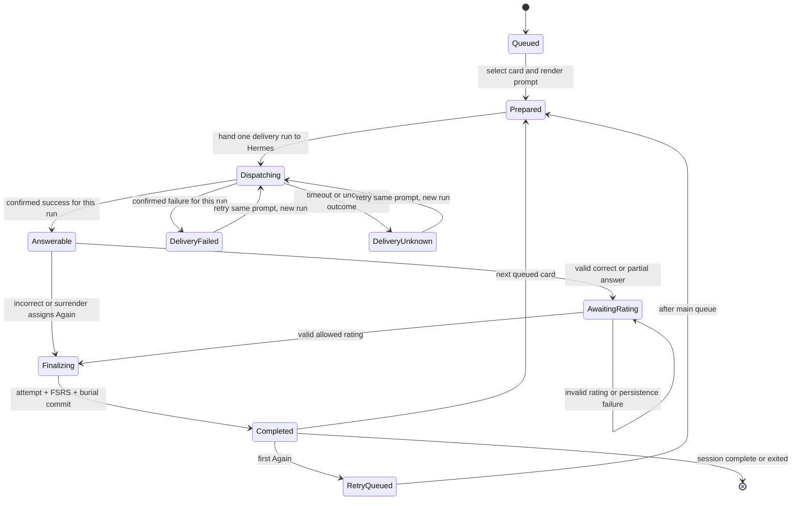
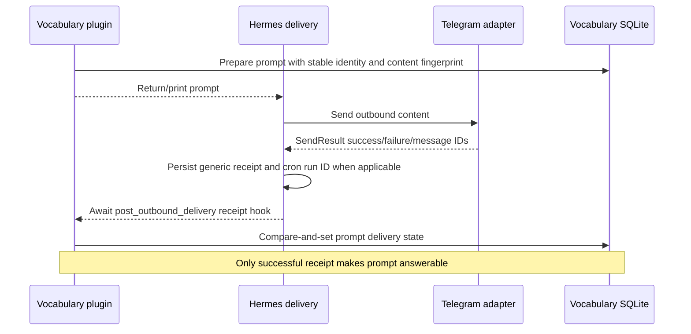
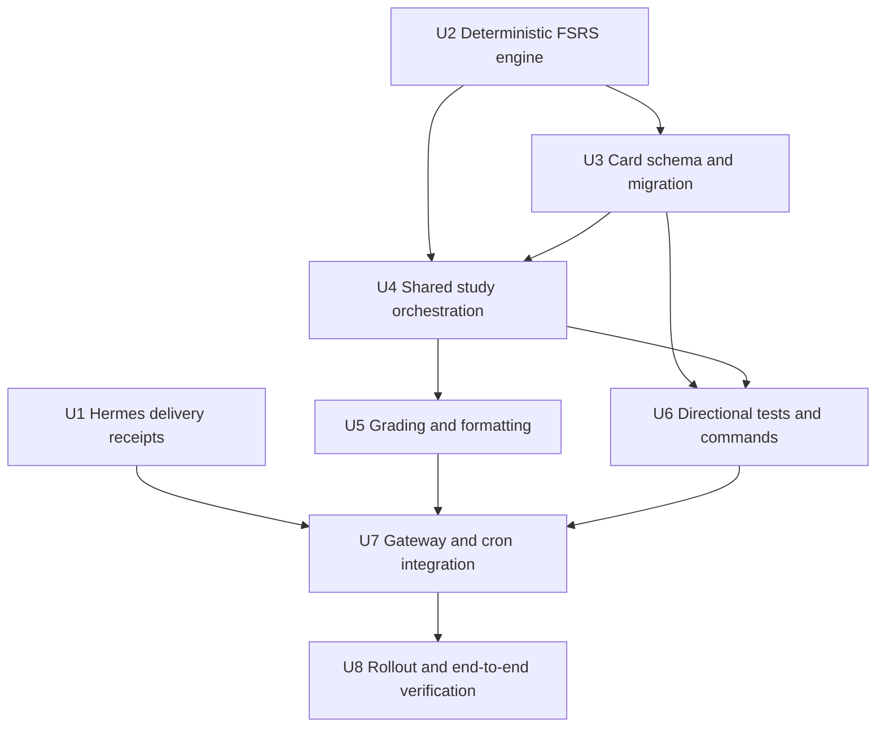
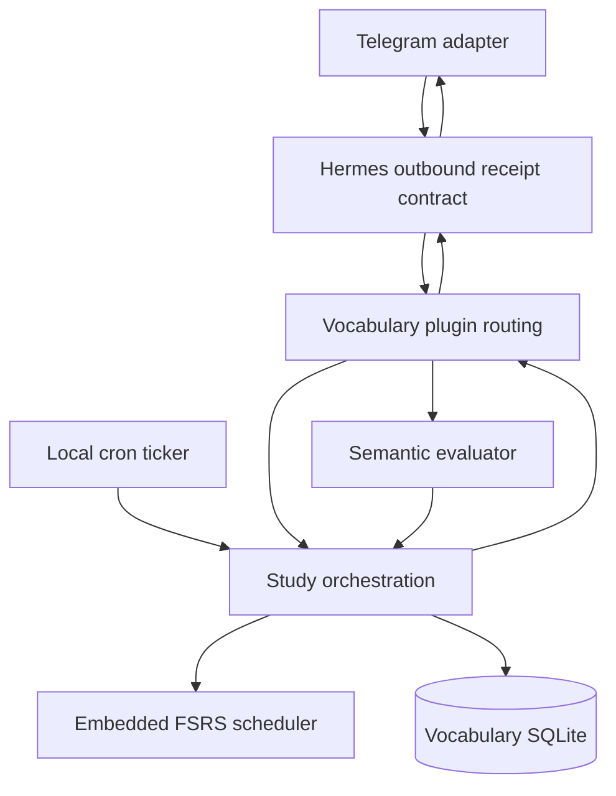

# feat: Add reliable spaced vocabulary review

## Summary

Replace entry-level completion rotation with project-owned directional cards, an embedded deterministic FSRS-6 scheduler, and persisted review/test sessions. Add a generic Hermes outbound-delivery receipt hook so the vocabulary plugin makes a prompt answerable only after confirmed Telegram delivery, while preserving local-only operation and plain-text answers.

---

## Problem Frame

The current cron script commits a pending review before Hermes attempts Telegram delivery. A failed send therefore leaves hidden state that can grade the learner's next vocabulary message, while correct, partial, and incorrect completions otherwise schedule identically. Five-word tests rotate by prior exposure rather than memory strength and cover only word-to-definition recall (see origin: `docs/brainstorms/2026-07-17-reliable-spaced-vocabulary-review-requirements.md`).

---

## Requirements

- R1. Keep all runtime and authoritative learning state local; calculate overdue work from real elapsed time after startup.
- R2. Persist prompt preparation, delivery outcome, answerability, answer/evaluation, rating, and completion as distinct monotonic states.
- R3. Consume plain non-command text only for a prompt with a confirmed successful outbound receipt; failed or unknown delivery remains capture-safe and retryable.
- R4. When due work interrupts ordinary capture, echo the untouched message, show the due prompt, and require resubmission after review or exit.
- R5. Support one resumable mixed `/review` session with sequential current/total progress, uncapped due work, and idempotent restart/exit behavior.
- R6. Create one forward card per entry and one independently scheduled reverse card per stored sense.
- R7. Schedule with deterministic embedded FSRS-6, 90% desired retention, actual UTC answer times, no fuzzing, and no optimizer.
- R8. Add up to five unseen eligible cards per configured local day even when overdue work exists; due work remains first and uncapped.
- R9. For bounded selection after all due work is included, prioritize weakest previously seen eligible cards before unseen cards within the shared quota; use stable insertion chronology only as the final tie-breaker.
- R10. Bury every sibling card for the same entry through the current local day after an answer, without changing sibling due times.
- R11. Forward grading maps incorrect/surrender to Again, partial to a learner choice of Again/Hard, and correct to Hard/Good/Easy after corrective reveal.
- R12. Reverse grading shows one definition and uses deterministic normalized equality against the complete saved entry; it never invokes the semantic evaluator.
- R13. Evaluation, delivery-receipt, or persistence failure must not duplicate an attempt, advance a session, or change scheduling.
- R14. Support `/test forward`, `/test reverse`, and explanatory bare `/test`; each test uses five cards from five distinct eligible entries.
- R15. Test answers update FSRS at their actual time, including early reviews, using due then weak then unseen selection.
- R16. A directional test with fewer than five distinct eligible entries reports the exact shortfall and creates no session; active study modes cannot overlap.
- R17. Persist attempt source, direction/sense, submitted answer, evaluator result, final rating, actual timestamp, and before/after schedule state.
- R18. Preserve legacy events as audit evidence; replay valid forward grades in timestamp order as correct→Good and partial/incorrect→Again; treat ungraded events as audit-only and initialize reverse cards unseen.
- R19. Correlate every delivery receipt with a stable prompt identity instead of trusting only Hermes's latest cron status.
- R20. Requeue an Again card once after the main session queue; a second same-session Again moves it to the next local day without minute-level prompts.

**Origin actors:** A1 (learner), A2 (vocabulary companion), A3 (Hermes/Telegram delivery path)

**Origin flows:** F1 (reliable local catch-up), F2 (mixed scheduled review), F3 (directional five-question test), F4 (due review encountered during normal capture)

**Origin acceptance examples:** AE1-A12 in `docs/brainstorms/2026-07-17-reliable-spaced-vocabulary-review-requirements.md`

---

## Scope Boundaries

- The computer remains the sole runtime and authoritative data location; the feature does not operate while it is off.
- Always-on hosting, remote databases, synchronization, and cloud deployment remain excluded.
- No generated synonyms, typo tolerance, multiple-choice prompts, new hint levels, or unrelated vocabulary commands.
- No minute-level FSRS learning/relearning notifications; Again receives one end-of-queue retry and then a next-local-day floor.
- No FSRS optimizer or runtime dependency; sparse history uses a pinned default FSRS-6 parameter vector.
- Hermes changes are limited to a generic outbound receipt contract and its persistence/invocation paths; vocabulary state and policy must not enter Hermes core.
- Legacy review/test tables remain preserved for audit and migration provenance but cease to be scheduling authority after cutover.

### Deferred to Follow-Up Work

- Personalized FSRS parameter optimization: revisit only after several hundred trustworthy rated reviews exist.
- Upstreaming the generic Hermes receipt hook: carry the local companion change first, then propose it upstream independently without blocking local correctness.

---

## Context & Research

### Relevant Code and Patterns

- `src/hermes_vocab/database.py` applies sequential SQL migrations inside `BEGIN IMMEDIATE`, validates foreign keys, and rolls back the version and schema together.
- `src/hermes_vocab/review.py` and `src/hermes_vocab/test_session.py` use guarded state transitions and conditional writes to make concurrent completions stale rather than duplicated.
- `src/hermes_vocab/hermes_plugin/gateway.py` already owns deterministic root-DM precedence before model work; this remains the only plain-text study continuation surface.
- `src/hermes_vocab/hermes_plugin/evaluation.py` provides strict structured semantic grades and already leaves state unchanged on invalid/provider output.
- `src/hermes_vocab/formatting.py` owns exact user-facing prompt, feedback, reveal, and progress text.
- `scripts/daily_review.py` is a thin no-agent cron producer; it currently cannot observe delivery.
- Hermes Agent 0.18.2 `gateway/platforms/base.py::SendResult` already carries success, error, and message IDs; `gateway/delivery.py` and `cron/scheduler.py` currently discard successful receipt detail before plugins can observe it.
- Hermes Agent 0.18.2 `hermes_cli/plugins.py::VALID_HOOKS` has inbound and lifecycle hooks but no outbound-delivery hook.
- Existing focused doubles and transaction tests live in `tests/unit/test_gateway_routing.py`, `tests/unit/test_evaluation.py`, `tests/unit/test_review.py`, `tests/unit/test_test_session.py`, `tests/unit/test_daily_review.py`, and `tests/integration/test_database.py`.

### Institutional Learnings

- No `docs/solutions/` or `STRATEGY.md` artifact exists in this repository. The current README and the graded-test/deterministic-routing plans are the local architecture record.
- Preserve the established boundary: core domain modules have no Hermes or Telegram import; only `hermes_plugin/` and the cron wrapper depend on Hermes integration behavior.
- Preserve the established transaction posture: prepare external work outside the write transaction where possible, then perform compare-and-set persistence inside a short `BEGIN IMMEDIATE` transaction.

### External References

- py-fsrs 6.3.1 scheduler and state contracts: https://github.com/open-spaced-repetition/py-fsrs/tree/6.3.1
- FSRS algorithm overview and FSRS-6 memory model: https://github.com/open-spaced-repetition/awesome-fsrs/wiki/The-Algorithm
- Anki FSRS retention, rating, and optimizer guidance: https://docs.ankiweb.net/deck-options.html#fsrs
- Anki answer-button semantics: https://docs.ankiweb.net/studying.html#answer-buttons
- Anki reverse-card and sibling-burying behavior: https://docs.ankiweb.net/templates/generation.html and https://docs.ankiweb.net/studying.html#siblings-and-burying

---

## Key Technical Decisions

| Decision | Implementation consequence | Rationale |
|---|---|---|
| Add one generic Hermes `post_outbound_delivery` receipt contract | Hermes emits one awaited receipt per destination/run/prompt for gateway and cron sends; optional structured plugin responses carry an opaque outbound correlation ID, while legacy string responses remain supported | Exact answerability cannot be inferred from pre-send state, prompt text, or latest job error; an opaque identity prevents equal text and stale receipts from crossing prompt boundaries |
| Give cron runs durable correlation IDs | Hermes passes a run ID to no-agent scripts and persists it with the receipt; the script records the same run ID on its prepared prompt, and the delivered-content fingerprint is only an integrity check | One prompt per run plus an exact run ID prevents a later silent or successful run from overwriting another prompt's outcome, including when Hermes transforms cron output |
| Embed an original, attributed FSRS-6 implementation | Add a small internal scheduler with pinned default parameters, 90% retention, no fuzzing, no optimizer, and golden vectors | Repository policy prohibits new dependencies without explicit request; py-fsrs otherwise adds a runtime dependency and its optimizer is unsuitable for sparse history |
| Persist scalar project-owned schedule state | Cards retain state, stability, difficulty, due/last-review instants, counts, and scheduler metadata; attempts retain before/after snapshots | Avoid package-object serialization lock-in and make every next due time explainable |
| Persist a two-phase answer/rating state | Evaluation writes an immutable answer draft; only a valid final rating atomically creates the attempt, advances FSRS/session state, and buries siblings | Prevent double evaluation, restart loss, or scheduling before learner effort is known |
| Use one shared study queue model | Review and both test directions share card eligibility, prompt/delivery, answer/rating, retry, quota, and burial rules; mode controls selection bounds and formatting | One state machine prevents the current daily-review/test paths from drifting |
| Count unseen introduction when first queued | A card receives a local introduction date when admitted to a session, not when eventually answered | Abandoned/restarted sessions cannot repeatedly bypass the shared five-card quota |
| Preserve but retire legacy scheduling fields | Existing rows remain queryable for audit; new services read/write only card/session/attempt state after migration | Clean cutover without destroying historical evidence or maintaining two schedulers |

---

## Open Questions

### Resolved During Planning

- **FSRS package or embedded implementation?** Embed deterministic FSRS-6 because the project has no runtime dependencies and no new dependency was requested. Keep equations/parameter provenance documented and protected by upstream golden vectors.
- **How does the plugin know a prompt was delivered?** Add a generic awaited Hermes receipt hook. Interactive structured responses carry an opaque outbound prompt ID; cron correlates by durable run ID. Content fingerprints validate the post-transform payload but are never the primary identity, and prompt preparation or mutable latest-status fields never imply delivery.
- **How are failed cards relearned?** Requeue once behind the main session queue; a second Again receives a next-local-day due floor and cannot loop again that session.
- **Do new cards pause during backlog?** No. Every local day may admit up to five unseen cards after all eligible due cards, intentionally allowing missed-day backlog growth.
- **Do non-due seen cards enter ordinary `/review`?** No. R8 and AE3 define `/review` as all currently due work plus the day's unseen introductions. Weakest-seen ranking applies when a bounded mode such as `/test` must fill remaining slots; it does not turn daily review into early review of the entire library.
- **How are active legacy states migrated?** Pending daily events become audit-only and non-answerable; an active forward test is reconstructed as an interrupted forward study session over its original five entries, with completed graded questions replayed and the remaining question requiring fresh confirmed delivery.

### Deferred to Implementation

- Exact SQL table/index names and final method decomposition: preserve the state and uniqueness contracts below; choose the smallest names that fit existing conventions.
- Exact generic receipt and optional structured-response type locations inside Hermes: keep them in a dependency-neutral module that gateway delivery, command dispatch, intercept dispatch, cron, and plugin callbacks can import without cycles.
- Exact formatting copy for progress, retry, and migration-resume notices: preserve origin behavior and formatter ownership; settle wording against focused exact-output tests.

---

## High-Level Technical Design

> *This illustrates the intended approach and is directional guidance for review, not implementation specification. The implementing agent should treat it as context, not code to reproduce.*

### Prompt and scheduling lifecycle

### Cross-repository receipt flow

---

## Implementation Units

### U1. Expose generic Hermes outbound delivery receipts

**Goal:** Extend Hermes Agent 0.18.2 with one generic, awaited outbound receipt contract that preserves adapter success/failure/unknown outcomes, message IDs, destination, content fingerprint, and cron run identity without importing vocabulary concepts.

**Requirements:** R2, R3, R13, R19; F1; AE1

**Dependencies:** None

**Target repo:** `hermes-agent`

**Files:**
- Modify: `hermes_cli/plugins.py`
- Modify: `gateway/platforms/base.py`
- Modify: `gateway/delivery.py`
- Modify: `gateway/run.py`
- Modify: `cron/scheduler.py`
- Modify: `cron/jobs.py`
- Modify: `website/docs/developer-guide/plugins/index.md`
- Test: `tests/cron/test_run_one_job.py`
- Test: `tests/cron/test_scheduler.py`
- Test: `tests/cron/test_jobs.py`
- Test: `tests/gateway/test_delivery.py`
- Test: `tests/plugins/test_plugins.py`
- Test: `tests/plugins/platforms/telegram/test_adapter.py`

**Approach:**
- Add a transport-neutral outbound receipt value and a `post_outbound_delivery` valid hook. Emit one receipt per destination/run/prompt; aggregate only chunks for that destination, and report success only when every required chunk succeeds. The receipt must distinguish `success`, `failure`, and `unknown`, retain destination and message IDs, carry an opaque outbound correlation ID or cron run ID, and include a post-transform delivered-content fingerprint only as integrity evidence.
- Extend plugin command dispatch with authenticated platform/chat/thread source context and an optional structured outbound response carrying the opaque correlation ID; extend gateway intercept responses equivalently. Preserve existing raw-argument/string handlers as backward-compatible behavior, but do not allow them to create destination-bound answerable study state.
- Invoke the hook exactly once from the delivery owner after an adapter or standalone sender resolves. Await callbacks before completing normal outbound dispatch so plugin state is updated before a subsequent inbound message can be routed; enforce a bounded hook deadline, and contain callback failure/timeout so the consumer remains unknown without changing transport success.
- Generate a unique run ID before a no-agent cron script starts, expose it to that process through a documented environment variable, and persist the same ID and structured per-destination receipt in job history while retaining backward-compatible `last_delivery_error` behavior.
- Make the timeout owner emit the run's single `unknown` receipt. If the underlying coroutine cannot be cancelled, any later adapter result is diagnostic only and must not emit another hook or promote the prompt; a later retry uses the same prompt identity with a new delivery run.
- Keep content fingerprints out of identity decisions. Cron fingerprints the final post-wrapper/filter text, and this vocabulary job explicitly disables generic cron response wrapping so the delivered prompt remains the intended one-question copy.

**Execution note:** Start with characterization tests for current delivery-result collapsing, timeout behavior, and cron mark ordering before changing the public plugin hook surface.

**Patterns to follow:**
- `hermes_cli/plugins.py` hook validation/invocation and async callback handling.
- `gateway/delivery.py::DeliveryRouter` per-target result aggregation.
- `gateway/platforms/base.py::SendResult` success/error/message-ID contract.
- `cron/scheduler.py::run_one_job` execute → save → deliver → mark ordering.

**Test scenarios:**
- Happy path: a live Telegram `SendResult(success=True, message_id=...)` produces one successful receipt for that destination/prompt with its opaque correlation ID, post-transform fingerprint, and all chunk IDs.
- Happy path: a standalone sender success produces the same per-destination receipt shape as the live adapter path.
- Error path: adapter failure and standalone fallback failure produce one failed receipt and preserve `last_delivery_error`.
- Edge case: a live-adapter timeout emits one `unknown`; a late success after an uncancellable timeout is diagnostic only, emits no second hook, and cannot unlock the prompt.
- Edge case: two delivery targets produce independent receipts; success for one cannot unlock another, and one failed chunk makes that destination's aggregate receipt fail.
- Error path: a receipt-hook exception is contained, is observable in logs, and cannot rewrite the transport result.
- Error path: a hung receipt callback reaches its bounded deadline, is logged, leaves consumer state unknown, and cannot wedge outbound dispatch indefinitely.
- Integration: a no-agent script receives a run ID, and the same ID appears in the persisted cron receipt before the run is considered complete.
- Source compatibility: authenticated command context reaches structured handlers, while existing plugins with string handlers or no receipt hook and existing cron-job readers continue unchanged.

**Verification:**
- Every gateway and cron Telegram send exposes exactly one terminal or unknown receipt, and a plugin can await it without vocabulary-specific Hermes code.

### U2. Implement deterministic embedded FSRS-6 scheduling

**Goal:** Add a dependency-free scheduling engine that calculates memory state, retrievability, and due times from actual UTC review instants with pinned FSRS-6 parameters and product-specific end-of-session relearning.

**Requirements:** R7, R9, R17, R20; AE10, AE11, AE12

**Dependencies:** None

**Target repo:** `hermes-vocab`

**Files:**
- Create: `src/hermes_vocab/scheduling.py`
- Modify: `src/hermes_vocab/models.py`
- Test: `tests/unit/test_scheduling.py`

**Approach:**
- Implement the published FSRS-6 equations independently, attribute the algorithm/parameter source in the module, and pin an implementation version plus default parameter vector.
- Model Again/Hard/Good/Easy, new/review/relearning state, stability, difficulty, due time, last review, repetitions, and lapses as immutable project domain values.
- Require timezone-aware UTC scheduling instants. Keep local-day quota, burial, and next-day failure floors outside the mathematical scheduler.
- Set desired retention to 0.90, disable interval fuzzing, impose a conservative maximum interval, and omit parameter optimization.
- Expose deterministic transition and retrievability operations over scalar state; return before/after snapshots for persistence rather than mutating database rows.
- Adapt short-term learning deliberately: the first Again yields an FSRS transition and a same-session retry marker; a second Again in that session applies the transition but floors due time to the next configured local day. Do not create one- or ten-minute timers.

**Execution note:** Implement from golden vectors first, then add product adaptation tests. Do not copy package source verbatim; preserve equation and parameter provenance.

**Patterns to follow:**
- Immutable enums/dataclasses in `src/hermes_vocab/models.py`.
- Injected clocks already used by `ReviewService` and `TestSessionService` tests.

**Test scenarios:**
- Golden contract: first Again/Hard/Good/Easy transitions match pinned FSRS-6 reference vectors with no random interval variance.
- Happy path: actual overdue UTC time changes retrievability and next state relative to an on-time review.
- Edge case: an early same-day test uses zero elapsed days safely and produces a deterministic transition.
- Error path: naive or non-UTC scheduling timestamps are rejected without state mutation.
- Happy path: a first Again marks one same-session retry; a second Again floors due to the next local day and cannot request another retry.
- Edge case: scheduler metadata/version and all scalar before/after values round-trip without package object serialization.

**Verification:**
- The scheduler is deterministic, dependency-free, compatible with Python 3.11-3.13, and protected by reference and adaptation vectors.

### U3. Migrate legacy state to directional cards and auditable study records

**Goal:** Introduce the card/session/prompt/delivery/attempt persistence model and atomically backfill existing entries, senses, graded history, and active legacy state without creating an answerable hidden prompt.

**Requirements:** R2, R6-R8, R10, R17-R19; AE4, AE9, AE10

**Dependencies:** U2

**Target repo:** `hermes-vocab`

**Files:**
- Create: `src/hermes_vocab/migrations/005_spaced_review_cards.sql`
- Create: `src/hermes_vocab/migrations/v005_backfill.py`
- Modify: `src/hermes_vocab/migrations/__init__.py`
- Modify: `src/hermes_vocab/database.py`
- Modify: `src/hermes_vocab/models.py`
- Test: `tests/integration/test_database.py`

**Approach:**
- Extend the migration runner with a version-bound Python backfill callback executed inside the same `BEGIN IMMEDIATE` transaction as the SQL migration and before `user_version` commit/foreign-key validation.
- Add project-owned directional cards, study sessions/queued questions, stable prompts, delivery receipts/attempts, answer drafts, final attempts with raw scheduler and effective due snapshots, durable retry-occurrence identity, and same-local-day burial/introduction state. Enforce one forward card per entry, one reverse card per sense, one active study mode, one active prompt, one final attempt per prompt/rating transition, and monotonic delivery/prompt states through constraints and guarded writes.
- Treat `vocabulary_entries.last_reviewed` and `review_status`, `review_events`, `test_sessions`, and `test_questions` as preserved legacy/audit data after migration; no new scheduler code reads them for selection.
- Create all cards. Replay each answered, graded forward row exactly once when it has a non-null UTC `answered_at`, ordered by `answered_at`, source, then legacy ID, using correct→Good and partial/incorrect→Again. Use a scheduler-only backfill path: write migration attempts and card schedule state without prompts, queue advancement, introduction, burial, or tail-retry side effects. Enforce migration provenance uniqueness on legacy source plus row ID. Keep ungraded answered, missed, and pending records audit-only.
- Convert every legacy pending daily event into due/non-answerable card state with no prepared prompt.
- Reconstruct one active legacy test as an interrupted forward study session over its original distinct entries by referencing the already migrated attempts for completed questions rather than replaying them again; preserve original progress, mark every queued unseen card introduced on the configured local day of the original `test_sessions.started_at`, and prepare no answerable next prompt until fresh delivery.
- Initialize every reverse-sense card unseen with no fabricated attempt; introduction is governed by the shared quota after cutover.
- Persist scheduler kind/version, parameter vector fingerprint, desired retention, migration provenance, and both raw and product-adjusted after-state where a due floor applies.

**Execution note:** Build populated v4 fixtures and failure-injection tests before adding the migration; migration correctness is the cutover gate.

**Patterns to follow:**
- Sequential migrations and rollback tests in `src/hermes_vocab/database.py` and `tests/integration/test_database.py`.
- v2/v3 table-rebuild and foreign-key validation patterns.

**Test scenarios:**
- Covers AE10. A v4 entry with three senses yields one forward and three independent reverse cards.
- Covers AE9. Interleaved correct, partial, incorrect, and ungraded review/test rows preserve audit data; only rows with a valid grade and UTC `answered_at` replay once in stable `answered_at`/source/ID order. Historical Again creates schedule evidence but no active retry, burial, introduction, or answerable prompt.
- Safety: pending/missed legacy daily rows create no delivered or answerable prompt.
- Restart: a partially answered active legacy test references its already replayed completed attempts exactly once, becomes one interrupted forward session, and creates no hidden continuation.
- Quota: unseen cards queued by an active legacy test receive introduction records on its original configured local day; migration and exit/restart cannot admit them twice for that day.
- Constraint: duplicate directional cards, retry occurrences, final attempts, active modes, or active prompts are rejected.
- Error path: injected schema or Python-backfill failure rolls back tables, replay, and `user_version`; retry produces the same final state once.
- Concurrency: two initializers cannot run the backfill twice or produce duplicate cards/attempts.
- Integrity: foreign-key checks and private SQLite/WAL behavior remain unchanged.

**Verification:**
- Any supported v1-v4 database reaches the new version transactionally with deterministic card state, preserved history, and zero answerable legacy prompts.

### U4. Build shared review selection and persisted study orchestration

**Goal:** Replace daily entry selection with one card-level service that owns mixed review queues, due/weak/new eligibility, local-day quota/burial, prompt states, exit/resume, and one end-of-queue retry.

**Requirements:** R1-R10, R13, R17, R20; F1, F2, F4; AE2-A4, AE10-A12

**Dependencies:** U2, U3

**Target repo:** `hermes-vocab`

**Files:**
- Modify: `src/hermes_vocab/review.py`
- Modify: `src/hermes_vocab/models.py`
- Modify: `src/hermes_vocab/config.py`
- Test: `tests/unit/test_review.py`

**Approach:**
- Make `ReviewService` the transport-agnostic study orchestrator over cards, queues, prompts, and final attempts; it accepts delivery receipts but imports no Hermes or Telegram code.
- Add an explicit mixed `/review` session. On start, snapshot all currently due eligible cards in overdue order and admit up to the remaining five unseen cards after them. Seen non-due cards are not ordinary `/review` work; the shared bounded selector uses them by weakness to fill tests.
- Persist queue membership/order and one current prompt identity so duplicate commands and same-day restarts resume rather than reselect. Exiting closes the session but leaves unanswered cards' due times unchanged.
- At the first service action after the configured local date changes, preserve any current answerable or awaiting-rating prompt, then atomically reconcile the remaining queue: retain unanswered prior introductions, insert every newly due eligible card ahead of non-due queued cards, and append up to that new day's remaining unseen quota. Record the reconciliation date so duplicate cron/command calls cannot append twice.
- Centralize eligibility: exclude cards buried for the configured local day, apply optional direction and distinct-entry filters, order due cards by overdue amount then retrievability, order seen non-due cards by retrievability for bounded selection, and use entry/card chronology only for stable final ties.
- Mark unseen introduction when first queued so abandoning/restarting cannot exceed five introductions across review and test modes that local day. Continue admitting up to five new cards even when an overdue backlog exists.
- On final attempt commit, atomically write the audit snapshot, raw FSRS after-state, effective product-adjusted due state, update only that card, record entry burial through local midnight, advance the queue, and append one durably identified retry occurrence at the tail for the first Again. A retry Again cannot append again; it persists the second attempt's retry identity and a next-local-day effective due floor separately from the raw scheduler transition.
- Expose explicit queries for answerable prompt, due-but-not-answerable work, active mode, awaiting-rating state, and current progress; remove routing decisions based on legacy pending events.

**Execution note:** Start with desired state-transition and concurrency tests; preserve short `BEGIN IMMEDIATE` compare-and-set transactions.

**Patterns to follow:**
- Guarded event/question completion in current `ReviewService.complete_review()` and `TestSessionService.complete()`.
- Configured IANA timezone handling in `src/hermes_vocab/config.py`.

**Test scenarios:**
- Covers AE3. Eight overdue plus five eligible unseen cards form a due-first 13-card sequential queue; exit/resume retains unanswered cards and current order.
- Local-day rollover: keep an in-flight answer/rating prompt pinned; otherwise reconcile once so newly due cards precede retained non-due introductions, then append at most five newly introduced cards for the new day. Concurrent cron and `/review` calls cannot reconcile twice.
- Covers AE11. In bounded test selection, a weaker newer seen card ranks ahead of an older stronger seen card; due always ranks ahead of non-due.
- Covers AE4. Completing one card buries all same-entry siblings until local midnight without changing their due times; overdue siblings reappear next local day.
- Quota: review and test admission share exactly five first introductions per configured local day, including across UTC midnight.
- Retry: first Again appends one tail occurrence; second Again does not loop and is due next local day.
- Restart: duplicate `/review`, process restart, and exit/restart preserve one current prompt and no duplicate queue rows.
- Retry restart/concurrency: two Agains around a restart create one tail occurrence, two uniquely identified attempts, no duplicate retry row, and an explainable raw FSRS versus next-local-day effective due snapshot.
- Concurrency: two session starts or two finalizations produce one active session, one final attempt, one schedule update, and one burial.
- Failure: attempt/schedule persistence failure leaves answer/rating state retryable and the queue unadvanced.

**Verification:**
- One domain service can deterministically explain every eligible card, queue position, skipped sibling, introduction count, retry, and next due time without legacy scheduling fields.

### U5. Separate correctness evaluation, rating collection, and user-facing feedback

**Goal:** Implement forward semantic and reverse exact answer paths as restart-safe answer drafts, then finalize only allowed ratings with grade-first corrective feedback and exact progress/retry formatting.

**Requirements:** R11-R13, R17, R20; AE5, AE6, AE12

**Dependencies:** U4

**Target repo:** `hermes-vocab`

**Files:**
- Modify: `src/hermes_vocab/hermes_plugin/evaluation.py`
- Modify: `src/hermes_vocab/formatting.py`
- Modify: `src/hermes_vocab/models.py`
- Test: `tests/unit/test_evaluation.py`
- Test: `tests/unit/test_formatting.py`

**Approach:**
- Keep the existing strict one-call forward evaluator and all-sense rubric. Persist its answer/evaluation exactly once as an immutable draft before asking for learner effort.
- Normalize reverse responses with casefolding, leading/trailing and repeated internal whitespace collapse, and harmless terminal punctuation removal. Compare against the full saved entry; reject typos, synonyms, and other entries; do not call the evaluator.
- Auto-finalize Again only for incorrect answers and exact `show answer` surrender. Partial drafts accept only Again/Hard; correct drafts accept only Hard/Good/Easy.
- While awaiting rating, parse deterministic case/whitespace-normalized tokens in state context. Invalid text reprints allowed choices and never reaches capture or evaluation. Restart restores the same draft and choices.
- Emit grade/feedback and canonical reveal before rating choices, then after finalization emit schedule/progress and the next prepared prompt. Reverse prompts contain one stored definition and no example sentence that can reveal the term.
- Keep formatter functions pure; orchestration supplies snapshots and allowed actions.

**Execution note:** Lock exact output and provider-call-count behavior before modifying orchestration.

**Patterns to follow:**
- Strict JSON parser/provider error behavior in `src/hermes_vocab/hermes_plugin/evaluation.py`.
- Exact reveal and prompt formatting tests in `tests/unit/test_formatting.py`.

**Test scenarios:**
- Covers AE5. Partial forward answer persists one evaluator result, shows missing content, accepts Again/Hard only, and changes no schedule before rating.
- Correct forward answer accepts Hard/Good/Easy and never re-evaluates after restart or invalid rating text.
- Incorrect/surrender forward answer auto-Again, reveals canonical content, and follows retry policy.
- Covers AE6. ` pro   forma. ` matches `Pro Forma`; misspelling, synonym, or another saved entry fails with zero model calls.
- Reverse multi-sense prompt shows only its selected definition and never an answer-bearing example.
- Error path: invalid/provider result leaves the same answerable prompt with no draft/attempt/schedule write.
- Error path: rating persistence failure retains the draft and allowed choices with no duplicate evaluator call.
- Concurrency: two answers retain one draft; two ratings retain one final attempt/schedule transition.
- Formatting: current/total, due backlog count, tail retry, exit/resubmit guidance, and final directional totals are exact and stable.

**Verification:**
- Correctness and learner effort are separate persisted decisions, every provider failure is retry-safe, and reverse grading is deterministic and model-free.

### U6. Convert five-question tests to directional scheduled sessions

**Goal:** Replace parameterless exposure rotation with `/test forward|reverse` sessions that use five distinct entries, shared selection/quota/burial, persisted answer/rating cycles, and actual-time FSRS updates.

**Requirements:** R8-R10, R12-R17, R20; F3; AE6-A8, AE11-A12

**Dependencies:** U3, U4, U5

**Target repo:** `hermes-vocab`

**Files:**
- Modify: `src/hermes_vocab/test_session.py`
- Modify: `src/hermes_vocab/hermes_plugin/__init__.py`
- Modify: `src/hermes_vocab/hermes_plugin/plugin.yaml`
- Modify: `src/hermes_vocab/hermes_plugin/schemas.py`
- Modify: `src/hermes_vocab/hermes_plugin/tools.py`
- Test: `tests/unit/test_test_session.py`
- Test: `tests/integration/test_hermes_plugin.py`

**Approach:**
- Parse bare, forward, reverse, and invalid `/test` arguments at the plugin command boundary. Bare/invalid input returns usage without state mutation.
- Use the shared study service with mode/direction constraints: select due directional cards first, then weakest seen non-due cards, then unseen cards within remaining quota; require five distinct entries after same-day burial.
- Persist mode, direction, original five-card queue, current prompt, and progress. Duplicate matching commands resume; a conflicting active review/test reports the active mode instead of replacing it.
- Forward questions target the entry card; reverse questions target an exact sense card and show only that sense's definition.
- Reuse answer-draft/rating/finalization and tail-retry behavior. Final totals count evaluator correctness for forward and deterministic correctness for reverse; ratings affect scheduling but do not replace correctness totals.
- Remove the old least-recently-tested exposure query and all production reads that treat `test_questions` history as scheduler authority.

**Execution note:** Preserve current insufficient-library/resume/concurrency contracts in failing directional tests before replacing selection.

**Patterns to follow:**
- Current one-active-test partial unique index and restart snapshots in `src/hermes_vocab/test_session.py`.
- Plugin command registration and async auxiliary/tool bridges in `src/hermes_vocab/hermes_plugin/__init__.py`.

**Test scenarios:**
- Command matrix: bare `/test` explains modes; forward/reverse starts the right direction; invalid/multi-argument input changes no state.
- Covers AE7. A reverse test selects due cards before weak/new cards and updates all five reverse-sense schedules at actual completion times.
- Covers AE8. Four distinct eligible entries after burial reports one missing entry and creates no session/queue/introduction.
- Distinctness: two senses from one entry can never occupy two slots in the same test.
- Resume: interrupted forward/reverse test returns the same mode, card, answer/rating phase, and original queue after restart.
- Conflict: active review blocks test; active test blocks review or opposite-direction test without replacing state.
- Quota: a test consumes only remaining unseen introductions for the local day; seen weak cards fill before a shortfall.
- Early review: a non-due weak card records actual elapsed time and changes only its own schedule.
- Retry: Again adds one tail retry without changing the five original-question correctness denominator.
- Concurrency/failure: stale duplicate answer/rating cannot advance twice or produce duplicate attempts.

**Verification:**
- Both test modes always contain five distinct eligible entries, survive restart, report stable correctness totals, and become real FSRS evidence rather than exposure rotation.

### U7. Integrate delivery-safe gateway routing and local cron catch-up

**Goal:** Wire the Hermes receipt contract into prompt state, make answerability the gateway precedence boundary, add `/review`, and replace once-daily unsafe cron creation with one-prompt-at-a-time idempotent catch-up/retry.

**Requirements:** R1-R5, R13, R19; F1, F2, F4; AE1-A3

**Dependencies:** U1, U4, U5, U6

**Target repos:** `hermes-vocab` and installed `hermes-agent` with U1 applied

**Files (`hermes-vocab`):**
- Modify: `src/hermes_vocab/hermes_plugin/__init__.py`
- Modify: `src/hermes_vocab/hermes_plugin/gateway.py`
- Modify: `src/hermes_vocab/hermes_plugin/hooks.py`
- Modify: `src/hermes_vocab/hermes_plugin/tools.py`
- Modify: `src/hermes_vocab/hermes_plugin/skills/vocabulary/SKILL.md`
- Modify: `src/hermes_vocab/config.py`
- Modify: `scripts/daily_review.py`
- Test: `tests/unit/test_gateway_routing.py`
- Test: `tests/unit/test_daily_review.py`
- Test: `tests/integration/test_hermes_plugin.py`

**Approach:**
- Register `/review` through the source-aware structured plugin command contract and register the generic `post_outbound_delivery` hook when the configured Telegram root DM is present. Reject command mutation unless platform, chat, chat type, and thread metadata prove the configured root DM; CLI and non-root command sources may show usage but cannot create global study state.
- Fail closed at plugin startup/registration unless the installed Hermes exposes the receipt hook, authenticated structured command context, and opaque outbound-correlation response contract. When incompatible, `/review`, `/test`, and cron return a configuration error before preparing any prompt or mutating study state.
- Before returning or printing a study prompt, persist one prepared prompt with destination, opaque outbound prompt ID, and optional cron run ID. Interactive structured responses carry that prompt ID through Hermes delivery; cron receipts correlate by run ID. Receipt callbacks compare-and-set that exact prompt to answerable only on matching success; content fingerprints validate the post-transform payload but never select a prompt. Failure/unknown remains non-answerable and retryable, and stale/equal-text receipts cannot alter a later or completed prompt.
- Route configured root-DM text by explicit state: awaiting rating → answerable delivered prompt → due-but-not-answerable interruption → active test/review control → stored-entry lookup/capture. Legacy pending-review status is removed from routing authority.
- For due-but-not-answerable ordinary text, call no evaluator/capture; prepare/display the first due prompt, echo the original text unchanged, and require resubmission after completion or exit.
- Make the cron script prepare or resume at most one prompt per run, print only that prompt, record Hermes's run ID, and run with generic cron response wrapping disabled. It never marks delivery success itself.
- Configure the cron job as a frequent silent local ticker rather than one irreversible noon attempt. The script remains silent before the configured local review hour when nothing is already overdue; after that hour—or at any time an older backlog exists—it retries failed/unknown prompt identities or emits the next due prompt. Successful delivery waits for the learner; subsequent ticks remain silent while that prompt is answerable.
- Suppress cron output while an interactive prompt is answerable, awaiting rating, or a conflicting active test owns the continuation. Cron must never dump the full queue; prompt copy includes due/progress count and advances only after completed answers.
- Keep delivery receipts privacy-bearing in the local database/logs and do not add answer text to Hermes receipt metadata.

**Execution note:** Begin with the observed production failure as an integration-shaped test: committed prepared prompt + failed receipt + `Xanthocroid` must not call evaluation or capture.

**Patterns to follow:**
- Root-DM source checks and precedence in `src/hermes_vocab/hermes_plugin/gateway.py`.
- Plugin hook/command registration in `src/hermes_vocab/hermes_plugin/__init__.py`.
- Silent no-agent output contract in `scripts/daily_review.py` and `tests/unit/test_daily_review.py`.

**Test scenarios:**
- Covers AE1. Cron prepares a prompt, delivery fails, and later `Xanthocroid` is not graded/captured; the same prompt identity retries.
- Unknown receipt: an assumed-delivered timeout remains non-answerable; a late result from that run is ignored, while a successful later retry run promotes the same prompt exactly once.
- Stale/equal-text receipt: an opaque prompt/run ID prevents a receipt for the first of two identically rendered prompts from unlocking the second.
- Covers AE2. Due work without answerable prompt interrupts capture, echoes exact input, calls no evaluator, and persists no vocabulary entry/attempt.
- Success: a matching structured interactive receipt makes the prompt answerable before the next inbound message; plain text then enters the answer path.
- Awaiting rating: `good` is rating input; in answer phase the same token remains answer text.
- Cron payload: generic wrapping is disabled; receipt identity uses run ID, and the fingerprint matches the actual post-transform text.
- Cron backlog: missed cards plus five new introductions produce one `1 of N` prompt; subsequent ticks are silent until answer or retry need.
- Startup: a pre-noon overdue backlog catches up; today's first new cards wait until configured review hour when no older work exists.
- Concurrency: cron and `/review` race creates one active session/current prompt; two receipt callbacks and two inbound answers remain idempotent.
- Restart: answer draft/rating, failed delivery, active review, and active directional test all resume from SQLite without model/conversation memory.
- Source safety: CLI commands, non-root Telegram, other platforms, groups, and threads cannot create or consume study state.
- Compatibility failure: an unpatched or upgraded Hermes cannot register mutating study commands or let cron prepare a prompt; it returns a configuration error with study state unchanged.

**Verification:**
- Reproducing the July delivery failure cannot grade or discard the next vocabulary word, while successful cron and interactive prompts still accept ordinary plain-text answers.

### U8. Cut over operations, documentation, and cross-repository verification

**Goal:** Replace obsolete completion-rotation guidance, document the Hermes companion prerequisite and retrying cron setup, migrate the live local database safely, and prove the full installed flow before rollout.

**Requirements:** R1-R20; all origin flows and acceptance examples

**Dependencies:** U1-U7

**Target repos:** `hermes-vocab` and `hermes-agent`

**Files (`hermes-vocab`):**
- Modify: `README.md`
- Modify: `docs/plans/2026-07-17-001-feat-graded-vocabulary-tests-plan.md` only if its active behavior claims would otherwise contradict the shipped cutover; preserve it as historical plan evidence rather than rewriting implementation history
- Test: `tests/integration/test_database.py`
- Test: `tests/integration/test_hermes_plugin.py`
- Test: `tests/unit/test_gateway_routing.py`
- Test: `tests/unit/test_daily_review.py`

**Approach:**
- Document card directions, rating semantics, backlog growth, five-new quota, one tail retry, sibling burial, `/review`, `/test forward|reverse`, local-only downtime/catch-up, and the difference between due/prepared/delivered/answerable states.
- Replace the once-daily cron instructions with the frequent silent ticker and configured local review hour. Document that the computer must still be on, successful prompts arrive one at a time, failed/unknown sends retry, and unattended due work accumulates.
- Document installation/version coupling for the Hermes receipt hook, its generic contract, and the required companion checkout/version. Include an upgrade check so Hermes updates cannot silently remove the hook.
- Stop the gateway and every legacy/new cron or ticker process before taking the SQLite backup. With both compatible packages installed and writers quiesced, use SQLite's backup API, run migration once, inspect card/attempt counts and integrity, then restart services; never copy only the WAL-backed main file.
- Exercise the installed Hermes plugin with deterministic local providers and a fake/controlled delivery receipt before a real Telegram smoke. Do not use a live model for scheduling correctness.
- Remove obsolete README/skill claims that grades do not affect scheduling, tests rotate only by exposure, or daily review is one event per day. Do not retain compatibility aliases or dual scheduler paths.

**Execution note:** Treat documentation and live migration as the final cutover after both repositories' focused suites and installed-package smoke pass.

**Patterns to follow:**
- Existing clean-machine, cron, privacy, backup, and gateway smoke sections in `README.md`.
- Installed-package smoke posture from the graded vocabulary implementation.

**Test scenarios:**
- Cross-repo integration: a fake successful Hermes receipt unlocks one vocabulary prompt; failure/unknown leaves it non-answerable.
- Migration smoke: a copy of the live-schema database preserves entry/sense/event counts and produces expected forward/reverse card counts with no answerable legacy prompt.
- End-to-end forward review: delivered prompt → semantic grade → allowed rating → attempt/schedule/burial → next prompt.
- End-to-end reverse test: five distinct definitions → exact answers/ratings → early/on-time schedule updates → totals.
- Catch-up: simulate computer downtime, overdue backlog, failed first delivery, successful retry, and sequential queue completion with five new cards still added.
- Exit/restart: leave during answer and rating phases, restart services, and resume without duplicate evaluator calls or attempts.
- Package compatibility: project source and installed editable package expose the same plugin hook/command behavior under Hermes Agent 0.18.2 plus U1.

**Verification:**
- Both repositories' focused and full suites pass, distributions build, the migrated live copy passes integrity checks, and an installed Telegram smoke proves failed-send safety plus successful sequential review/test behavior.

---

## System-Wide Impact

- **Interaction graph:** Cron and plugin commands prepare prompts; Hermes delivery emits receipts; gateway continuations evaluate or rate only confirmed prompts; the shared study service commits attempts and FSRS transitions to SQLite.
- **Error propagation:** Delivery failure/unknown stays non-answerable; evaluator failure preserves the delivered prompt; rating/storage failure preserves the answer draft; stale transitions return current state rather than throwing away progress.
- **State lifecycle risks:** Migration replay, prompt receipt races, double answers/ratings, same-day quota, sibling burial, and restart recovery all require database uniqueness plus current-state compare-and-set guards.
- **API surface parity:** Gateway live sends, standalone sends, and no-agent cron delivery must emit the same generic receipt semantics. Forward/reverse review and tests must use the same finalization contract.
- **Integration coverage:** Unit tests cannot prove the callback ordering between Telegram send, Hermes hook, plugin compare-and-set, and immediate inbound routing; cross-repository integration and installed smoke are required.
- **Unchanged invariants:** Vocabulary capture/lookup, definition generation, hint text, database privacy, configured root-DM boundaries, and model-free cron selection remain unchanged. Hermes plugins without the new hook remain compatible.

---

## Alternative Approaches Considered

- **Require Telegram Reply for every answer:** Rejected because it avoids a Hermes change by imposing repeated interaction friction and changes the established plain-text study flow.
- **Let the vocabulary plugin send Telegram messages directly:** Rejected because it duplicates token handling, chunking, retries, thread routing, and adapter behavior that Hermes already owns.
- **Reconcile only `jobs.json.last_delivery_error`:** Rejected as the sole mechanism because latest-job status is mutable, has no exact prompt/run identity, and cannot cover interactive command/gateway responses.
- **Add py-fsrs as a runtime dependency:** Rejected because no dependency was requested and the repository currently has none; embedded deterministic equations cover the required runtime surface without optimizer dependencies or serialized-object lock-in.
- **Use minute-level Anki learning/relearning steps:** Rejected for this local Telegram flow; a single tail retry provides corrective retrieval without timers, later interruptions, or hidden sub-day due work.
- **Keep review and test schedulers separate:** Rejected because it would preserve the current drift where test evidence and daily scheduling disagree.

---

## Risk Analysis & Mitigation

| Risk | Likelihood | Impact | Mitigation |
|---|---|---|---|
| Local Hermes update removes or changes the receipt hook | Medium | High | Document/version the companion patch, add installed compatibility smoke, and upstream the generic hook separately |
| Receipt callback runs after a fast inbound answer | Low | High | Await hook dispatch after adapter resolution and before outbound handling completes; keep unknown non-answerable |
| Successful send followed by hook/storage failure causes a repeated visible prompt | Medium | Low | Requirements explicitly prefer safe repetition over hidden answerability; reuse one prompt identity and expose progress |
| Migration corrupts or mis-replays live history | Low | High | Transactional SQL+Python backfill, populated fixtures, deterministic ordering, foreign-key checks, SQLite backup, stopped gateway, rollback/retry tests |
| Embedded FSRS formulas drift from upstream | Medium | Medium | Pin algorithm/version/parameters, use golden vectors, record metadata with attempts, and require explicit migration for upgrades |
| Backlog grows rapidly after missed days because five new cards continue | High by design | Medium | Show total progress and overdue priority; preserve exit/resume; do not cap due work or silently mark it complete |
| Same-entry reverse senses leak answers | Medium | Medium | Persist local-day burial by entry and require distinct entries in tests |
| Two-phase rating leaves apparently stuck sessions | Medium | Low | Persist answer draft and allowed choices, resume exactly after restart, and make invalid input re-display the rating prompt |
| Cross-repository execution diverges | Medium | High | Land and verify Hermes receipt contract first, test vocabulary against the real contract, then perform one installed end-to-end smoke |

---

## Phased Delivery

### Phase 1: Transport and scheduling foundations

- Land U1 in Hermes Agent and U2 in the vocabulary repository independently; verify generic receipts and deterministic FSRS vectors before persistence depends on them.

### Phase 2: Transactional data cutover

- Land U3 against populated legacy fixtures, then U4 shared orchestration. Do not route production messages into the new state machine until migration and concurrency coverage are green.

### Phase 3: User interaction parity

- Land U5 and U6 so forward/reverse grading, ratings, tests, retries, quota, and burial are complete behind the domain boundary.

### Phase 4: Delivery-safe integration and rollout

- Land U7 only after the real Hermes receipt contract is installed, then complete U8 documentation, live-copy migration, package build, and Telegram smoke. Remove the legacy scheduler path in the same cutover.

---

## Documentation / Operational Notes

- Update README setup to pin the compatible Hermes receipt-hook version/commit and explain how to verify the hook before restarting the gateway.
- Change the cron schedule to a frequent silent ticker and retain a local notification-hour gate so catch-up retries work without producing new-card prompts at midnight.
- Explain that turning off the computer pauses all work; restart catches up using actual elapsed time and unattended cards remain overdue.
- Explain backlog policy explicitly: overdue first, up to five unseen cards still added daily, one prompt at a time, one tail retry after Again.
- Preserve privacy guidance: prompt/answer/evaluation/receipt history is local and sensitive; SQLite backup must include WAL state through the backup API.
- Rehearse rollback as a version-coupled operation: stop the gateway and cron/ticker, revert both the `hermes-vocab` package and Hermes receipt-hook checkout, restore the pre-migration SQLite backup, verify the old package sees the expected `PRAGMA user_version` and passes integrity checks without auto-migrating, then restart. The new schema is a clean cutover, not dual-write compatible.

---

## Success Metrics

- The observed failed-delivery scenario leaves `Xanthocroid` ungraded and uncaptured, while the same prompt retries and becomes answerable only after a successful receipt.
- Every entry/sense yields the correct independent card count and historical forward evidence replays deterministically without fabricated effort.
- Review ordering demonstrates overdue-first behavior, five new cards despite backlog, same-day sibling burial, one tail retry, and restart-stable progress.
- `/test forward` and `/test reverse` each use five distinct entries and update the exact directional schedules at actual answer times.
- Every next due time is explainable from a persisted rating, actual timestamp, scheduler version/parameters, and before/after state.

---

## Sources & References

- **Origin document:** [docs/brainstorms/2026-07-17-reliable-spaced-vocabulary-review-requirements.md](../brainstorms/2026-07-17-reliable-spaced-vocabulary-review-requirements.md)
- Related plan: [docs/plans/2026-07-17-001-feat-graded-vocabulary-tests-plan.md](2026-07-17-001-feat-graded-vocabulary-tests-plan.md)
- Related code: `src/hermes_vocab/review.py`, `src/hermes_vocab/test_session.py`, `src/hermes_vocab/hermes_plugin/gateway.py`, `scripts/daily_review.py`
- Hermes Agent 0.18.2 source surfaces: `gateway/platforms/base.py`, `gateway/delivery.py`, `gateway/run.py`, `cron/scheduler.py`, `cron/jobs.py`, `hermes_cli/plugins.py`
- py-fsrs 6.3.1: https://github.com/open-spaced-repetition/py-fsrs/tree/6.3.1
- FSRS algorithm: https://github.com/open-spaced-repetition/awesome-fsrs/wiki/The-Algorithm
- Anki FSRS guidance: https://docs.ankiweb.net/deck-options.html#fsrs
