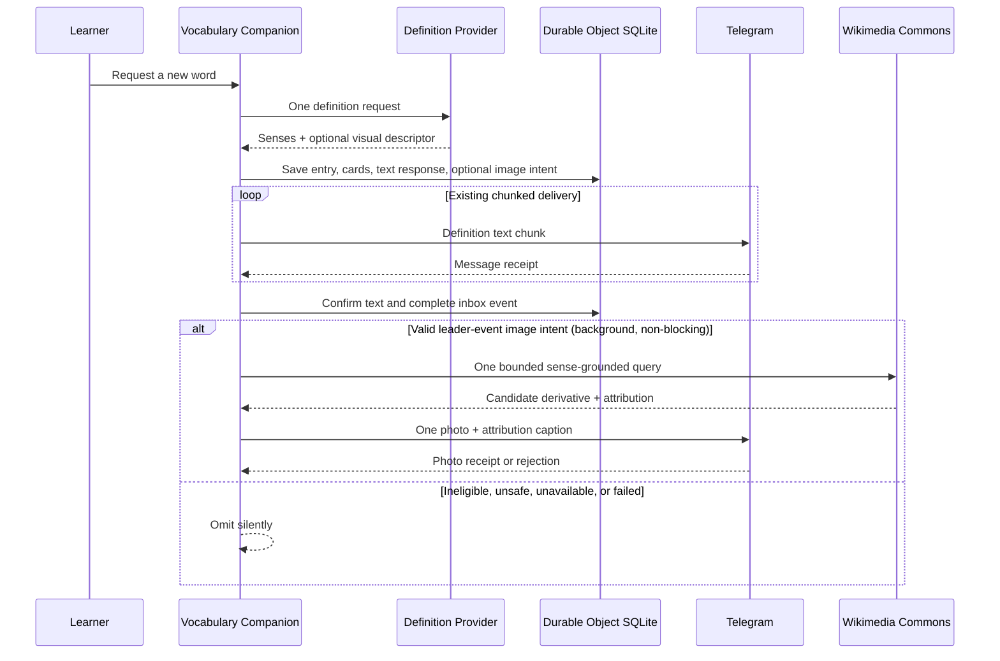

# feat: Add trustworthy visual vocabulary images

## Summary

Extend the existing definition request with a conservative visual-enrichment decision, carry that intent through the durable capture inbox, and perform one bounded Wikimedia lookup plus one best-effort Telegram photo send only after the definition text is durably complete.

---

## Problem Frame

The production Worker already provides reliable, delivery-safe definition capture, but visually distinctive terms such as `Doric` and `aster` have no visual anchor. Image enrichment introduces external relevance, licensing, safety, ordering, and failure surfaces that must remain subordinate to the existing text contract (see origin: `docs/brainstorms/2026-08-27-visual-vocabulary-images-requirements.md`).

---

## Requirements
- R1. Automatic images apply only when a vocabulary entry is newly saved; an already-saved response does not trigger another image lookup.
- R2. An entry is eligible only when it has a clear visual referent, including concrete objects, plants, animals, places, materials, architectural forms, and visually distinctive descriptors.
- R3. The bot must omit the image when the entry has several unrelated visual senses and no single sense is clearly dominant.
- R4. The bot must reject medical/anatomy, sexual, gore, injury, and procedure topics before image lookup and must screen Wikimedia text metadata for the same classes. Pixel moderation is not part of this version; rare mislabeled or vandalized-file risk is accepted.
- R5. Image selection must be grounded in the relevant stored sense, not merely the raw spelling of the requested word.
- R6. Low confidence results in no image; coverage must not be increased by accepting a weak or misleading match.
- R7. The complete saved-definition message is sent first and retains its current content and delivery guarantees.
- R8. At most one image is sent, as a separate Telegram photo after the text response.
- R9. The image message includes a concise description plus Wikimedia source, creator when available, license, and a link to the source page.
- R10. Image lookup and delivery are optional enrichment: failure, timeout, malformed metadata, or Telegram photo rejection must not change the saved entry, resend the definition, or surface an image-specific error to the learner.
- R11. The bot must omit candidates that cannot provide a usable image, source page, and required attribution metadata.

**Origin actors:** A1 (learner), A2 (vocabulary bot), A3 (Wikimedia Commons)

**Origin flows:** F1 (new visual entry), F2 (ineligible or unavailable image)

**Origin acceptance examples:** AE1 (`Doric` architecture), AE2 (`aster` plant), AE3 (ambiguous visual senses), AE4 (`duplicity` abstract), AE5 (`paraphimosis` sensitive), AE6 (lookup/metadata failure), AE7 (already-saved repeat)

---

## Scope Boundaries

- No images for already-saved entries requested again.
- No multiple-image results, galleries, candidate-selection UI, or learner approval step.
- No second model request dedicated to eligibility, relevance, or safety classification.
- No broad web image search, generated images, Pexels, or Unsplash.
- No image caching, self-hosting, R2 bucket, durable per-entry image record, or snapshot-format change.
- No image-specific user-facing warning, photo retry loop, or delayed definition retry.
- No Python reference implementation or local database parity work.

---

## Context & Research

### Relevant Code and Patterns

- `worker/src/vocabulary-companion.ts` — production orchestration from capture routing through definition preparation, chunked Telegram delivery, retries, and inbox completion. Extend the existing event lifecycle; do not create a parallel scheduler.
- `worker/src/integrations/opencode.ts` — strict definition response parser and one existing generation request. Extend this same contract with optional visual metadata so relevance does not add a second model call.
- `worker/src/storage/vocabulary-store.ts` — `captureEntry` distinguishes `SAVED` from `ALREADY_EXISTS`; image intent must be gated on `SAVED` only.
- `worker/src/storage/schema.ts` — `inbox_events` is the transient persistence seam. It is excluded from snapshots, but production requires an additive existing-table migration for any new column.
- `worker/src/integrations/telegram.ts` — existing `sendText` transport validates Telegram receipts. Add photo delivery beside it without changing text splitting.
- `worker/src/domain/formatting.ts` — deterministic user-visible formatting convention for the attribution caption.
- `worker/test/vocabulary-companion.test.ts` — end-to-end fetch transport stub, coalescing tests, chunk retry tests, and delivery-gating contracts.
- `worker/test/integrations.test.ts` — current external-provider and Telegram adapter unit-test pattern.

### Institutional Learnings

- `docs/superpowers/specs/2026-07-17-deterministic-telegram-vocabulary-routing-design.md` establishes that partial enrichment is never visible; optional media must not create a half-saved vocabulary aggregate.
- `docs/superpowers/plans/2026-08-11-explicit-provider-limit-errors.md` establishes typed external failures, bounded waits, and privacy-safe structured logging that never includes submitted vocabulary or provider bodies.
- `docs/superpowers/plans/2026-08-02-worker-first-agent-guidance.md` and `AGENTS.md` make `worker/` the production authority and require Worker-first tests and deployment evidence.

### External References

- [MediaWiki Imageinfo](https://www.mediawiki.org/wiki/API:Imageinfo) — thumbnail URLs, source-page URLs, MIME/dimensions, and filtered `extmetadata`; values such as creator and description are HTML-formatted and require sanitization.
- [MediaWiki Search API](https://www.mediawiki.org/wiki/API:Search) — relevance-ranked generator search constrained to Commons File namespace.
- [Wikimedia User-Agent Policy](https://foundation.wikimedia.org/wiki/Policy:Wikimedia_Foundation_User-Agent_Policy) — descriptive application identity is required; use the API-specific application header where outbound `User-Agent` behavior is uncertain.
- [Wikimedia API etiquette](https://www.mediawiki.org/wiki/API:Etiquette) — serialize reads, request few results, filter expensive metadata, and use compression.
- [Commons reuse guidance](https://commons.wikimedia.org/wiki/Commons:Reusing_content_outside_Wikimedia) — per-file license verification is required; hotlinking is allowed but discouraged and can fail after rename/deletion.
- [Telegram Bot API `sendPhoto`](https://core.telegram.org/bots/api#sendphoto) — remote HTTPS photo URLs, caption limit, image dimensions, and synchronous Message receipt.
- [Telegram Bot API file delivery](https://core.telegram.org/bots/api#sending-files) — plan against the conservative 5 MB URL-photo limit and supported image MIME types.

---

## Key Technical Decisions

- **Use the existing definition generation for visual judgment without making optional metadata authoritative.** Extend the found-definition response with an optional descriptor that names exactly one dominant sense, one allowed visual category, a sense-grounded Commons search phrase, and a concise image description. Core senses retain their existing strict validation; malformed visual metadata is isolated to `null`.
- **Make local policy rejection-only across every untrusted semantic field.** Initial eligible categories are plant, animal, architecture, object, material, place, garment, food, vehicle, instrument, landform, and visual style. Medical/anatomy, sexual, gore, injury, procedure, person/social-role, action, event, emotion, and abstract categories are always text-only. The policy validates the referenced sense, rejects disagreement/ambiguity, and screens entry, sense, descriptor, and candidate text; changes to category or sensitive-class tables require product review.
- **Persist only a transient leader-event intent.** Store the validated search phrase and description on the one capture inbox event whose save returned `SAVED`. Pending or ready duplicate followers receive the same text but no image intent, guaranteeing one photo per newly saved entry without a durable per-entry image table.
- **Use one literal, parameterized Commons query.** Request a small relevance-ranked File-namespace candidate set and filtered image metadata in one generator request. Construct fixed control parameters separately from a bounded plain-text phrase; reject control characters and MediaWiki operator/namespace syntax so model output cannot override namespace, limits, or properties. Do not relax or paginate.
- **Treat every returned URL and license as untrusted.** Require purpose-specific HTTPS authority checks for Wikimedia derivative/source URLs, reject credentials/non-default ports/IP hosts and redirects outside approved Wikimedia origins, and derive outbound license links from a conservative allowlist of accepted public-domain/Creative Commons identifiers rather than echoing arbitrary metadata URLs.
- **Validate reusable candidates before delivery.** Require a bounded raster derivative, supported MIME/dimensions, canonical source page, accepted license mapping, and license-mandated attribution fields. Reject unknown, nonfree, NC, ND, custom, restricted, or label/URL-mismatched candidates.
- **Complete text before optional work without blocking later definitions.** On the final successful text chunk, preserve existing study-prompt confirmation, capture the local image intent, and complete the inbox event before Wikimedia or photo delivery. Start one bounded background attempt attached to the current Durable Object event; subsequent inbox text may proceed, and the caption names the entry so an interleaved photo remains unambiguous.
- **Prefer loss over duplication.** The completed event is never reopened and photos are never retried. A crash after text completion but before or during photo delivery may omit the image; this is acceptable optional-enrichment loss and prevents duplicated photos or definition re-sends.
- **Keep direct derivative delivery for this scope.** Send a Wikimedia-generated derivative URL to Telegram with deterministic attribution. Accept the low-volume hotlink/rename risk rather than introducing storage or caching.
- **Keep logs content-free.** Log only structured failure kind and inbox event identity; never log the vocabulary term, semantic query, image URL, caption, or raw Wikimedia/Telegram payload.

---

## Open Questions

### Resolved During Planning

- **How is eligibility decided without a second generation?** The existing definition request emits optional visual metadata; local policy can only reject it.
- **How is Commons queried?** One relevance-ranked File-namespace generator request returns a small candidate set plus filtered image metadata and a resized derivative.
- **How is sensitive content blocked without Commons SafeSearch?** Initial eligible categories exclude all medical/anatomy, sexual, gore, injury, and procedure topics. Defense in depth then screens normalized entry/sense/descriptor/candidate text, while the user-approved policy accepts residual risk from mislabeled or vandalized pixels.
- **How does optional media fit text delivery?** The text inbox event reaches completed state before one isolated background image attempt. Image work never gates later definitions and cannot affect text retry accounting.
- **How are concurrent duplicate requests handled?** Only the event that actually saves the new aggregate receives image intent; followers remain text-only.
- **Is durable attribution history required?** No. The Telegram caption provides user-visible traceability; no image table or snapshot change is in scope.
- **How are crashes handled?** Optional-image loss is accepted after text completion; there is no recovery or photo retry.

### Deferred to Implementation

- **Policy table tuning:** Implementation may add normalized spelling variants inside the already fixed allowed-category and blocked-class policy, but may not add categories or weaken exclusions without product review.
- **Exact Commons phrase tokenization:** Preserve the model-provided sense grounding while tuning the bounded literal-character policy; fixed MediaWiki controls must remain non-overridable.
- **Exact metadata sanitizer implementation:** Preserve the required text-node-only, decode-once, whitespace-normalized, control-stripped, code-point-bounded output contract while choosing the smallest Worker-compatible implementation.
- **Timeout constant:** Use a short single-attempt bound appropriate for optional enrichment; the implementing agent may tune within a few seconds while preserving silent omission.

---

## High-Level Technical Design

> *This illustrates the intended approach and is directional guidance for review, not implementation specification. The implementing agent should treat it as context, not code to reproduce.*

The text path remains authoritative. Every arrow after inbox completion is optional, non-recoverable, and may interleave with later definitions; the caption preserves association.

---

## Implementation Units

### U1. Extend the definition contract with conservative visual intent

**Goal:** Produce a validated, sense-grounded visual decision during the existing definition generation without changing valid core-sense handling or adding a second model request.

**Requirements:** R2, R3, R4, R5, R6; F1, F2; AE1, AE2, AE3, AE4, AE5

**Dependencies:** None

**Files:**
- Create: `worker/src/domain/visual-enrichment.ts`
- Modify: `worker/src/domain/models.ts`
- Modify: `worker/src/integrations/opencode.ts`
- Test: `worker/test/integrations.test.ts`
- Test: `worker/test/domain.test.ts`

**Approach:**
- Extend the found-definition response with an optional visual descriptor; keep the not-found response and strict core-sense validation unchanged.
- Parse visual metadata through an isolated optional boundary. Unknown keys, invalid sense reference/category/query/description, excessive lengths, or malformed values reduce visual intent to `null` while valid senses remain usable.
- Require exactly one existing dominant-sense reference and one initial allowed category: plant, animal, architecture, object, material, place, garment, food, vehicle, instrument, landform, or visual style.
- Require no descriptor when senses compete without a clear dominant visual referent or when the subject is medical/anatomy, sexual, gore, injury, procedure, person/social-role, action, event, emotion, or abstract.
- Keep visual metadata transient: return it beside validated senses, not inside persisted entries, senses, cards, or snapshots.
- Apply deterministic rejection over the requested entry, all generated senses, the model-provided search phrase, and the model-provided description. Validate sense/category references, ambiguity indicators, field bounds, literal-query characters, and normalized sensitive markers. The local policy may only reject.
- Treat category and blocked-class tables as reviewed product policy. Implementation may add normalized spelling variants but may not add eligible categories or weaken exclusions.

**Execution note:** Start with failing parser and policy tests for `Doric`, `aster`, `duplicity`, competing senses, and `paraphimosis`. Before changing the provider prompt, capture a small fixed core-definition fixture/smoke corpus; afterward verify core parse success, sense ordering/shape, response latency, and output budget remain acceptable without requiring identical model prose.

**Patterns to follow:**
- Strict core-field validation and typed provider outcomes in `worker/src/integrations/opencode.ts`.
- Normalization and identity helpers in `worker/src/domain/normalization.ts`.
- Static string-keyed policy tables as `Record` values.

**Test scenarios:**
- Happy path — **Covers AE1.** `Doric` references one architectural sense and yields a bounded architecture query/description.
- Happy path — **Covers AE2.** `aster` references one plant sense and remains eligible.
- Ambiguity — **Covers AE3.** Missing/out-of-range sense references, multiple dominant references, or competing unrelated senses collapse to text-only.
- Abstract — **Covers AE4.** `duplicity` remains text-only even when mocked output supplies a descriptor.
- Sensitive — **Covers AE5.** `paraphimosis` and medical/anatomy, sexual, gore, injury, or procedure markers in entry, senses, query, or description collapse to text-only.
- Optional-error path — malformed or unknown visual metadata collapses to `null`; the same valid ordered senses still save and format unchanged.
- Core-error path — malformed senses retain the existing invalid-definition behavior.
- Core compatibility — an existing valid found-definition response with no visual field parses and formats exactly as before.
- Compatibility — `not_found` remains valid without visual fields.

**Verification:**
- One provider call yields valid ordered senses plus either one fully validated transient visual intent or none.
- Optional visual errors cannot change the authoritative definition result.
- No visual field enters persisted vocabulary or SnapshotV2 types.

### U2. Add bounded Wikimedia candidate lookup and attribution formatting

**Goal:** Resolve one validated visual intent to one relevant Telegram-compatible Commons derivative with complete sanitized attribution.

**Requirements:** R4, R5, R6, R9, R10, R11; A3; F1, F2; AE1, AE2, AE6

**Dependencies:** U1

**Files:**
- Create: `worker/src/integrations/wikimedia.ts`
- Modify: `worker/src/domain/formatting.ts`
- Test: `worker/test/wikimedia.test.ts`
- Test: `worker/test/formatting.test.ts`

**Approach:**
- Use one Commons Action API generator search restricted to File namespace, relevance ordered, with a small result limit.
- Build fixed endpoint/control parameters separately from a bounded literal semantic phrase. Reject control characters and MediaWiki query/operator syntax so model output cannot change namespace, limits, or requested properties.
- Retrieve derivative URL, dimensions/MIME, canonical file title, source page, creator, description, reusable-license fields, and restrictions in the same response.
- Identify the application with Wikimedia’s API-specific user-agent header, request compression, disable automatic redirects, and treat every redirect as no image.
- Use one short timeout and no retry/pagination/query relaxation.
- Canonicalize metadata before any policy decision: extract text nodes, discard elements/attributes/embedded links, decode entities once, Unicode-normalize, strip C0/C1 plus bidi and zero-width format controls, normalize whitespace, then bound by code points.
- Screen canonical file title, candidate description, creator, and restrictions through the same rejection-only sensitive policy. The user-approved contract accepts residual mislabeled/vandalized pixel risk and adds no image-moderation provider.
- Require deterministic relevance independent of rank: candidate title/description must share distinctive non-stopword tokens with the entry, referenced sense, or approved search phrase. No passing candidate means text-only.
- Require Telegram-compatible raster MIME and conservative dimensions. Imageinfo cannot prove thumbnail byte size; let Telegram rejection silently handle the rare oversized derivative.
- Validate purpose-specific HTTPS authorities: approved Wikimedia derivative host for the photo and canonical Commons origin for the source page; reject credentials, non-default ports, IP literals, malformed hosts, and arbitrary response-provided links.
- Accept only a conservative reusable-license allowlist with canonical local link mappings. Reject unknown, nonfree, NC, ND, custom, restricted, or internally inconsistent metadata. Recognized public-domain files may omit a license URL.
- Reserve complete mandatory creator/credit, accepted license attribution, and canonical source page first. Truncate only optional descriptive prose; reject a candidate whose mandatory attribution cannot fit Telegram’s caption limit.
- Begin the plain-text caption with the entry name and referenced-sense description so a later interleaved photo remains clearly associated with its definition.

**Patterns to follow:**
- Typed external-result unions, AbortController timeouts, and content-free structured logging in `worker/src/integrations/opencode.ts`.
- Deterministic formatters and boundary tests in `worker/src/domain/formatting.ts`.

**Test scenarios:**
- Happy path — a relevant JPEG/PNG/WebP derivative on approved Wikimedia authorities with an accepted reusable license becomes one photo payload.
- Relevance — a fully attributed high-ranked candidate with no distinctive token overlap is skipped; a later relevant candidate from the same response may be selected.
- Candidate filtering — unsafe canonical metadata, unsupported media, incomplete attribution, disallowed license, or restrictions reject a candidate without another request.
- Query safety — `&`, `#`, quotes, controls, namespace prefixes, and search operators cannot override fixed parameters.
- Redirect/URL trust — no request follows a redirect; wrong hosts, credentials, ports, IP literals, malformed source/derivative URLs, and response-provided license URLs are rejected.
- Public domain — recognized public-domain metadata without a license URL is accepted with canonical source attribution.
- Error path — **Covers AE6.** Timeout, fetch rejection, non-success HTTP, MediaWiki error, malformed JSON, no pages, or no passing candidates returns no image without logging vocabulary/query content.
- Canonicalization — entity-encoded blocked markers are detected after decode; tags, hrefs, raw URLs, malformed entities, bidi/zero-width/C0/C1 controls, and post-decode expansion yield bounded plain text.
- Caption boundary — optional prose is truncated while creator/credit/license/source remain complete; overlong mandatory attribution rejects the candidate.

**Verification:**
- At most one Wikimedia request occurs per eligible entry; there is no redirect follow, pagination, or relaxed fallback.
- Every returned payload is relevant by the conservative text gate, uses approved authorities/license mappings, and carries complete attribution.

### U3. Persist transient image intent through text retries

**Goal:** Preserve one leader-only visual intent across Durable Object eviction and text retries without changing snapshots or saved vocabulary.

**Requirements:** R1, R7, R8, R10, R11; F1, F2; AE6, AE7

**Dependencies:** U1

**Files:**
- Modify: `worker/src/storage/schema.ts`
- Modify: `worker/src/vocabulary-companion.ts`
- Modify: `worker/src/storage/vocabulary-store.ts`
- Test: `worker/test/storage.test.ts`
- Test: `worker/test/snapshot.test.ts`
- Test: `worker/test/vocabulary-companion.test.ts`

**Approach:**
- Add one nullable serialized image-intent field to the cold `inbox_events` schema.
- Add a separate warm-database migration that checks column presence before applying `ALTER TABLE`; run it inside constructor `blockConcurrencyWhile` after base schema creation and before inbox access. Do not rely on `CREATE TABLE IF NOT EXISTS` to upgrade production.
- Persist only validated sense/category/query/description needed after text delivery; never store Wikimedia results or raw model output.
- Write leader intent in the same ready-event update/transaction as the definition response, and only when capture returns `SAVED`. Already-saved/error paths plus pending and ready followers retain null intent.
- Preserve intent during pending/ready text retries and DO eviction.
- Clear intent in terminal delivery failure, completion, generic failure, and authenticated aggregate-deletion cleanup.
- Keep inbox state outside SnapshotV2. Older rollback code remains compatible because the added field is nullable and existing SQL names columns explicitly.

**Execution note:** Characterize cold and populated schema initialization before the migration, then add retry/eviction/coalescing coverage before delivery orchestration.

**Patterns to follow:**
- Constructor schema/maintenance sequencing and `maintenance_migrations` conventions.
- Existing inbox serialization/cleanup and coalesced capture tests.

**Test scenarios:**
- Migration — populated old schema upgrades once without row loss; cold schema is current; repeated initialization cannot duplicate the column.
- Persistence — leader intent is atomically ready with text and survives chunk retry plus DO eviction.
- Terminal cleanup — completion, delivery failure, generic failure, and admin deletion clear intent.
- Concurrency — pending and ready follower forms receive text but no intent; only the saving leader retains it.
- Repeat — **Covers AE7.** Already-saved requests have no visual intent.
- Snapshot/rollback — snapshot format remains unchanged and older explicit-column Worker writes tolerate the nullable field.

**Verification:**
- Exactly one transient intent exists for one newly saved aggregate regardless of duplicate requests.
- No entry/sense/card, snapshot, inspector, or Python schema carries image metadata.

### U4. Deliver one non-blocking best-effort photo after text completion

**Goal:** Add Telegram photo support and invoke it at most once after the corresponding definition text succeeds, without coupling optional media to text latency or retries.

**Requirements:** R7, R8, R9, R10, R11; F1, F2; AE1, AE2, AE6

**Dependencies:** U2, U3

**Files:**
- Modify: `worker/src/integrations/telegram.ts`
- Modify: `worker/src/vocabulary-companion.ts`
- Test: `worker/test/integrations.test.ts`
- Test: `worker/test/vocabulary-companion.test.ts`

**Approach:**
- Add one remote-URL Telegram photo operation with a plain attribution caption, its own AbortSignal deadline, and strict success/Message-photo receipt validation. Leave `sendText` and splitting unchanged.
- On the final successful definition chunk, retain existing prompt confirmation, copy/validate local image intent, and complete the inbox event before optional I/O.
- Start one background attempt attached to the current Durable Object event so the next inbox definition can proceed without waiting. Bound both Commons and Telegram calls; contain all optional failures outside text retry accounting.
- Never increment inbox attempts, reopen a completed event, schedule photo retry, resend text, or show image-specific errors.
- Use privacy-safe failure stage/kind plus event ID only. Never log term, query, URL, caption, or payload.
- Accept image loss if the DO restarts after completion. Completed events remain non-replayable, preventing duplicate photos.
- Because later text may interleave before the photo, require the caption to name the entry and sense.

**Patterns to follow:**
- Telegram receipt validation in `worker/src/integrations/telegram.ts`.
- Final-chunk confirmation/completion and `ctx.waitUntil` lifecycle usage in the Durable Object.
- Existing transport collectors and delivery-gating tests.

**Test scenarios:**
- Happy path — **Covers AE1 / AE2.** Complete definition receipt precedes exactly one photo with complete attribution.
- Repeat/coalescing — simultaneous duplicate capture yields one photo total; later already-saved request yields none.
- Text failure — terminal or partial text failure produces no Wikimedia call/photo.
- Chunk retry — no image attempt begins until the final definition chunk succeeds.
- Lookup failure — **Covers AE6.** Commons timeout/malformed/incomplete result leaves text completed and produces no user error/resend.
- Telegram failure — rejected, malformed, missing-photo receipt, fetch rejection, or never-resolving send hits its deadline, remains non-fatal, and is not retried.
- Crash boundary — post-completion restart can lose the photo but can never replay it.
- Non-blocking interleaving — hold Commons/Telegram pending, enqueue another word, and prove the later definition proceeds; any later photo remains identifiable by its caption.
- Queue recovery — subsequent inbox work proceeds after image success, failure, or timeout.

**Verification:**
- Each eligible entry’s own text precedes its photo; optional image work never delays later definition delivery.
- All image failures converge on completed text state with no image error or retry.

### U5. Document, roll out, and prove production behavior

**Goal:** Document user-visible behavior and operational constraints, then verify the deployed Worker against a reproducible positive/negative matrix.

**Requirements:** R1-R11; F1, F2; AE1-AE7

**Dependencies:** U1, U2, U3, U4

**Files:**
- Modify: `worker/README.md`
- Modify: `worker/wrangler.jsonc` only if application identity cannot be expressed safely in existing configuration/source
- Test: `worker/test/vocabulary-companion.test.ts`
- Test: `worker/test/integrations.test.ts`
- Test: `worker/test/wikimedia.test.ts`

**Approach:**
- Document eligible categories, excluded classes, newly-saved-only behavior, text-first/non-blocking order, attribution, silent omission, metadata-only safety, and no retries/caching/audit.
- Document Wikimedia application identity/contact and direct-derivative dependency without adding a secret.
- Preserve routes, cron, DO binding, compatibility date, and required secrets unless a reviewed config change is necessary.
- Before deployment, run focused contract/orchestration tests, complete Worker suite, typecheck, and required dry run.
- Define the live canary before deployment: one fresh low-risk visual term with expected sense/category, one text-only control, and one repeated request. Retain deployed version, Telegram timestamps/message IDs, Commons source/license URL, and observed omission/success reason.
- Verify positive text-before-photo and attribution, then repeat the term and confirm no second image. Use the inspector deletion action to remove temporary canary entries only after the repeat check.
- Stop/rollback on altered definition behavior, wrong-sense media, missing attribution, explicit/sensitive media, duplicate photo, or image failure affecting later text.

**Patterns to follow:**
- Production evidence and deployment procedure in `AGENTS.md` and `worker/README.md`.

**Test scenarios:**
- Automated acceptance matrix maps to all origin acceptance examples.
- Production positive canary yields definition then one attributed image on the named deployed version.
- Production text-only control follows the planned omission path.
- Production repeat yields no second image.
- Production health and later text remain normal if Commons/image delivery is unavailable; do not induce a destructive outage solely for proof.

**Verification:**
- Production evidence names the deployed version and exact observed Telegram path.
- Documentation and tests make every eligibility, omission, attribution, and failure boundary explicit.

---

## System-Wide Impact

- **Interaction graph:** Definition generation emits optional transient visual intent; capture preparation atomically stores it with the leader ready response; final text delivery completes the event; one bounded background Commons/Telegram task may finish after later inbox text, with an entry-naming caption preserving association.
- **Error propagation:** Malformed optional visual metadata collapses to text-only while core sense errors retain current provider behavior. Commons/photo errors become private warnings and do not reach capture status, inbox retry counters, Telegram text, or study state.
- **State lifecycle risks:** Existing production databases need a presence-checked additive inbox column migration before inbox access. Intent survives text retries and is cleared on every terminal path. Event completion before optional I/O intentionally trades image durability for at-most-once behavior; background work is bounded and non-durable.
- **API surface parity:** Only the Worker production runtime gains image enrichment. No Python parity, snapshot version, admin API, inspector display, or Telegram command is added.
- **Integration coverage:** Unit tests must be complemented by companion-level coalescing/retry/non-blocking interleaving tests and one authorized live Telegram proof on the deployed version.
- **Unchanged invariants:** Entry/sense/card atomicity, valid core definition handling, text formatting, chunking, text retries, prompt answerability, review scheduling, pause state, authenticated deletion, snapshot interchange, and existing secrets/routes remain unchanged.

---

## Risks & Dependencies

| Risk | Mitigation |
|------|------------|
| Malformed optional visual metadata breaks definition capture | Parse visual metadata independently and reduce failures to text-only while keeping strict core-sense validation |
| Augmented provider prompt degrades core definition output | Preserve visual as optional, retain old found-response compatibility, and compare a fixed core-definition smoke corpus for parse success, sense shape/order, latency, and output budget before rollout |
| Model incorrectly approves an abstract, ambiguous, or blocked topic | Fixed eligible-category and blocked-class policy rejects across entry/sense/descriptor fields; no fallback broadens eligibility |
| Commons has no SafeSearch and benign metadata cannot prove safe pixels | Exclude medical/anatomy, sexual, gore, injury, and procedure topics before lookup; canonicalize/screen candidate text; accept the user-approved residual mislabeled-file risk |
| Model-generated query changes MediaWiki behavior | Use fixed parameterized controls and a bounded literal phrase policy that rejects controls/operators and cannot override namespace or limits |
| Wikimedia response injects arbitrary remote URLs or redirects | Disable automatic redirects; authority-check derivative/source URLs; reject credentials/ports/IP hosts; derive license links from local mappings |
| License metadata is present but not reusable or internally inconsistent | Accept only a conservative public-domain/Creative Commons allowlist with canonical mappings and required complete attribution |
| Relevance-ranked candidate is safe but depicts the wrong sense | Require distinctive token overlap with entry/referenced-sense/query text; skip every off-sense candidate and never relax/paginate |
| Wikimedia metadata contains deceptive HTML, controls, or links | Canonicalize in a fixed order before policy checks; extract text only, decode once, strip links/format controls, normalize, and bound |
| Direct derivative URL is renamed, deleted, or unavailable | Use resized derivatives and one-shot silent omission; caching/self-hosting remain out of scope |
| Telegram rejects or stalls remote image delivery | Apply a dedicated photo deadline, validate Bot API receipt, never retry, and never alter text state; Telegram handles rare oversized derivatives |
| Optional photo arrives after a later definition | Allow non-blocking interleaving and require the caption to name the entry and referenced sense |
| Crash after text completion loses image | Explicitly accepted; completed state prevents duplicates and preserves text correctness |
| Additive schema change fails on existing storage | Use presence detection plus a separate idempotent warm migration; test cold, populated, and repeated initialization |
| External requests leak private content in logs | Send only the targeted semantic phrase to Commons; never log word/query/URL/payload; keep structured failure metadata minimal |

---

## Documentation / Operational Notes

- Wikimedia receives a targeted semantic phrase derived from the requested entry’s generated sense; it must never receive Telegram chat/user identifiers or submitted message envelopes.
- The application identity header should use a stable project URL/contact and no secret.
- Direct Wikimedia derivative use is deliberately low-volume and one-item-at-a-time; no parallel candidate downloads or pagination.
- Candidate filtering is metadata-based and cannot guarantee pixel content; the accepted residual risk must be visible in rollout notes and production verification should use low-risk subjects only.
- Observability should distinguish eligibility omission, Commons unavailability, candidate rejection, and Telegram photo rejection without logging content.
- Rollback is code-only: the transient inbox field remains nullable and harmless on an older Worker, while no persistent entry/snapshot data depends on it.

---

## Sources & References

- **Origin document:** [docs/brainstorms/2026-08-27-visual-vocabulary-images-requirements.md](../brainstorms/2026-08-27-visual-vocabulary-images-requirements.md)
- Related code: `worker/src/vocabulary-companion.ts`
- Related code: `worker/src/integrations/opencode.ts`
- Related code: `worker/src/integrations/telegram.ts`
- Related code: `worker/src/storage/schema.ts`
- Related tests: `worker/test/vocabulary-companion.test.ts`
- Related tests: `worker/test/integrations.test.ts`
- Institutional guidance: `docs/superpowers/specs/2026-07-17-deterministic-telegram-vocabulary-routing-design.md`
- Institutional guidance: `docs/superpowers/plans/2026-08-11-explicit-provider-limit-errors.md`
- [MediaWiki Imageinfo](https://www.mediawiki.org/wiki/API:Imageinfo)
- [MediaWiki Search API](https://www.mediawiki.org/wiki/API:Search)
- [Wikimedia User-Agent Policy](https://foundation.wikimedia.org/wiki/Policy:Wikimedia_Foundation_User-Agent_Policy)
- [Wikimedia API etiquette](https://www.mediawiki.org/wiki/API:Etiquette)
- [Commons reuse guidance](https://commons.wikimedia.org/wiki/Commons:Reusing_content_outside_Wikimedia)
- [Telegram Bot API `sendPhoto`](https://core.telegram.org/bots/api#sendphoto)
- [Telegram Bot API sending files](https://core.telegram.org/bots/api#sending-files)
