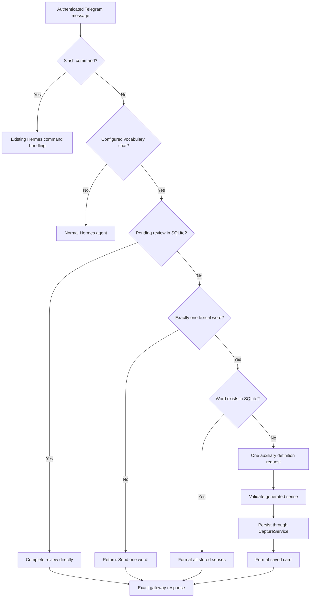

# Deterministic Telegram Vocabulary Routing Design

**Date:** 2026-07-17  
**Status:** Approved design

## Goal

Make the configured Telegram direct-message chat a vocabulary-only interface. A normal message must not enter Hermes' conversational agent loop. The system must return an exact vocabulary response without visible tool activity or model-written commentary.

The only conversational exception is an active daily review: when SQLite records a pending review, the next non-command message is the user's review answer.

## Problem

The current plugin uses `pre_llm_call` to tell the main Hermes model that a Telegram word is a vocabulary capture. The model must interpret the message, select `vocabulary_save_card`, and then make another model request to relay the tool result. This creates three failures:

1. Every word loads and processes the full conversational context before choosing a deterministic operation.
2. Tool-selection and follow-up model requests add avoidable latency.
3. The final model can paraphrase, expose planning text, or omit the definition even when the tool returned the correct card.

The observed `Perfidy` turn demonstrated the third failure: `vocabulary_save_card` completed successfully and returned a full card, but the follow-up model emitted an empty response and later replaced the card with a generic apology.

## Product Decisions

- The configured Telegram DM is vocabulary-only.
- Slash commands remain Hermes commands and bypass vocabulary interception.
- A pending review takes precedence over vocabulary lookup.
- With no pending review, exactly one lexical word is accepted.
- Any other non-command input returns exactly `Send one word.`
- Existing words are served from SQLite without a model call.
- Unseen words use one focused definition-generation request.
- The response sent to Telegram is deterministic formatter output, never model prose.
- The chat shows no tool progress, interim commentary, operation names, or reasoning.
- SQLite remains the source of truth.

## Considered Approaches

### 1. Generic Hermes inbound interception — selected

Add a generic gateway interception hook to Hermes. A plugin may claim an authenticated inbound message and return an exact response before Hermes creates an agent turn.

The vocabulary plugin uses the hook for the configured Telegram chat, performs review or lookup directly, and uses one auxiliary model request only when a word has no stored definition.

This preserves Hermes as the messaging foundation without paying for its general conversational loop on a deterministic route.

### 2. Standalone Telegram vocabulary process — rejected

A separate polling bot would provide deterministic routing without changing Hermes. It would duplicate Telegram authentication, authorization, retries, delivery, and process supervision. It also could not safely poll the same bot token alongside Hermes.

### 3. Existing agent hooks plus output transformation — rejected

`transform_llm_output` could force the final visible card and Telegram tool progress could be disabled. The main agent would still load the full conversation, choose the tool, and run a follow-up request. It would fix presentation but not the routing or latency problem.

## Architecture

## Hermes Gateway Extension

Hermes currently exposes agent lifecycle hooks but no plugin boundary before an agent turn. Add one generic, vocabulary-agnostic inbound interception surface.

### Invocation point

The gateway invokes interceptors after:

- platform authentication and allowlist checks;
- Telegram batching and message normalization;
- built-in interrupt and slash-command handling.

It invokes them before:

- session creation or restoration;
- agent runner acquisition;
- conversation-history loading;
- model or tool-loop execution.

This order preserves Hermes security and command semantics while avoiding all agent cost for handled messages.

### Callback input

The callback receives normalized, non-secret routing data:

- `platform`;
- `sender_id`;
- `chat_id`;
- `thread_id` when present;
- `user_message`;
- reply metadata when present.

Callbacks may be synchronous or asynchronous. Hermes awaits asynchronous callbacks and evaluates them in plugin registration order.

### Callback result

- `None`: the plugin declines the message; normal Hermes handling continues.
- `GatewayInterceptResponse(text: str)`: the message is handled; Hermes sends `text` through the existing adapter and does not start an agent turn.

The first handled response wins. Empty response text is invalid. Core remains plugin-neutral and does not know vocabulary statuses or schemas.

Unexpected interceptor exceptions are logged and fail open so one plugin cannot disable the gateway. The vocabulary interceptor catches its own operational failures and returns a handled, user-safe error, preventing expected database or enrichment failures from falling into general conversation.

## Vocabulary Interceptor

### Scope

The interceptor claims a message only when all conditions hold:

- `platform == "telegram"`;
- the source is a direct message;
- `chat_id` matches the configured vocabulary chat;
- the message is not a slash command.

The vocabulary chat ID is explicit configuration. It is not inferred from conversation history.

### Review route

If `ReviewService.has_pending_review()` is true, pass the raw message to `ReviewService.complete_review()` and return `format_review_completion()` exactly.

This preserves the existing rules:

- any non-empty answer completes the pending review;
- `show answer` is accepted;
- Hermes does not grade the answer;
- the response reveals the concise definition and example;
- same-day completion remains idempotent.

The review route runs before lexical-word validation because review answers may be phrases or sentences.

### Existing-word route

With no pending review, trim the message and require one lexical word. Normalize it with the current Unicode/casefold rules and load the word aggregate from SQLite.

If the word exists, return every stored sense in capture order. This is a lookup, not a new capture:

- no model request;
- no database write;
- no duplicate sense;
- no review-state change.

A one-sense word uses the normal card shape. A multi-sense word uses stable numbering and includes part of speech, definition, and example for each sense.

### Unseen-word route

If the word does not exist, invoke one plugin-registered auxiliary task named `vocabulary_definition`.

The request contains only:

- the normalized display word;
- instructions to produce one concise dictionary sense;
- a strict structured schema for `part_of_speech`, `definition`, and `example_sentence`.

It contains no Telegram conversation history and exposes no tools. Use a low-variance configuration and bounded output. The generated payload must pass the existing `SenseCard` domain validation before any write.

After validation, call the existing capture handler/service directly with `new_word`. Return `format_capture()` exactly. The operation uses the same transaction, conflict handling, and SQLite constraints as the registered Hermes tool; only model-driven tool selection is removed.

If a concurrent writer creates the word first, reload authoritative SQLite state and return the stored card instead of generating a duplicate or starting a conversational retry.

### Invalid and failure responses

- Invalid non-command input: `Send one word.`
- SQLite lookup or write failure: `I couldn't save that word. Please try again.`
- Definition-generation or validation failure: `I couldn't define that word. Please try again.`

No stack trace, provider detail, raw model output, SQL detail, or tool name is sent to Telegram.

## Presentation Configuration

For Telegram, configure:

- `display.platforms.telegram.tool_progress: off`;
- `display.platforms.telegram.interim_assistant_messages: off`.

The direct inbound route does not emit agent tool events, but these settings also keep unrelated plugin or command operations quiet in this dedicated chat. Final vocabulary text is sent once through the normal Telegram adapter.

## State and Conversation History

Handled vocabulary messages do not enter the Hermes model transcript because no agent turn exists. Vocabulary history remains entirely in SQLite.

Gateway delivery logs may retain normal operational metadata according to Hermes' existing logging behavior. They must not become a second source of vocabulary state.

## Testing

### Hermes core contract

- A declining interceptor leaves normal gateway behavior unchanged.
- A handled response skips session lookup, agent creation, model execution, and tool dispatch.
- Slash commands run before interceptors.
- The first handled response wins.
- Async callbacks are awaited.
- An unexpected plugin exception is logged and normal handling continues.
- Existing platforms and gateways behave unchanged when no interceptor is registered.

### Vocabulary routing

- Pending review plus one-word answer completes the review rather than looking up the word.
- Pending review plus phrase answer completes the review.
- No pending review plus invalid input returns `Send one word.` without a model call.
- Existing one-sense word returns its stored card without a model call or write.
- Existing multi-sense word returns every sense in insertion order without a model call or write.
- Unseen word performs one auxiliary request, validates, saves once, and returns the exact card.
- Malformed auxiliary output performs no write and returns the deterministic definition error.
- SQLite failure returns a handled storage error and never falls through to the main agent.
- Concurrent creation converges on one word and one sense.
- Messages from other platforms or Telegram chats are declined.

### End-to-end Telegram proof

For a fresh word:

- exactly one final Telegram message contains word, part of speech, definition, example, and `✓ Saved.`;
- no `⚙️ vocabulary_save_card...` bubble appears;
- no operation name or model commentary appears;
- logs show one auxiliary model request and no main-agent API request.

For the same word again:

- the stored definition returns directly;
- logs show no model request and no database write.

For a pending daily review:

- the user's answer completes the review directly;
- the exact definition/example response is delivered;
- logs show no model request.

## Migration and Rollout

1. Add and verify the generic Hermes gateway interception contract in the Hermes checkout.
2. Add the vocabulary interceptor and auxiliary-task registration in this package.
3. Configure the dedicated Telegram chat ID and quiet Telegram presentation.
4. Restart the supervised Hermes gateway once so both the core extension and plugin registration load together.
5. Exercise fresh-word, existing-word, invalid-input, and pending-review paths in the live Telegram chat.

The existing `pre_llm_call` vocabulary routing remains available only for non-dedicated surfaces where general Hermes conversation is desired. The dedicated Telegram chat must have one routing owner; it must not invoke both inbound interception and the old agent-injection path for the same message.

## Success Criteria

- A stored word is answered from SQLite without any model request.
- A new word uses exactly one focused definition request and one database transaction.
- A review answer uses no model request.
- The exact formatter response reaches Telegram.
- No vocabulary tool progress or internal planning text appears.
- Invalid input is rejected deterministically.
- The general Hermes agent never handles non-command messages from the configured vocabulary chat.
