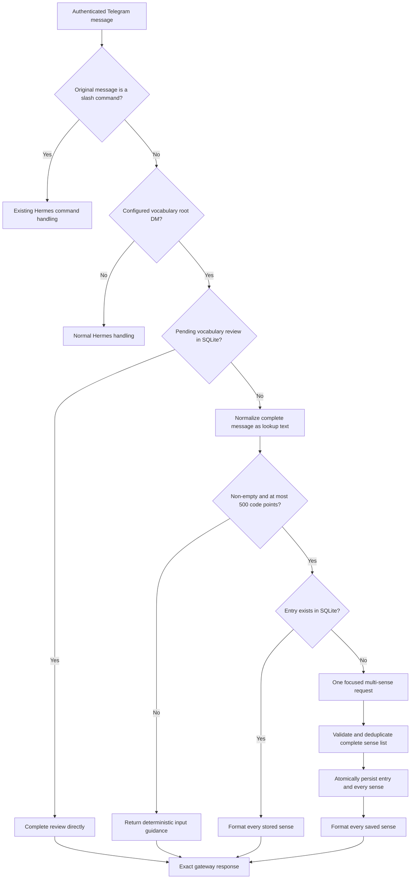

# Deterministic Telegram Vocabulary Routing Design

**Date:** 2026-07-17  
**Status:** Revised design awaiting specification approval

## Goal

Make the configured Telegram direct-message chat a vocabulary-only interface. A normal message must not enter Hermes' conversational agent loop. The system must return an exact vocabulary response without visible tool activity or model-written commentary.

The only conversational exception is an active daily review: when SQLite records a pending review, the next non-command message is the user's review answer.

## Problem

The current plugin uses `pre_llm_call` to tell the main Hermes model that Telegram text is a vocabulary capture. The model must interpret the message, select `vocabulary_save_card`, and then make another model request to relay the tool result. This creates three failures:

1. Every lookup loads and processes the full conversational context before choosing a deterministic operation.
2. Tool-selection and follow-up model requests add avoidable latency.
3. The final model can paraphrase, expose planning text, or omit the definition even when the tool returned the correct card.

The observed `Perfidy` turn demonstrated the third failure: `vocabulary_save_card` completed successfully and returned a full card, but the follow-up model emitted an empty response and later replaced the card with a generic apology.

## Product Decisions

- The configured Telegram root DM is vocabulary-only; Telegram topic lanes are not claimed.
- Slash commands remain Hermes commands and bypass vocabulary interception, even when a command later rewrites its text.
- A pending vocabulary review takes precedence over lookup.
- With no pending review, every non-empty non-command message is the complete term or expression to define.
- Single words, multiword expressions such as `pro forma`, idioms, and short quoted phrases use the same route.
- Lookup text is capped at 500 Unicode code points after normalization; longer input returns exactly `Send a word or phrase under 500 characters.`
- Existing entries are served from SQLite without a model call.
- Unseen entries use one focused request that returns up to 20 distinct credible English senses.
- Sense coverage explicitly asks for common, literary, archaic, regional, and major technical meanings. It is broad best-effort model coverage, not a claim of parity with every dictionary.
- Every returned sense includes part of speech, a concise definition, and an example sentence.
- All generated senses are validated and saved atomically; partial enrichment is never visible.
- The response sent to Telegram is deterministic formatter output, never model prose.
- The chat shows no tool progress, interim commentary, operation names, or reasoning.
- SQLite remains the source of truth after capture.

## Considered Approaches

### 1. Generic Hermes inbound interception — selected

Add a generic gateway interception hook to Hermes. A plugin may claim an authenticated inbound message and return an exact response before Hermes creates an agent turn.

The vocabulary plugin uses the hook for the configured Telegram chat, performs review or lookup directly, and uses one auxiliary model request only when a term or expression has no stored definition.

This preserves Hermes as the messaging foundation without paying for its general conversational loop on a deterministic route.

### 2. Standalone Telegram vocabulary process — rejected

A separate polling bot would provide deterministic routing without changing Hermes. It would duplicate Telegram authentication, authorization, retries, delivery, and process supervision. It also could not safely poll the same bot token alongside Hermes.

### 3. Existing agent hooks plus output transformation — rejected

`transform_llm_output` could force the final visible card and Telegram tool progress could be disabled. The main agent would still load the full conversation, choose the tool, and run a follow-up request. It would fix presentation but not the routing or latency problem.

## Architecture

## Hermes Gateway Extension

Hermes currently exposes agent lifecycle hooks but no plugin boundary before an agent turn. Add one generic, vocabulary-agnostic inbound interception surface.

### Invocation point

The gateway records whether the normalized inbound message is a slash command before any command handler can rewrite `event.text`. It invokes interceptors after platform authentication and allowlist checks but before any subsystem consumes non-command free text, including:

- pending update, clarification, approval, or confirmation prompts;
- active-session queue, steer, or interrupt handling;
- Telegram topic-lobby handling;
- session creation or restoration;
- conversation-history loading;
- agent, model, or tool-loop execution.

The interceptor is skipped for internal events and for any message that was originally a slash command. This order preserves Hermes authorization and command semantics while ensuring a dedicated vocabulary message cannot leak into an active or pending conversational flow.

### Callback input

The callback receives normalized scalar routing data only:

- `platform`;
- `sender_id`;
- `chat_id`;
- `chat_type`;
- `thread_id` when present;
- `user_message`;
- `reply_to_message_id`;
- `reply_to_text`;
- `reply_to_author_id`;
- `reply_to_author_name`;
- `reply_to_is_own_message`.

Hermes does not expose the mutable `MessageEvent`, `GatewayRunner`, session store, raw platform payload, media paths, or free-form metadata through this hook.

Callbacks may be synchronous or asynchronous. Hermes awaits them in plugin registration order.

### Callback result

- `None` or any value other than the handled-response type: the plugin declines and dispatch continues to the next interceptor.
- `GatewayInterceptResponse(text: str)`: the message is handled; Hermes immediately stops evaluating interceptors, returns `text` through the existing adapter, and does not start an agent turn.

The first handled response wins. Empty response text is invalid. Core remains plugin-neutral and does not know vocabulary statuses or schemas.

Unexpected interceptor exceptions are logged and fail open to the next interceptor so one plugin cannot disable the gateway. The vocabulary interceptor catches its own expected operational failures and returns a handled, user-safe error, preventing database or enrichment failures from falling into general conversation.

## Vocabulary Interceptor

### Scope

The interceptor claims a message only when all conditions hold:

- `platform == "telegram"`;
- `chat_type == "dm"`;
- `chat_id` matches the configured vocabulary chat;
- `thread_id is None`, so user-created Telegram topic lanes remain normal Hermes surfaces;
- the gateway has already established that the inbound message was not a slash command.

The vocabulary chat ID is explicit configuration. It is not inferred from conversation history.

### Review route

If `ReviewService.has_pending_review()` is true, pass the raw message to `ReviewService.complete_review()` and return `format_review_completion()` exactly.

This preserves the existing rules:

- any non-empty answer completes the pending review;
- `show answer` is accepted;
- Hermes does not grade the answer;
- the response reveals every stored definition and example for the reviewed entry;
- same-day completion remains idempotent.

The review route runs before lookup normalization because review answers may themselves look like words, phrases, or expressions.

### Lookup normalization

With no pending review, the complete message is the lookup text. There is no lexical-word parser and no contextual sentence syntax in the dedicated chat.

Create two values:

- `display_text`: the NFKC-normalized message with only leading and trailing whitespace removed;
- `normalized_text`: `display_text` with every internal whitespace run collapsed to one space and then Unicode-casefolded.

`Pro   Forma`, `pro forma`, and `PRO FORMA` therefore address one entry while the first successfully captured display form remains available for presentation. Reject only an empty/whitespace-only value or a normalized display value longer than 500 Unicode code points.

### Existing-entry route

Load the entry aggregate by `normalized_text`. If it exists, return every stored sense in capture order. This is a lookup, not a new capture:

- no model request;
- no database write;
- no duplicate sense;
- no review-state change.

A one-sense entry uses the normal card shape. A multi-sense entry uses stable numbering and includes part of speech, definition, and example for each sense.

### Unseen-entry route

If the entry does not exist, invoke one plugin-registered auxiliary task named `vocabulary_definition`.

The request contains only:

- `display_text` exactly as normalized for presentation;
- instructions to define the complete lexical expression rather than extracting or guessing a single word from it;
- instructions to enumerate up to 20 distinct credible English senses, covering common, literary, archaic, regional, and major technical usage when applicable;
- a strict structured response with either a non-empty sense array or an explicit `not_found` status;
- for every sense, `part_of_speech`, `definition`, and `example_sentence`.

It contains no Telegram conversation history and exposes no tools. Use a low-variance configuration and bounded output. Broad coverage is best effort: the system must not claim that model output exhausts every proprietary or historical dictionary.

Python must validate before any write:

- the response is valid JSON;
- a defined result contains between 1 and 20 senses;
- every sense field is a non-empty string within domain length limits;
- exact duplicate `(part_of_speech, definition)` pairs are removed while preserving model order;
- a `not_found` result contains no senses.

The capture service gains one batch operation that validates the entire command, opens one `BEGIN IMMEDIATE` transaction, inserts the entry, inserts every sense, and commits only after the full batch succeeds. Any validation, constraint, or storage failure rolls back the complete entry. The plugin must not loop over the existing single-sense public capture API because that would expose partial state.

Return deterministic formatter output for the complete stored aggregate. If a concurrent writer creates the entry first, reload authoritative SQLite state and return every committed sense instead of writing duplicates or starting a conversational retry.

### Entry data model

The vocabulary domain uses entry-oriented names because a captured item may be a word or expression:

- `VocabularyEntry`;
- `display_text`;
- `normalized_text`;
- `vocabulary_entries`;
- `entry_id` on senses and review events.

Schema migration 003 atomically migrates existing `vocabulary_words` rows and foreign-key references without changing IDs, timestamps, review state, or sense order. Existing SQLite files remain authoritative and migrate automatically. No compatibility aliases or parallel word/entry models remain after the cutover.

### Invalid and failure responses

- Empty input: `Send a word or phrase.`
- More than 500 normalized code points: `Send a word or phrase under 500 characters.`
- Explicit enrichment `not_found`: `I couldn't define that. Please try another word or phrase.`
- SQLite lookup or write failure: `I couldn't save that. Please try again.`
- Definition-generation or validation failure: `I couldn't define that. Please try again.`

No stack trace, provider detail, raw model output, SQL detail, or tool name is sent to Telegram.

## Presentation Configuration

For Telegram, configure:

- `display.platforms.telegram.tool_progress: off`;
- `display.platforms.telegram.interim_assistant_messages: off`.

The direct inbound route does not emit agent tool events, but these settings also keep unrelated plugin or command operations quiet in this dedicated chat. Final vocabulary text is sent once through the normal Telegram adapter.

## State and Conversation History

Handled vocabulary messages do not enter the Hermes model transcript because no agent turn exists. Vocabulary history remains entirely in SQLite.

Gateway delivery logs may retain normal operational metadata according to Hermes' existing logging behavior. They must not become a second source of vocabulary state.

## Testing

### Hermes core contract

- An unauthorized message never reaches the interceptor.
- A declining interceptor leaves normal gateway behavior unchanged.
- A handled response skips pending free-text consumers, active-session handling, session lookup, agent creation, model execution, and tool dispatch.
- An original slash command bypasses interception even when its handler later rewrites the event text.
- The first handled response stops callback evaluation; later interceptors are not invoked.
- Async callbacks are awaited.
- An unexpected plugin exception is logged and dispatch continues to the next interceptor.
- Only scalar routing and complete scalar reply metadata are forwarded.
- Existing platforms and gateways behave unchanged when no interceptor is registered.

### Vocabulary routing

- Telegram topic lanes and non-configured chats are declined.
- Pending review plus a one-word answer completes the review rather than looking up the answer.
- Pending review plus a phrase answer completes the review.
- With no pending review, `pro forma` is treated as one complete lookup expression.
- Internal whitespace and case variations resolve to the same normalized entry.
- Empty and oversized input return exact guidance without a model call.
- Existing one-sense entry returns its stored card without a model call or write.
- Existing multi-sense entry returns every sense in insertion order without a model call or write.
- Unseen entry performs exactly one focused request, validates multiple senses, commits once, and returns every saved sense.
- Explicit `not_found` performs no write and returns deterministic guidance.
- Duplicate generated senses collapse deterministically before persistence.
- One invalid sense rejects the complete generated batch and performs no write.
- A failure during the second or later sense insert rolls back the entry and every earlier insert.
- SQLite failure returns a handled storage error and never falls through to the main agent.
- Concurrent creation converges on one entry and one complete committed sense set.
- Restarted plugin handlers preserve the same routes and authoritative SQLite state.

### End-to-end Telegram proof

For a fresh polysemous expression such as `pro forma`:

- one final response, adapter-chunked only when required by Telegram limits, contains the expression, stable numbering, every saved part of speech, definition, example, and `✓ Saved.`;
- no `⚙️ vocabulary_save_card...` bubble appears;
- no operation name or model commentary appears;
- logs show one focused model request and no main-agent API request.

For the same expression with different case or whitespace:

- every stored sense returns directly under the originally stored display form;
- logs show no model request and no database write.

For a pending daily review:

- either a word-like or phrase-like answer completes the review directly;
- the exact stored definition/example response is delivered;
- logs show no model request.

## Migration and Rollout

1. Add and verify the generic Hermes gateway interception contract in the Hermes checkout.
2. Migrate the vocabulary domain and SQLite schema from word-oriented to entry-oriented names.
3. Add the atomic multi-sense entry capture operation and migration-safe tests.
4. Add the focused term/expression definition provider and vocabulary interceptor.
5. Configure the dedicated Telegram root-DM chat ID and quiet Telegram presentation.
6. Restart the supervised Hermes gateway once so the core extension, schema migration, and plugin registration load together.
7. Exercise fresh expression, normalized repeat, invalid-input, active-agent, topic-lane, and pending-review paths in the live Telegram chat.

The existing `pre_llm_call` vocabulary routing remains available only for non-dedicated surfaces where general Hermes conversation and contextual capture are desired. The dedicated Telegram root DM has one routing owner and treats the complete non-command message as its lookup expression; it must not invoke both inbound interception and the old agent-injection path for the same message.

## Success Criteria

- A stored entry is answered from SQLite without any model request.
- A new word or expression uses exactly one focused multi-sense request and one atomic database transaction.
- Every accepted generated sense is returned and stored; no partial batch is visible.
- Existing word data, senses, and review history survive the entry-schema migration unchanged.
- A review answer uses no model request.
- The exact formatter response reaches Telegram, with adapter chunking only when necessary.
- No vocabulary tool progress or internal planning text appears.
- The complete non-command message—not a parser-selected token—is the lookup text.
- Slash commands, Telegram topic lanes, and non-configured chats retain normal Hermes behavior.
- The general Hermes agent and all pending conversational consumers never handle non-command messages from the configured vocabulary root DM.
