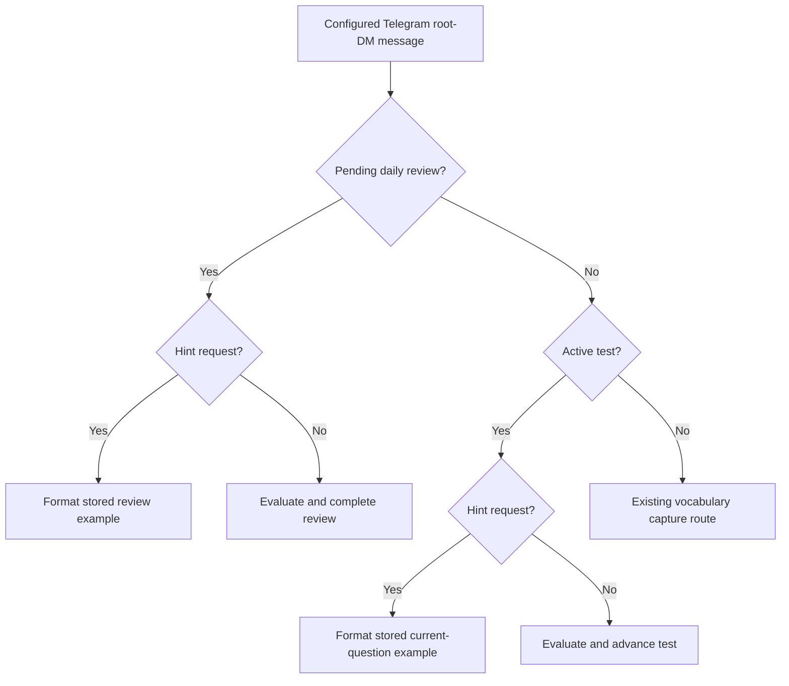

# Vocabulary Hints and Test Rotation Design

**Date:** 2026-07-17  
**Status:** Approved design

## Goal

Let a learner request a contextual hint during a pending daily review or active `/test` question without grading the request or advancing the question. Also rotate `/test` words through the saved vocabulary library instead of repeatedly selecting the same five entries.

## Product Decisions

- Hint requests work during both pending daily reviews and active five-word tests.
- A hint shows one complete stored example sentence, including the vocabulary word.
- A hint request does not call the evaluator, persist an answer or grade, advance the question, complete a review, or alter scheduling.
- The current question remains active after a hint and accepts the learner's next response normally.
- Hint handling is deterministic and applies only while a review or test question is pending.
- Outside a pending review or active test, existing vocabulary capture behavior is unchanged.
- `/test` prioritizes entries that have never appeared in a test, then entries least recently used in a test.
- Test rotation uses existing test-session history and does not update `last_reviewed` or daily-review scheduling.
- Existing review-priority ordering remains the deterministic tie-breaker between equally recent test entries.

## Accepted Hint Requests

The router trims leading and trailing whitespace, collapses internal whitespace, removes trailing sentence punctuation (`?`, `.`, or `!`), and compares case-insensitively against this fixed set:

- `hint`
- `give me a hint`
- `can i have a hint`
- `show me an example`
- `example sentence`

No model is used to classify hint intent. Other text remains an attempted answer and follows the existing semantic evaluation path.

## Hint Response

The response format is:

```text
Hint: <stored example sentence>
```

The sentence is returned exactly as stored and includes the vocabulary word. For a multi-sense entry, the first sense in the existing stable sense order supplies the example. Every persisted vocabulary entry already has at least one validated sense and example sentence, so hint handling requires no fallback model call.

## Test Rotation

When creating a new five-question session, calculate each eligible entry's most recent test-session start time from existing `test_questions` and `test_sessions` rows. Select entries in this order:

1. Entries that have never appeared in a test.
2. Entries whose most recent test appearance is oldest.
3. Existing daily-review priority: never reviewed first, then oldest `last_reviewed` or `date_added`.
4. `date_added` and entry ID as stable final tie-breakers.

The five selected entries remain distinct. If the library size is not a multiple of five, some overlap between consecutive sessions is unavoidable, but all less-recently-tested entries are selected before more-recently-tested entries.

No migration is required. Test history already identifies which entries appeared in each persisted session.

## Architecture

Hint detection belongs at the deterministic gateway routing boundary, before either `complete_pending_review` or `complete_test_question` receives answer text.



A small shared hint-intent helper owns normalization and fixed-phrase matching. Formatting owns the exact `Hint: ...` response. Review and test services remain authoritative sources for the pending entry and current test entry.

## Error Handling

- If reading the pending review or active test fails, preserve the existing storage-error response; do not attempt hint formatting.
- A hint never changes SQLite state, so delivery failure can be retried safely.
- Evaluator failures remain unchanged because hints bypass evaluation entirely.
- A phrase resembling a hint but not in the fixed accepted set is evaluated as an answer, preserving deterministic routing and avoiding broad intent guesses.

## Considered Approaches

### 1. Deterministic gateway hint interception — selected

Recognize a bounded phrase set after the gateway identifies a pending review or active test. This is fast, state-preserving, testable, and shared across both study flows.

### 2. Evaluator-classified hint intent — rejected

Passing hint requests to the semantic evaluator adds latency and cost, makes intent handling nondeterministic, and risks persisting a grade or advancing the question.

### 3. `/hint` command only — rejected

A slash command is deterministic but does not support the conversational request the learner asked for and adds another plugin command to an already crowded Telegram command menu.

### 4. Random test selection — rejected

Random selection can immediately repeat the same words. Least-recently-tested ordering provides predictable library-wide rotation without changing review scheduling.

## Verification

Tests must prove these observable contracts:

- Each accepted hint phrase works with case, whitespace, and trailing-punctuation variations during a daily review.
- Each accepted hint phrase works during an active `/test` question.
- The returned hint contains the complete stored example sentence and vocabulary word.
- A multi-sense entry uses the first stored sense deterministically.
- A hint does not call the evaluator, write answer/grade fields, advance test position, complete the review, or modify review timestamps.
- The next ordinary response after a hint is evaluated against the same entry.
- Non-matching text continues through semantic evaluation.
- Hint-like text outside an active study flow preserves existing capture behavior.
- A second test prioritizes entries not used in the first test when alternatives exist.
- Across multiple tests, entries with the oldest test appearance are selected first.
- Rotation does not modify `last_reviewed`, `review_status`, or daily-review event behavior.
- Existing insufficient-library, duplicate `/test`, restart, and concurrent-answer behavior remains unchanged.

## Scope Boundaries

- No generated hints, definitions, synonyms, or multiple hint levels.
- No hint counters, penalties, score adjustments, or hint persistence.
- No changes to semantic grading criteria.
- No changes to daily-review scheduling.
- No Hermes core changes or new plugin commands.
